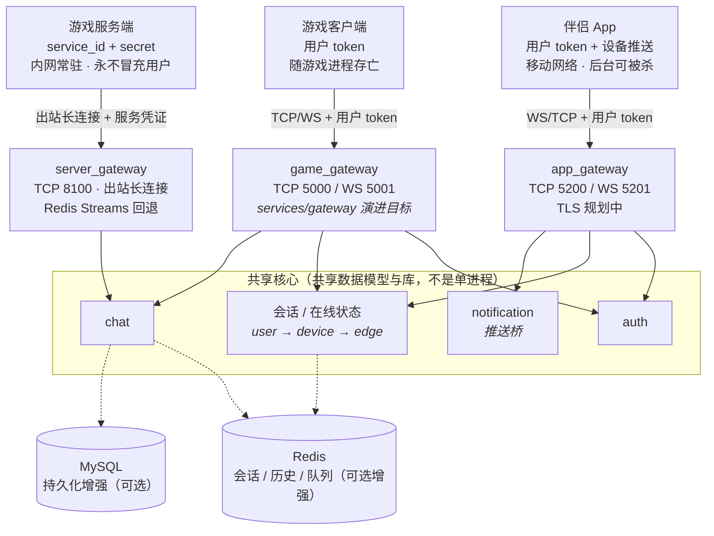

# chirp

[](https://github.com/cuihairu/chirp/actions/workflows/ci.yml)
[](https://codecov.io/gh/cuihairu/chirp)


## 为什么做这个

游戏团队想把"玩家联系"做进自己的游戏时，往往要自己从零搭一套实时通信：登录会话、心跳踢人、私聊群聊、离线消息、推送、再接一个 NPC 对话。这些和玩法逻辑无关，却每个游戏都要重写一遍。

chirp 想解决的就是这件事，设计目标按优先级排列：

1. **让游戏快速接入** —— 第一目标。客户端走 TCP/WebSocket + Protobuf 长连接，游戏服务端走独立的服务平面（出站长连接 + 服务凭证），不需要暴露回调端口，几条命令起服务即可联调。
2. **App 与游戏打通** —— 玩家不在游戏里时，通过 App 收发与游戏好友的聊天、语音邀请、组队邀请；游戏侧事件通过服务器平面推到 App（推送桥接规划中）。
3. **游戏内 NPC AI 聊天** —— 游戏服以非用户身份（SYSTEM / NPC / SERVICE）向频道或个人注入消息，为 NPC 对话、系统公告、交易状态播报留好通道。
4. **拉近玩家与游戏的关系** —— 聊天、组队、好友这些社交粘性能力不该是每个游戏重复造的轮子；chirp 把它们做成可独立部署、按需启用的服务。

## 当前定位

诚实地讲：chirp 目前是**可运行的核心通信骨架 + 一批实验性扩展**，不是所有目录都同等成熟的完整产品。

- 成熟主线是 `gateway + auth + chat`：登录、心跳、会话绑定、私聊、群组、历史、离线队列，25 个单测套件覆盖，行覆盖率 100%（CI 按包 98% 门槛硬卡，`scripts/run_coverage.sh` 本地可复现）。
- 服务器平面 `server_gateway`（游戏服务端接入）枢纽与 chat 侧注入消费均已实现并全覆盖（进程级端到端验证 `./test_services.sh --smoke-npc`），标记为实验中。
- 其余（`social`、`voice`、`notification`、`search`、多端 SDK、移动端、管理后台）完成度不一致，不要对外当作稳定能力介绍。真实状态见[能力矩阵](docs/CAPABILITY_MATRIX.md)。

## 三条接入边缘

三个接入点相互独立，不共用 gateway；共享的是核心能力（认证、设备级会话/在线状态、聊天、通知）：



要点：**边缘薄、核心共享**。边缘只做连接管理、协议适配、认证转发和心跳；同一玩家在游戏内和 App 上同时在线是核心场景，跨设备投递、kick 策略、统一未读数都在核心解决，不落在任何边缘。游戏服务端平面只认服务凭证、只做出站连接，与玩家边缘彻底隔离。详见[整体架构](docs/architecture.md)。

| 服务 | 默认端口 | 状态 | 作用 |
| --- | --- | --- | --- |
| Gateway | TCP 5000 / WS 5001 | Supported | 游戏客户端边缘：登录、登出、心跳、会话绑定、可选 Redis 跨实例 kick |
| Auth | TCP 6000 | Supported | token 校验；依赖满足时可构建增强认证 |
| Chat | TCP 7000 / WS 7001 | Supported | 私聊、群组、已读回执、正在输入、表情回应、消息编辑/删除、@提及、历史、离线队列 |
| Server Gateway | TCP 8100 | Experimental | 服务平面枢纽：游戏服出站长连接 + 凭证接入，注入系统/NPC 消息，事件离线排队、重连重投直到 ack；支持 Redis Streams 上行注入回退（`--broker_redis_host`），见 [docs/server_plane.md](docs/server_plane.md) |
| Notification | TCP 5006 / WS 5016 | Experimental | 推送平面：设备注册/注销/token 更新/查询（6xxx）、按用户推送；APNs/FCM 的 HTTP 投递目前是日志 stub（`PushTransport` 可注入真实实现） |
| App Gateway | TCP 5200 / WS 5201 | Experimental | App 接入边缘：登录/心跳/会话绑定 + 设备消息转发到 notification（要求已认证会话，user_id 以服务端认证结果为准） |

## 先读什么

- [核心说明](docs/CORE.md)：当前可用链路、服务边界、协议和本地验证命令
- [能力矩阵](docs/CAPABILITY_MATRIX.md)：各服务、SDK、应用的真实完成度
- [整体架构](docs/architecture.md)：三边缘拓扑、服务器平面设计
- [服务器平面](docs/server_plane.md)：游戏服务端接入契约
- [API 概述](docs/api/overview.md)：Packet 协议、消息 ID 和核心流程
- [快速开始](docs/guide/getting-started.md)：构建、Docker Compose、smoke test

## 快速开始

平台目标为 Linux（CI 仅跑 Linux）。依赖：CMake 3.21+、C++23、Protocol Buffers。Docker、MySQL、libsodium 为可选增强依赖。

```bash
./gen_proto.sh
cmake --preset dev
cmake --build --preset dev
ctest --preset dev
```

最小构建：

```bash
cmake --preset minimal
cmake --build --preset minimal
```

smoke test：

```bash
./test_services.sh --smoke       # auth + gateway + TCP/WS login
./test_services.sh --smoke-chat  # chat + chat clients
./test_services.sh --smoke-sdk   # 游戏客户端 SDK(sdks/core)+ chat:登录/双向收发/离线队列
./test_services.sh --smoke-npc   # 服务器平面 + NPC 对话回环
./test_services.sh --smoke-redis # Redis session/kick path
```

Docker Compose：

```bash
docker compose up --build
```

## 协议要点

TCP 和 WebSocket 使用同一套二进制 payload：

```text
[uint32_be payload_size][chirp.gateway.Packet protobuf bytes]
```

业务 envelope 定义在 `proto/gateway.proto`：

- `msg_id`：消息类型，按接入平面分段——1xxx 认证/会话、2xxx 聊天、3xxx 社交、4xxx 语音、5xxx 服务器平面、6xxx 推送/设备
- `sequence`：请求序号，用于匹配响应
- `body`：具体业务 protobuf bytes，例如 `chirp.auth.LoginRequest`、`chirp.server_gateway.MessageInjectRequest`

## 当前边界

- `gateway` 还不是通用业务路由层；聊天包请发到 `chat`。
- `gateway` 登录不会自动授权一个独立的 `chat` 连接。
- `server_gateway` 的注入链路已在回环级打通（chat 作为内部节点消费 `InjectMessageNotify`，走与玩家发消息相同的存储/投递尾巴），并支持 Redis Streams 上行回退（游戏服无法长连接时 `XADD` 注入，ack + PEL 重放，需 Redis >= 6.2），但 `OK` 仍只表示"服务平面已受理"，未确认玩家侧送达；NPC 对话环路的进程级 E2E 见 `./test_services.sh --smoke-npc`。
- `social`、`voice`、`notification`、`search`、SDK、移动端、管理后台不应默认视为生产稳定能力。
- Web 伴侣 App(`apps/web_companion`)一期已可用,但走的是**过渡路径**——浏览器直连 chat(7001)与 social(8001)的 WS 边缘 + scaffold 登录;social 平面的好友列表/移除等 API 服务端尚未实现,web 端以 localStorage 补位。详见 [docs/web_companion.md](docs/web_companion.md)。
- `app_gateway` 与推送链路已可用但边界明确：chat 离线消息会经 `PushBridge` → notification 触发设备推送；notification 的 provider HTTP 投递是日志 stub（无 TLS，真实 APNs HTTP/2 / FCM HTTP 待接），推送桥仅接入默认构建的 `chirp_chat`（`main_enhanced`/`main_distributed` 未接）。
- NPC 对话已落地为关键词规则引擎（`services/npc_dialog`）：玩家私聊 `npc:` 前缀的接收者会转为 `npc.player_message` 事件发给 NPC 服务，NPC 的回复经注入通道回到 chat（at-least-once，hub 重投窗口内可能重复回复）；对话质量是规则表（`*` 为默认台词），LLM 引擎留作接口替换。设计文档（[docs/design-notes/](docs/design-notes/)）描述的完整 NPC 系统仍不是现状。

## Roadmap

已完成的里程碑：

1. ~~chat 作为内部节点接入服务器平面，消费注入消息，打通端到端注入链路~~（已完成，回环级验证 + `--smoke-npc` 进程级 E2E）
2. ~~服务器平面增加 Redis Streams broker 回退（无法长连接的游戏服走 ack + 重放）~~（已完成，仅上行注入：游戏服 `XADD` → hub 消费组 → 现有注入链路，见 [docs/server_plane.md](docs/server_plane.md)）
3. ~~`app_gateway` 与推送桥接（APNs/FCM，经 notification 服务）~~（已完成，部分交付：`app_gateway` 5200/5201、notification 协议面 5006/5016、chat 离线消息触发推送；推送 HTTP 层是 `PushTransport` 抽象 + 日志 stub，真实 APNs/FCM 投递待接）
4. ~~NPC 对话服务落地（依赖注入通道 + 事件通道）~~（已完成：chat 识别 `npc:` 前缀私聊转 `npc.player_message` 事件，`npc_dialog` 服务经关键词规则引擎回复并走注入通道投递；`./test_services.sh --smoke-npc` 进程级验证）

当前焦点与架构债（P0 公共代码沉淀、P1 登录语义统一、两条 smoke 纳入 CI 等）统一维护在 [TODO.md](TODO.md)，本节不再重复。

## 工程结构

- `proto/`：协议定义（`gateway.proto`、`server_gateway.proto` 等）
- `libs/common`：日志、JWT/HS256、base64、sha256 等基础工具
- `libs/network`：ASIO TCP/WS server/session、framing、Redis RESP（未来 I/O 后端封装在这里）
- `services/gateway`：玩家边缘入口和会话能力
- `services/auth`：认证服务
- `services/chat`：私聊、群组、历史和离线队列
- `services/server_gateway`：服务器平面枢纽
- `services/npc_dialog`：NPC 对话服务（关键词规则引擎，纯服务器平面客户端）
- `sdks/core`：C++ 客户端集成实验
- `apps/web_companion`：Web 伴侣 App(浏览器端,登录/私聊/群组/好友/在线状态;[docs/web_companion.md](docs/web_companion.md))
- `tools/benchmark`：本地验证工具
- `tests`：单元和集成 smoke 测试

## License

[Apache License 2.0](LICENSE)
