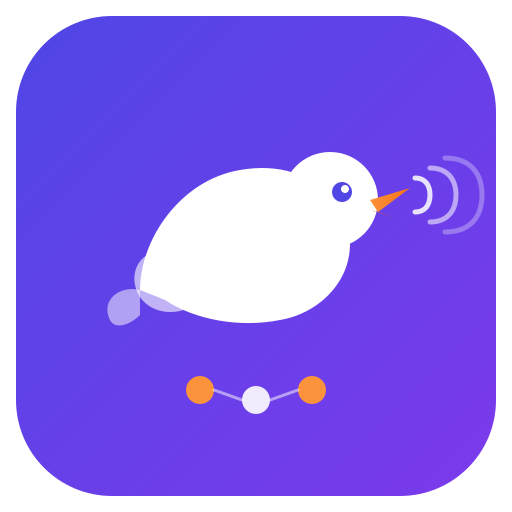
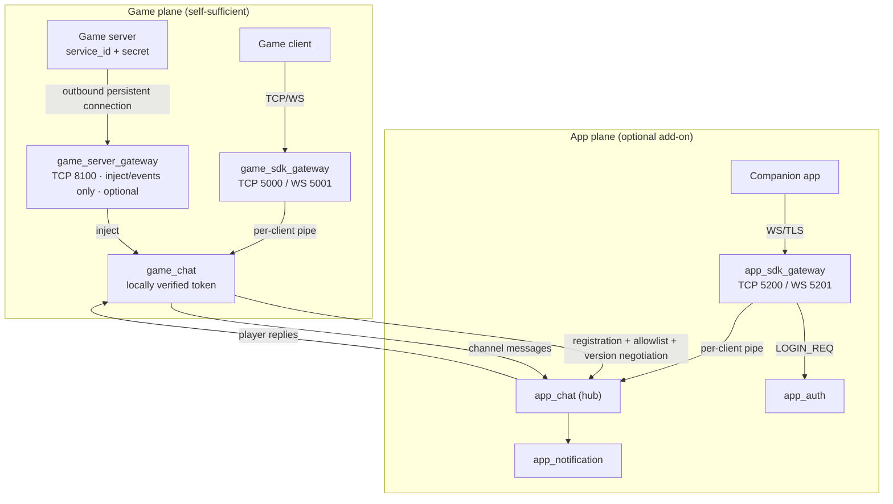

[English](README.md) | [中文](README.zh.md)

<p align="center">
  
</p>

<h1 align="center">chirp</h1>

<p align="center">

[](https://github.com/cuihairu/chirp/actions/workflows/ci.yml)
[](https://codecov.io/gh/cuihairu/chirp)


</p>

## Demo Site

Live demo (web chat, deployed automatically from `main`): **<https://chirp.cuihairu.site/chat>** — scaffold login, any user ID gets in directly; a sandbox demo account for the password login path (SDK / protocol integration testing) is available: `demo` / `Demo-58610c42c9950348d2234db2`.

## Why This Project Exists

When a game team wants to bring "player connections" into their own game, they typically have to build out a real-time communication stack themselves: login sessions, heartbeat-driven kick, direct and group messaging, offline messages, push notifications, and perhaps an NPC conversation channel on top. None of this relates to gameplay logic, yet every game ends up rewriting it.

chirp is built to address exactly this. The design goals, in priority order:

1. **Fast integration for games**. Clients connect over TCP/WebSocket + Protobuf persistent connections; game servers integrate through a dedicated server plane (outbound persistent connections + service credentials), with no need to expose callback ports — a few commands bring the services up for integration testing.
2. **Connecting the companion app with the game**. While players are outside the game, they can chat with in-game friends, and receive voice and party invitations through the app; in-game events are pushed to the app via the server plane (push bridging is planned).
3. **In-game NPC AI chat**. Game servers can inject messages into channels or to individuals as non-user identities (SYSTEM / NPC / SERVICE), reserving a channel for NPC dialogue, system announcements, and trade status broadcasts.
4. **Social features as standalone services**. Chat, party, and friends should not be wheels every game rebuilds; chirp packages them as independently deployable, opt-in services.

## Technical Foundation

chirp is built on the following open-source components; see `vcpkg.json` for the full dependency list:

- **Network I/O**: [asio](https://think-async.com/) provides the TCP/WebSocket server and client; TLS goes through [OpenSSL](https://www.openssl.org/) (the TLS server/session in `libs/network`, and the push channel's HTTPS client share the same source).
- **Wire protocol**: [Protocol Buffers](https://protobuf.dev/). Defined in `proto/`, with protoc generating C++/Go/TypeScript/C#/Java bindings; the TypeScript runtime uses [protobufjs](https://github.com/protobufjs/protobuf.js), and Go uses [protobuf-go](https://github.com/protocolbuffers/protobuf-go).
- **Storage**: MySQL/MariaDB for profiles via [libmariadb](https://github.com/mariadb-corporation/mariadb-connector-c); Redis for sessions, caching, and offline queues — the RESP client in `libs/network` is written in this repository rather than pulling in a third-party Redis SDK.
- **Optional crypto**: libsodium (the auxiliary authentication path in `app_auth`).
- **Build & dependencies**: CMake + Ninja, with [vcpkg](https://vcpkg.io/) for dependency management; abseil comes in with the protobuf runtime.
- **Web companion app**: [React](https://react.dev/) 18 + MUI; the protocol layer is `@chirp/app-protocol`, written in this repository.

What this repository itself contains: the protocol definitions, the gateway/auth/chat and other service implementations, the integration layers of the SDKs in each language, and all of the tests.

## Current State

To be candid: chirp is currently a **runnable core communication skeleton plus a set of experimental extensions** — not a complete product in which every directory is equally mature.

- The mature main line is `gateway + auth + chat`: login, heartbeat, session binding, direct messages, groups, history, and offline queues, covered by 44 unit test suites under `tests/unit` with 100% line coverage (CI enforces the 100% threshold as a hard gate, except for lines registered in the `KNOWN_UNCOVERABLE` exemption tables; `scripts/run_coverage.sh` reproduces this locally).
- The server plane `server_gateway` (game server integration) hub and the chat-side injection consumption are both implemented and fully covered (process-level end-to-end verification via `./test_services.sh --smoke-npc`); they are marked as experimental.
- The rest (`social`, `voice`, `notification`, the multi-platform SDKs, mobile clients, admin dashboard) vary in completeness and should not be presented externally as stable capabilities. See the [capability matrix](docs/CAPABILITY_MATRIX.md) for the actual status.

## Two Planes, One Protocol

The game plane and the app plane are two independently deployed systems, each with its own edge and its own chat; cross-plane communication is a native chat capability — two `chirp_chat` instances connect directly, with the built-in registration protocol, version negotiation, and allowlist mechanism handling onboarding. No external bridging process is required. The game plane is self-sufficient and does not depend on any app-plane component.


```mermaid
flowchart TB
    Game["Game client"]
    App["Companion app"]
    GS["Game server<br/>service_id + secret"]

    subgraph gp["Game plane (self-sufficient)"]
        GG["game_sdk_gateway<br/>TCP 5000 / WS 5001"]
        GCHAT["game_chat<br/>locally verified token"]
        SG["game_server_gateway<br/>TCP 8100 · inject/events only · optional"]
        GG -->|per-client pipe| GCHAT
        SG -->|inject| GCHAT
        Game -- "TCP/WS" --> GG
        GS -- "outbound persistent connection" --> SG
    end

    subgraph ap["App plane (optional add-on)"]
        AG["app_sdk_gateway<br/>TCP 5200 / WS 5201"]
        ACHAT["app_chat (hub)"]
        APPAUTH["app_auth"]
        NOTIF["app_notification"]
        AG -->|per-client pipe| ACHAT
        AG -->|LOGIN_REQ| APPAUTH
        ACHAT --> NOTIF
        App -- "WS/TLS" --> AG
    end

    GCHAT -->|"registration + allowlist + version negotiation"| ACHAT
    GCHAT -->|"channel messages"| ACHAT
    ACHAT -->|"player replies"| GCHAT
```

The two planes are decoupled: on the game plane, tokens are issued by the game backend and verified locally by game_chat, with no external authentication dependency; on the app plane, authentication is handled independently by `app_auth`. Cross-plane communication uses chat's native trusted-peer protocol, with `app_chat` acting as the hub controlling access through allowlists and version negotiation. See the [architecture overview](docs/architecture.md) for details.

| Service | Default Port | Status | Purpose |
| --- | --- | --- | --- |
| game_sdk_gateway | TCP 5000 / WS 5001 | Supported | Game client edge: login, logout, heartbeat, session binding, optional Redis cross-instance kick |
| game_chat | TCP 7000 / WS 7001 | Supported | In-game chat: direct messages, groups, read receipts, typing indicators, emoji reactions, message edit/delete, @mentions, history, offline queues. Locally verified token (--token_secret), no external authentication dependency |
| game_server_gateway | TCP 8100 | Experimental | Game backend injection hub: outbound persistent connection + credential onboarding, injects system/NPC messages, event offline queuing and redelivery on reconnect until acked. Optional |
| app_auth | TCP 6000 | Supported | App-plane authentication: issues/verifies platform user tokens (player_id JWT), serving the app plane only |
| app_sdk_gateway | TCP 5200 / WS 5201 | Experimental | App access edge: login/heartbeat/session binding + device message forwarding to app_notification |
| app_chat | — | Experimental | App-plane hub: accepts game_chat registrations, aggregates cross-game channels, identity binding, channel subscriptions, unread counts |
| app_notification | TCP 5006 / WS 5016 | Experimental | Backend push: device register/unregister/token update/query (6xxx), APNs/FCM offline push |
| chirp_search | TCP 5007 | Supported | Message search service: SQLite FTS5 index, MySQL full backfill + id-cursor incremental sync, 2248/2249 composite-cursor pagination, graceful degradation without kick |

## What to Read First

- [Core notes](docs/CORE.md): currently working paths, service boundaries, protocols, and local verification commands
- [Capability matrix](docs/CAPABILITY_MATRIX.md): the actual completion status of each service, SDK, and app
- [Architecture overview](docs/architecture.md): two-plane separation, zero dependencies, hub-spoke integration model, registration protocol and allowlist
- [Server plane](docs/server_plane.md): the game server integration contract
- [API overview](docs/api/overview.md): the Packet protocol, message IDs, and core flows
- [Getting started](docs/guide/getting-started.md): build, Docker Compose, smoke tests

## One-Command Install

Install the latest daily build (unsigned, for integration testing only); the script auto-detects OS and architecture, and re-running it upgrades in place (idempotent):

```bash
# Linux / macOS
curl -fsSL https://raw.githubusercontent.com/cuihairu/chirp/main/install.sh | bash
```

```powershell
# Windows (PowerShell)
irm https://raw.githubusercontent.com/cuihairu/chirp/main/install.ps1 | iex
```

By default this installs the desktop chat app (Linux x86_64/aarch64; with root it uses `dpkg -i`, without root it unpacks into `~/.local`); `--component app|cpp|go|ts|all` (default `app`) selects the component — cpp installs the C++ core SDK (`--prefix`), go installs the Go SDK source package (`--install-dir`), ts installs the `@chirp/protocol` npm package. Platforms without artifacts (darwin/windows, armv7, and similar) fail with an explicit error (build matrix in [nightly.yml](.github/workflows/nightly.yml), available artifacts in [nightly-dist/manifest.json](https://github.com/cuihairu/chirp/tree/nightly-dist)). Downloads are served from the `nightly-dist` branch mirror, directly linkable without login.

## Getting Started

The platform target is Linux (CI runs Linux only). Dependencies: CMake 3.21+, C++23, Protocol Buffers. Docker, MySQL, and libsodium are optional enhancements.

```bash
./gen_proto.sh
cmake --preset dev
cmake --build --preset dev
ctest --preset dev
```

Minimal build:

```bash
cmake --preset minimal
cmake --build --preset minimal
```

Smoke tests:

```bash
./test_services.sh --smoke       # auth + gateway + TCP/WS login
./test_services.sh --smoke-chat  # chat + chat clients
./test_services.sh --smoke-sdk   # game client SDK (sdks/core) + chat: login/bidirectional send-receive/offline queue
./test_services.sh --smoke-npc   # server plane + NPC dialogue loop
./test_services.sh --smoke-edge  # gateway absorbing the chat direct-connection entry (trusted bridge + pipe forwarding)
./test_services.sh --smoke-jwt   # unified login: full JWT chain, scaffold rejected
./test_services.sh --smoke-redis # Redis session/kick path
./test_services.sh --smoke-game  # pure game plane: gateway scaffold login + chat bridge
./test_services.sh --smoke-voice # voice plane: real chirp_voice room lifecycle
./test_services.sh --smoke-party # party plane: real chirp_party snapshot lifecycle
```

Docker Compose (container orchestration):

```bash
docker compose up --build
```

## Protocol Essentials

TCP and WebSocket share the same binary payload:

```text
[uint32_be payload_size][chirp.gateway.Packet protobuf bytes]
```

Business envelopes are defined in `proto/gateway.proto`:

- `msg_id`: message type, segmented by integration plane — 1xxx auth/session, 2xxx chat, 3xxx social, 4xxx voice, 5xxx server plane, 6xxx push/devices, 7xxx party
- `sequence`: request sequence number, used to match responses
- `body`: the concrete business protobuf bytes, e.g. `chirp.auth.LoginRequest`, `chirp.game_server_gateway.MessageInjectRequest`

## Current Boundaries

- When the SDK gateway is configured with `--chat_host`, client chat business packets (2xxx) are forwarded frame by frame to chat through a per-client pipe (chat replays the login for authentication on its side; a chat bridge disconnect kicks clients per the existing semantics). 2248 search packets are intercepted ahead of the 2xxx wildcard: when `--search_host` (default 5007) is configured they are forwarded to the search service, a failed search bridge degrades back to `SERVER_UNAVAILABLE` without kicking the client, and when unconfigured they fall back to the chat wildcard. social (3xxx) / voice (4xxx) are not on the forwarding path; without `--chat_host` configured, 2xxx packets are not forwarded.
- Gateway login and chat-side authentication are two independent gates — pipe forwarding replays the login on the chat side, while connecting directly to chat still requires authenticating yourself.
- The `server_gateway` injection chain is connected at loopback level (chat consumes `InjectMessageNotify` as an internal node, through the same storage/delivery tail as player-sent messages), and supports a Redis Streams upstream fallback (for game servers that cannot hold persistent connections: `XADD` injection, ack + PEL replay, requires Redis >= 6.2). However, `OK` still only means "the server plane has accepted the request" — player-side delivery is not confirmed. The process-level E2E for the NPC dialogue loop is at `./test_services.sh --smoke-npc`.
- `social`, `voice`, `notification`, the SDKs, mobile clients, and the admin dashboard should not be assumed production-stable by default.
- The web companion app (`apps/web_companion`) is available, on a **direct-connection transitional topology** — the browser connects through five degradable websockets directly to chat (7001)/social (8001)/party (7501)/voice (9001)/app_gateway (5201); friends and presence are served by the server-authoritative social service. See [docs/web_companion.md](docs/web_companion.md) for details.
- `app_sdk_gateway` and the push chain are available with clear boundaries: chat offline messages go through `PushBridge` → `app_notification` to trigger device pushes (all three chat mains are wired; enabled by configuring `--notification_host`); `app_notification` defaults to `--push_transport logging` which only logs, while `--push_transport http` performs real HTTP POST (TLS 1.2+ certificate verification for https endpoints, endpoint overridable via flag); the official APNs endpoint requires HTTP/2, production deployments put a protocol conversion proxy in front of that channel, and wiring up real credentials is left to the deployment environment.
- NPC dialogue is implemented as a keyword rule engine (`services/game/npc_dialog`): player messages to recipients with the `npc:` prefix are converted into `npc.player_message` events sent to the NPC service, and NPC replies travel back to chat over the injection channel (at-least-once; duplicate replies are possible within the hub redelivery window); dialogue quality is a rule table (`*` serves as the default line), with an LLM engine reserved as a swappable interface. The full NPC system described in the design documents ([docs/design-notes/](docs/design-notes/)) is still not the current state.

## Roadmap

Completed milestones:

1. ~~chat integrated into the server plane as an internal node, consuming injected messages, closing the end-to-end injection chain~~ (loopback-level verification + `--smoke-npc` process-level E2E)
2. ~~Redis Streams broker fallback added to the server plane (for game servers that cannot hold persistent connections: ack + replay)~~ (upstream injection only: game server `XADD` → hub consumer group → existing injection chain, see [docs/server_plane.md](docs/server_plane.md))
3. ~~`app_gateway` and push bridging (APNs/FCM, via the notification service)~~ (partially delivered: `app_gateway` 5200/5201, notification protocol plane 5006/5016, chat offline messages triggering pushes; `--push_transport http` performs real HTTP(S) delivery, the official APNs HTTP/2 endpoint needs a protocol conversion proxy in front, wiring up real credentials is left to the deployment environment)
4. ~~NPC dialogue service implemented (injection channel + event channel)~~ (chat recognizes `npc:`-prefixed direct messages and converts them into `npc.player_message` events; the `npc_dialog` service replies via a keyword rule engine and delivers over the injection channel; process-level verification via `./test_services.sh --smoke-npc`)

Current focus and architectural debt (P0 shared-code consolidation, P1 unified login semantics, adding two smoke legs to CI, etc.) are maintained in [TODO.md](TODO.md); this section no longer duplicates them.

## Repository Layout

- `proto/`: protocol definitions (`gateway.proto`, `game_server_gateway.proto`, etc.)
- `libs/common`: logging, JWT/HS256, base64, sha256, and other foundational utilities
- `libs/network`: ASIO TCP/WS server/session, framing, Redis RESP (future I/O backends will be encapsulated here)
- `services/game/sdk_gateway/`: game client edge entry and session capabilities (`game_sdk_gateway`)
- `services/shared/chat/`: chat service (the same `chirp_chat` binary deploys as `game_chat` or `app_chat` by launch arguments; game_chat verifies tokens locally)
- `services/game/server_gateway/`: game backend injection hub (`game_server_gateway`, optional)
- `services/app/sdk_gateway/`: app client edge entry (`app_sdk_gateway`)
- `services/app/auth/`: app-plane authentication (`app_auth`)
- `services/app/notification/`: backend push (`app_notification`)
- `sdks/core`: C++ client integration experiments
- `apps/web_companion`: web companion app (browser side: login/direct messages/groups/friends/presence)
- `tools/benchmark`: local verification tools
- `tests`: unit and integration smoke tests

## License

[Apache License 2.0](LICENSE)
