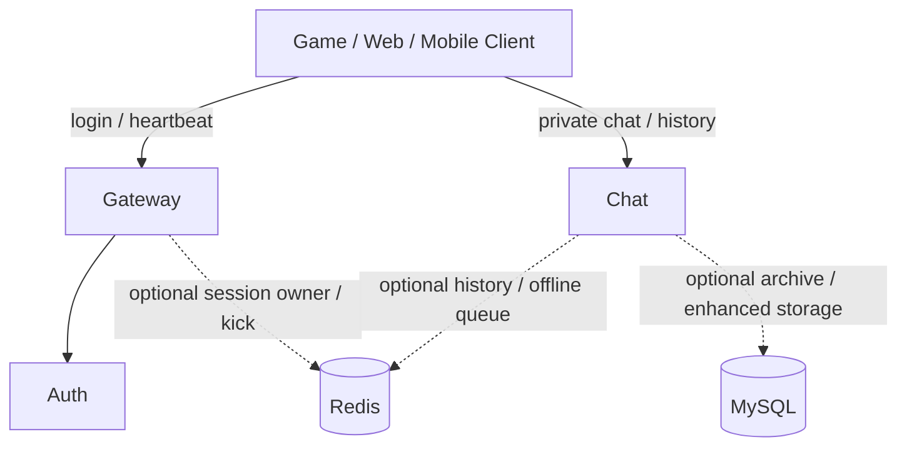

# Chirp Core

This page is the compact source of truth for the current core runtime.

Chirp should currently be understood as a game-oriented realtime communication backend skeleton. The mature path is `gateway + auth + chat`; the rest of the repository is useful for experiments, demos, or future product work.

## Core Runtime

| Service | Default port | Status | Responsibility |
| --- | --- | --- | --- |
| Gateway | TCP 5000 / WS 5001 | Supported | Login, logout, heartbeat, session binding, optional Redis-backed cross-instance kick |
| Auth | TCP 6000 | Supported | Token validation path; enhanced auth is conditional on native dependencies |
| Chat | TCP 7000 / WS 7001 | Supported | Private messages, history, offline queue, optional Redis/MySQL enhanced paths |

Minimal useful topology:



## Current Contract

- Use `gateway` for login, logout, heartbeat, and session-level validation.
- Use `chat` directly for private messages and history.
- Do not assume `gateway` forwards arbitrary business packets yet.
- Do not assume a successful Gateway login automatically authenticates an independent Chat connection.
- Treat Redis and MySQL paths as optional enhancements unless the deployment explicitly enables them.

## Protocol

TCP streams and WebSocket binary frames carry the same application payload:

```text
[uint32_be payload_size][chirp.gateway.Packet protobuf bytes]
```

`chirp.gateway.Packet` is the business envelope:

```protobuf
message Packet {
  MsgID msg_id = 1;
  int64 sequence = 2;
  bytes body = 3;
}
```

Important mappings:

| Packet `msg_id` | Packet `body` |
| --- | --- |
| `LOGIN_REQ` | `chirp.auth.LoginRequest` |
| `LOGIN_RESP` | `chirp.auth.LoginResponse` |
| `HEARTBEAT_PING` | `chirp.gateway.HeartbeatPing` |
| `HEARTBEAT_PONG` | `chirp.gateway.HeartbeatPong` |
| `SEND_MESSAGE_REQ` | `chirp.chat.SendMessageRequest` |
| `SEND_MESSAGE_RESP` | `chirp.chat.SendMessageResponse` |
| `GET_HISTORY_REQ` | `chirp.chat.GetHistoryRequest` |
| `GET_HISTORY_RESP` | `chirp.chat.GetHistoryResponse` |
| `CHAT_MESSAGE_NOTIFY` | `chirp.chat.ChatMessage` |

## Local Verification

```bash
./gen_proto.sh
cmake --preset dev
cmake --build --preset dev
ctest --preset dev
```

Smoke tests:

```bash
./test_services.sh --smoke
./test_services.sh --smoke-chat
./test_services.sh --smoke-redis
```

Docker Compose:

```bash
docker compose up --build
```

For first validation, focus on `redis`, `auth`, `gateway`, and `chat`.

## Non-Core Areas

These areas exist in the repository but should not be presented as stable core capability without checking current code and tests:

- `services/social`
- `services/voice`
- `services/notification`
- `services/search`
- `sdks/core`, `sdks/unity`, `sdks/unreal`
- `apps/mobile_companion`
- `apps/admin_dashboard`
- NPC dialog system design
- distributed chat alternate targets and scalability examples

Use [Capability Matrix](./CAPABILITY_MATRIX.md) as the status source of truth.

## Detail Pages

- [Getting Started](./guide/getting-started.md)
- [API Overview](./api/overview.md)
- [Overall Architecture](./architecture.md)
- [Capability Matrix](./CAPABILITY_MATRIX.md)
