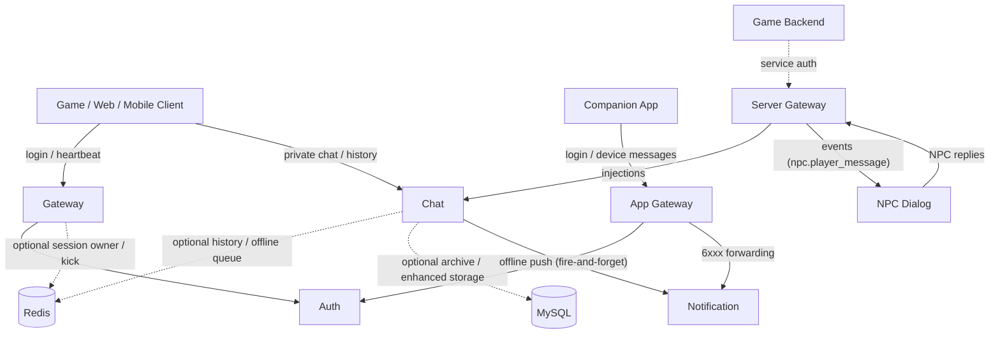

# Chirp Core

This page is the compact source of truth for the current core runtime.

Chirp should currently be understood as a game-oriented realtime communication backend skeleton. The mature path is `gateway + auth + chat`; the rest of the repository is useful for experiments, demos, or future product work.

## Core Runtime

| Service | Default port | Status | Responsibility |
| --- | --- | --- | --- |
| Gateway | TCP 5000 / WS 5001 | Supported | Login, logout, heartbeat, session binding, optional Redis-backed cross-instance kick |
| Auth | TCP 6000 | Supported | Token validation path; enhanced auth is conditional on native dependencies |
| Chat | TCP 7000 / WS 7001 | Supported | Private messages, groups, history, offline queue, optional Redis/MySQL enhanced paths |
| Server Gateway | TCP 8100 | Experimental | Trusted service-plane hub: game backends authenticate with `service_id` + secret, inject system/NPC messages, and receive events queued until acked |
| NPC Dialog | no listener | Experimental | Server-plane client: answers `npc.player_message` events with keyword-rule replies injected back into chat (see [server_plane.md](./server_plane.md)) |
| Notification | TCP 5006 / WS 5016 | Experimental | Device registry and push plane (6xxx); provider HTTP delivery is a logging `PushTransport` stub |
| App Gateway | TCP 5200 / WS 5201 | Experimental | Companion-app edge: login/heartbeat/session binding plus device-message forwarding to Notification (authenticated sessions only). |

Minimal useful topology:


```mermaid
graph TD
    Client[Game / Web / Mobile Client]
    Client -- login / heartbeat --> Gateway[Gateway]
    Gateway --> Auth[Auth]
    Gateway -. optional session owner / kick .-> Redis[(Redis)]

    Client -- private chat / history --> Chat[Chat]
    Chat -. optional history / offline queue .-> Redis
    Chat -. optional archive / enhanced storage .-> MySQL[(MySQL)]
    Chat -- offline push (fire-and-forget) --> Notification[Notification]

    App[Companion App] -- login / device messages --> AppGateway[App Gateway]
    AppGateway --> Auth
    AppGateway -- 6xxx forwarding --> Notification

    GameBackend[Game Backend] -. service auth .-> ServerGateway[Server Gateway]
    ServerGateway -- injections --> Chat
    ServerGateway -- events (npc.player_message) --> NpcDialog[NPC Dialog]
    NpcDialog -- NPC replies --> ServerGateway
```

## Current Contract

- Use `gateway` for login, logout, heartbeat, and session-level validation.
- Use `chat` directly for private messages and history.
- Do not assume `gateway` forwards arbitrary business packets yet.
- Do not assume a successful Gateway login automatically authenticates an independent Chat connection.
- Treat Redis and MySQL paths as optional enhancements unless the deployment explicitly enables them.

## Protocol

TCP streams and WebSocket binary frames carry the same application payload:

```text
[uint32_be payload_size][chirp.gateway.Packet protobuf bytes]
```

`chirp.gateway.Packet` is the business envelope:

```protobuf
message Packet {
  MsgID msg_id = 1;
  int64 sequence = 2;
  bytes body = 3;
}
```

Important mappings:

| Packet `msg_id` | Packet `body` |
| --- | --- |
| `LOGIN_REQ` | `chirp.auth.LoginRequest` |
| `LOGIN_RESP` | `chirp.auth.LoginResponse` |
| `HEARTBEAT_PING` | `chirp.gateway.HeartbeatPing` |
| `HEARTBEAT_PONG` | `chirp.gateway.HeartbeatPong` |
| `SEND_MESSAGE_REQ` | `chirp.chat.SendMessageRequest` |
| `SEND_MESSAGE_RESP` | `chirp.chat.SendMessageResponse` |
| `GET_HISTORY_REQ` | `chirp.chat.GetHistoryRequest` |
| `GET_HISTORY_RESP` | `chirp.chat.GetHistoryResponse` |
| `CHAT_MESSAGE_NOTIFY` | `chirp.chat.ChatMessage` |
| `MARK_READ_REQ` | `chirp.chat.MarkReadRequest` |
| `MARK_READ_RESP` | `chirp.chat.MarkReadResponse` |
| `GET_READ_RECEIPTS_REQ` | `chirp.chat.GetReadReceiptsRequest` |
| `GET_READ_RECEIPTS_RESP` | `chirp.chat.GetReadReceiptsResponse` |
| `GET_UNREAD_COUNT_REQ` | `chirp.chat.GetUnreadCountRequest` |
| `GET_UNREAD_COUNT_RESP` | `chirp.chat.GetUnreadCountResponse` |
| `MESSAGE_READ_NOTIFY` | `chirp.chat.MessageReadNotify` |
| `TYPING_INDICATOR_NOTIFY` | `chirp.chat.TypingIndicator` |
| `GET_TYPING_USERS_REQ` | `chirp.chat.GetTypingUsersRequest` |
| `GET_TYPING_USERS_RESP` | `chirp.chat.GetTypingUsersResponse` |
| `ADD_REACTION_REQ` | `chirp.chat.AddReactionRequest` |
| `ADD_REACTION_RESP` | `chirp.chat.AddReactionResponse` |
| `REMOVE_REACTION_REQ` | `chirp.chat.RemoveReactionRequest` |
| `REMOVE_REACTION_RESP` | `chirp.chat.RemoveReactionResponse` |
| `GET_REACTIONS_REQ` | `chirp.chat.GetReactionsRequest` |
| `GET_REACTIONS_RESP` | `chirp.chat.GetReactionsResponse` |
| `REACTION_ADDED_NOTIFY` | `chirp.chat.ReactionAddedNotify` |
| `REACTION_REMOVED_NOTIFY` | `chirp.chat.ReactionRemovedNotify` |
| `EDIT_MESSAGE_REQ` | `chirp.chat.EditMessageRequest` |
| `EDIT_MESSAGE_RESP` | `chirp.chat.EditMessageResponse` |
| `DELETE_MESSAGE_REQ` | `chirp.chat.DeleteMessageRequest` |
| `DELETE_MESSAGE_RESP` | `chirp.chat.DeleteMessageResponse` |
| `BULK_DELETE_REQ` | `chirp.chat.BulkDeleteRequest` |
| `BULK_DELETE_RESP` | `chirp.chat.BulkDeleteResponse` |
| `MESSAGE_EDITED_NOTIFY` | `chirp.chat.MessageEditedNotify` |
| `MESSAGE_DELETED_NOTIFY` | `chirp.chat.MessageDeletedNotify` |
| `GET_MENTION_SUGGESTIONS_REQ` | `chirp.chat.GetMentionSuggestionsRequest` |
| `GET_MENTION_SUGGESTIONS_RESP` | `chirp.chat.GetMentionSuggestionsResponse` |

Note: `TYPING_INDICATOR_NOTIFY` is inbound-only from clients (the server never
replies on that connection; it broadcasts to the other channel members) and
server-pushed typing/reaction/read/edit/delete notifications use sequence `0`.
Messages carry a 15-minute edit window and soft delete by default; moderator
rights come from group roles (MODERATOR and above). @everyone/@here mentions
share a per-user, per-channel cooldown and are rejected with `AUTH_FAILED`
while cooling down.

Direct-entry rate limiting: `chirp_chat` counts login attempts per client IP
(default 30/minute) and validated message sends per user (default 120/minute)
in fixed 60s Redis-backed windows. Any Redis failure fails open (the limiter
is inert without `--redis_host`); denials are answered with `RATE_LIMITED`
(`common.ErrorCode = 8`). Thresholds are configurable via
`--login_rate_limit_per_min` / `--send_rate_limit_per_min`.

### Server plane (5xxx)

`chirp_server_gateway` (TCP 8100) speaks the same Packet framing on a separate
trust plane: peers are game backends and internal services authenticated by
`service_id` + secret — never user accounts. See
[Server Plane](./server_plane.md) for the full contract.

| Packet `msg_id` | Packet `body` |
| --- | --- |
| `SERVER_AUTH_REQ` | `chirp.server_gateway.ServerAuthRequest` |
| `SERVER_AUTH_RESP` | `chirp.server_gateway.ServerAuthResponse` |
| `SERVER_HEARTBEAT_PING` / `PONG` | `chirp.server_gateway.ServerHeartbeatPing` / `Pong` |
| `INJECT_MESSAGE_REQ` | `chirp.server_gateway.MessageInjectRequest` |
| `INJECT_MESSAGE_RESP` | `chirp.server_gateway.MessageInjectResponse` |
| `INJECT_MESSAGE_NOTIFY` | `chirp.server_gateway.InjectMessageNotify` (hub -> chat) |
| `EVENT_PUBLISH_REQ` | `chirp.server_gateway.EventPublishRequest` |
| `EVENT_PUBLISH_RESP` | `chirp.server_gateway.EventPublishResponse` |
| `EVENT_DELIVER_NOTIFY` | `chirp.server_gateway.EventDeliverNotify` (hub -> target service) |
| `EVENT_ACK_REQ` / `RESP` | `chirp.server_gateway.EventAckRequest` / `Response` |

Status: Experimental — handlers and the chat-side consumption of
`INJECT_MESSAGE_NOTIFY` are unit-verified, and the NPC loop has a process-level
E2E smoke (`./test_services.sh --smoke-npc`). Events are at-least-once: queued
while the target is offline and redelivered on reconnect until acked.

### Notification / device plane (6xxx)

`chirp_notification` (TCP 5006 / WS 5016) owns the device registry and push
dispatch. `chirp_app_gateway` (TCP 5200 / WS 5201) forwards these messages
for authenticated app sessions with `user_id` pinned to the session owner.

| Packet `msg_id` | Packet `body` |
| --- | --- |
| `REGISTER_DEVICE_REQ` / `RESP` | `chirp.notification.RegisterDeviceRequest` / `RegisterDeviceResponse` |
| `UNREGISTER_DEVICE_REQ` / `RESP` | `chirp.notification.UnregisterDeviceRequest` / `UnregisterDeviceResponse` |
| `UPDATE_DEVICE_TOKEN_REQ` / `RESP` | `chirp.notification.UpdateDeviceTokenRequest` / `UpdateDeviceTokenResponse` |
| `GET_USER_DEVICES_REQ` / `RESP` | `chirp.notification.GetUserDevicesRequest` / `GetUserDevicesResponse` |
| `PUSH_NOTIFICATION_REQ` / `RESP` | `chirp.notification.PushNotificationRequest` / `PushNotificationResponse` |

Ids 6011+ are reserved (badge / silent / preferences). Provider HTTP delivery
(APNs HTTP/2 / FCM HTTP) is behind a `PushTransport` seam currently backed by
a logging stub; chat enqueues offline-message pushes through this plane only
in the default `chirp_chat` build.

## Local Verification

```bash
./gen_proto.sh
cmake --preset dev
cmake --build --preset dev
ctest --preset dev
```

Line coverage (rebuilds `build-cov`, runs all suites, fails under 98% per package):

```bash
scripts/run_coverage.sh
```

Smoke tests:

```bash
./test_services.sh --smoke
./test_services.sh --smoke-chat
./test_services.sh --smoke-sdk
./test_services.sh --smoke-npc
./test_services.sh --smoke-redis
```

Docker Compose:

```bash
docker compose up --build
```

For first validation, focus on `redis`, `auth`, `gateway`, and `chat`.

## Non-Core Areas

These areas exist in the repository but should not be presented as stable core capability without checking current code and tests:

- `services/social`
- `services/voice`
- `services/notification`
- `services/search`
- `services/server_gateway` (unit-verified protocol incl. chat-side injection consumption; NPC dialog loop has a process-level smoke)
- `sdks/core`, `sdks/unity`, `sdks/unreal`
- `apps/mobile_companion`
- `apps/admin_dashboard`
- NPC dialog system design (the landed keyword-rule service in `services/npc_dialog` is narrower; the design notes describe the fuller vision)
- distributed chat alternate targets and scalability examples

Use [Capability Matrix](./CAPABILITY_MATRIX.md) as the status source of truth.

## Detail Pages

- [Getting Started](./guide/getting-started.md)
- [API Overview](./api/overview.md)
- [Overall Architecture](./architecture.md)
- [Capability Matrix](./CAPABILITY_MATRIX.md)
