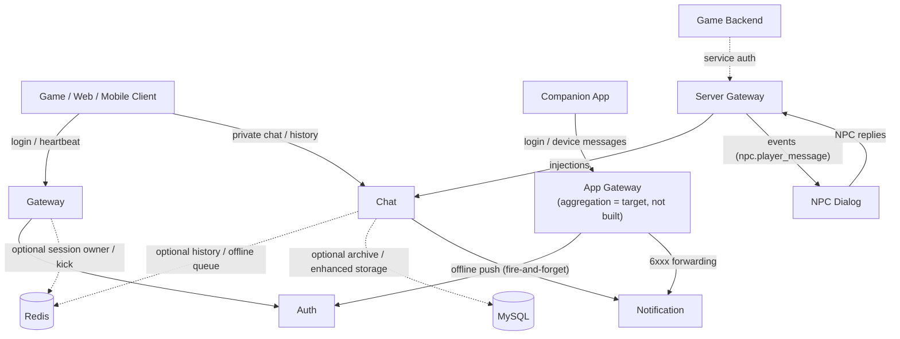

# Chirp 核心

本页是当前核心运行时的浓缩版事实来源。

目前应当把 Chirp 理解为一个面向游戏的实时通信后端骨架。成熟路径是 `gateway + auth + chat`;仓库其余部分可用于实验、演示或后续产品化工作。

## 核心运行时

| 服务 | 默认端口 | 状态 | 职责 |
| --- | --- | --- | --- |
| Gateway | TCP 5000 / WS 5001 | Supported | 登录、登出、心跳、会话绑定,可选的 Redis 支撑跨实例踢线 |
| Auth | TCP 6000 | Supported | token 校验路径;增强版 auth 依赖本地库,是条件性的 |
| Chat | TCP 7000 / WS 7001 | Supported | 私聊、群组、历史、离线队列,可选的 Redis/MySQL 增强路径 |
| Server Gateway | TCP 8100 | Experimental | 可信服务面枢纽:游戏后端用 `service_id` + secret 认证,注入系统/NPC 消息,并接收排队到 ack 为止的事件 |
| NPC Dialog | 无监听 | Experimental | server plane 客户端:用关键词规则回复 `npc.player_message` 事件,并把回复注回 chat(见 [server_plane.md](./server_plane.md)) |
| Notification | TCP 5006 / WS 5016 | Experimental | 设备注册表与推送面(6xxx);provider HTTP 投递目前是记日志的 `PushTransport` 占位 |
| App Gateway | TCP 5200 / WS 5201 | Experimental | 伴侣应用边缘:登录/心跳/会话绑定,外加设备消息转发到 Notification(仅限已认证会话)。今天只有连接骨架——目标是**玩家聚合面**:一个玩家身份关联多个游戏(跨游戏频道订阅、聚合的游戏内聊天、跨游戏语音组队);见 [architecture.md](./architecture.md) 的"Game-facing plane vs player aggregation plane" |

最小可用拓扑:


```mermaid
graph TD
    Client[Game / Web / Mobile Client]
    Client -- login / heartbeat --> Gateway[Gateway]
    Gateway --> Auth[Auth]
    Gateway -. optional session owner / kick .-> Redis[(Redis)]

    Client -- private chat / history --> Chat[Chat]
    Chat -. optional history / offline queue .-> Redis
    Chat -. optional archive / enhanced storage .-> MySQL[(MySQL)]
    Chat -- offline push (fire-and-forget) --> Notification[Notification]

    App[Companion App] -- login / device messages --> AppGateway["App Gateway<br/>(aggregation = target, not built)"]
    AppGateway --> Auth
    AppGateway -- 6xxx forwarding --> Notification

    GameBackend[Game Backend] -. service auth .-> ServerGateway[Server Gateway]
    ServerGateway -- injections --> Chat
    ServerGateway -- events (npc.player_message) --> NpcDialog[NPC Dialog]
    NpcDialog -- NPC replies --> ServerGateway
```

## 当前契约

- 登录、登出、心跳和会话级校验走 `gateway`。
- 私聊和历史直接走 `chat`。
- 不要假设 `gateway` 会转发任意业务包——还不能。
- 不要假设 Gateway 登录成功就自动认证了一条独立的 Chat 连接——两回事。
- 游戏面(game plane)和应用面(app plane)是两套独立系统:各自有自己的 chat(`game_chat` / `app_chat`,同一二进制、分开部署)和自己的边缘。游戏面完全自洽:游戏后端签发 token,`game_chat` 本地校验(`--token_secret`),不依赖外部 auth。应用面有自己的 auth(`app_auth`)。跨面通信是 chat 的内建能力:`game_chat` 用原生 peer 注册协议(带白名单与版本协商)注册进 `app_chat`——见 [architecture.md](./architecture.md)。
- Redis 和 MySQL 路径一律视为可选增强,除非部署明确启用。

## 协议

TCP 流和 WebSocket 二进制帧承载同一份应用载荷:

```text
[uint32_be payload_size][chirp.gateway.Packet protobuf bytes]
```

`chirp.gateway.Packet` 是业务信封:

```protobuf
message Packet {
  MsgID msg_id = 1;
  int64 sequence = 2;
  bytes body = 3;
}
```

重要映射:

| Packet `msg_id` | Packet `body` |
| --- | --- |
| `LOGIN_REQ` | `chirp.auth.LoginRequest` |
| `LOGIN_RESP` | `chirp.auth.LoginResponse` |
| `HEARTBEAT_PING` | `chirp.gateway.HeartbeatPing` |
| `HEARTBEAT_PONG` | `chirp.gateway.HeartbeatPong` |
| `SEND_MESSAGE_REQ` | `chirp.chat.SendMessageRequest` |
| `SEND_MESSAGE_RESP` | `chirp.chat.SendMessageResponse` |
| `GET_HISTORY_REQ` | `chirp.chat.GetHistoryRequest` |
| `GET_HISTORY_RESP` | `chirp.chat.GetHistoryResponse` |
| `CHAT_MESSAGE_NOTIFY` | `chirp.chat.ChatMessage` |
| `MARK_READ_REQ` | `chirp.chat.MarkReadRequest` |
| `MARK_READ_RESP` | `chirp.chat.MarkReadResponse` |
| `GET_READ_RECEIPTS_REQ` | `chirp.chat.GetReadReceiptsRequest` |
| `GET_READ_RECEIPTS_RESP` | `chirp.chat.GetReadReceiptsResponse` |
| `GET_UNREAD_COUNT_REQ` | `chirp.chat.GetUnreadCountRequest` |
| `GET_UNREAD_COUNT_RESP` | `chirp.chat.GetUnreadCountResponse` |
| `MESSAGE_READ_NOTIFY` | `chirp.chat.MessageReadNotify` |
| `TYPING_INDICATOR_NOTIFY` | `chirp.chat.TypingIndicator` |
| `GET_TYPING_USERS_REQ` | `chirp.chat.GetTypingUsersRequest` |
| `GET_TYPING_USERS_RESP` | `chirp.chat.GetTypingUsersResponse` |
| `ADD_REACTION_REQ` | `chirp.chat.AddReactionRequest` |
| `ADD_REACTION_RESP` | `chirp.chat.AddReactionResponse` |
| `REMOVE_REACTION_REQ` | `chirp.chat.RemoveReactionRequest` |
| `REMOVE_REACTION_RESP` | `chirp.chat.RemoveReactionResponse` |
| `GET_REACTIONS_REQ` | `chirp.chat.GetReactionsRequest` |
| `GET_REACTIONS_RESP` | `chirp.chat.GetReactionsResponse` |
| `REACTION_ADDED_NOTIFY` | `chirp.chat.ReactionAddedNotify` |
| `REACTION_REMOVED_NOTIFY` | `chirp.chat.ReactionRemovedNotify` |
| `EDIT_MESSAGE_REQ` | `chirp.chat.EditMessageRequest` |
| `EDIT_MESSAGE_RESP` | `chirp.chat.EditMessageResponse` |
| `DELETE_MESSAGE_REQ` | `chirp.chat.DeleteMessageRequest` |
| `DELETE_MESSAGE_RESP` | `chirp.chat.DeleteMessageResponse` |
| `BULK_DELETE_REQ` | `chirp.chat.BulkDeleteRequest` |
| `BULK_DELETE_RESP` | `chirp.chat.BulkDeleteResponse` |
| `MESSAGE_EDITED_NOTIFY` | `chirp.chat.MessageEditedNotify` |
| `MESSAGE_DELETED_NOTIFY` | `chirp.chat.MessageDeletedNotify` |
| `GET_MENTION_SUGGESTIONS_REQ` | `chirp.chat.GetMentionSuggestionsRequest` |
| `GET_MENTION_SUGGESTIONS_RESP` | `chirp.chat.GetMentionSuggestionsResponse` |

注意:`TYPING_INDICATOR_NOTIFY` 只有客户端入站这一种用法(服务端不在该连接上回复,
而是广播给频道内其他成员);服务端推送的 typing/reaction/read/edit/delete 通知都
用 sequence `0`。消息默认带 15 分钟编辑窗口和软删除;管理员权限来自群角色
(MODERATOR 及以上)。@everyone/@here 提及共享按用户、按频道的冷却,冷却期内以
`AUTH_FAILED` 拒绝。

直连入口限流:`chirp_chat` 按 60 秒固定窗口统计每客户端 IP 的登录尝试(默认
30 次/分钟)和每用户的已校验发送(默认 120 次/分钟),窗口数据放 Redis。任何
Redis 故障都放行(fail-open;不配 `--redis_host` 时限流器完全不启用);被拒时
以 `RATE_LIMITED`(`common.ErrorCode = 8`)应答。阈值可用
`--login_rate_limit_per_min` / `--send_rate_limit_per_min` 配置。

直连登录 token:不配 `--token_secret` 时,`chirp_chat`(basic 与 distributed
构建一致)保留脚手架式登录(token 字段直接当 user id 用)。配置共享密钥后,
token 必须是用该密钥签名的 HS256 JWT,强制携带 `exp` claim,登录用户放在 `sub`;
校验在 chat 本地完成(`libs/common` 的 JWT 辅助函数),过期/签名错误/缺 claim 的
token 一律 `AUTH_FAILED` 拒绝。登录语义已在 2026-09 拉齐:auth-enhanced 在
`--jwt_secret` 下对 `LOGIN_REQ` 强制同一套 HS256 契约——部署约定是给 auth 和
边缘服务发同一把密钥,客户端的原始 token 经 gateway → chat 管道原样透传
(`--smoke-jwt` 端到端覆盖)。auth 的 scaffold 回退需要 `--allow_scaffold_login 1`
(默认关)。吊销目前仍以 TTL 为界——(Redis 吊销的)混合变体推迟到 P3(TODO.md);
经 `AuthClient` RPC 的 gateway 登录路径不变。

### Server plane(5xxx)

`chirp_game_server_gateway`(TCP 8100)在另一个信任面上讲同一套 Packet 帧:
peer 是游戏后端和内部服务,以 `service_id` + secret 认证——从来不是用户账号。
完整契约见 [Server Plane](./server_plane.md)。

| Packet `msg_id` | Packet `body` |
| --- | --- |
| `SERVER_AUTH_REQ` | `chirp.server_gateway.ServerAuthRequest` |
| `SERVER_AUTH_RESP` | `chirp.server_gateway.ServerAuthResponse` |
| `SERVER_HEARTBEAT_PING` / `PONG` | `chirp.server_gateway.ServerHeartbeatPing` / `Pong` |
| `INJECT_MESSAGE_REQ` | `chirp.server_gateway.MessageInjectRequest` |
| `INJECT_MESSAGE_RESP` | `chirp.server_gateway.MessageInjectResponse` |
| `INJECT_MESSAGE_NOTIFY` | `chirp.server_gateway.InjectMessageNotify`(hub -> chat) |
| `EVENT_PUBLISH_REQ` | `chirp.server_gateway.EventPublishRequest` |
| `EVENT_PUBLISH_RESP` | `chirp.server_gateway.EventPublishResponse` |
| `EVENT_DELIVER_NOTIFY` | `chirp.server_gateway.EventDeliverNotify`(hub -> 目标服务) |
| `EVENT_ACK_REQ` / `RESP` | `chirp.server_gateway.EventAckRequest` / `Response` |

状态:Experimental——处理器与 chat 侧对 `INJECT_MESSAGE_NOTIFY` 的消费已有单测
验证,NPC 闭环另有进程级 E2E 冒烟(`./test_services.sh --smoke-npc`)。事件是
至少一次(at-least-once)语义:目标离线时排队,重连后重投直到 ack。

### Notification / 设备面(6xxx)

`chirp_app_notification`(TCP 5006 / WS 5016)管设备注册表和推送分发。
`chirp_app_sdk_gateway`(TCP 5200 / WS 5201)为已认证的应用会话转发这些消息,
`user_id` 钉死为会话属主。

| Packet `msg_id` | Packet `body` |
| --- | --- |
| `REGISTER_DEVICE_REQ` / `RESP` | `chirp.notification.RegisterDeviceRequest` / `RegisterDeviceResponse` |
| `UNREGISTER_DEVICE_REQ` / `RESP` | `chirp.notification.UnregisterDeviceRequest` / `UnregisterDeviceResponse` |
| `UPDATE_DEVICE_TOKEN_REQ` / `RESP` | `chirp.notification.UpdateDeviceTokenRequest` / `UpdateDeviceTokenResponse` |
| `GET_USER_DEVICES_REQ` / `RESP` | `chirp.notification.GetUserDevicesRequest` / `GetUserDevicesResponse` |
| `PUSH_NOTIFICATION_REQ` / `RESP` | `chirp.notification.PushNotificationRequest` / `PushNotificationResponse` |

6011+ 的 id 预留(角标 / 静默 / 偏好设置)。provider HTTP 投递(APNs HTTP/2 /
FCM HTTP)藏在 `PushTransport` 接缝后面,当前由日志占位支撑;chat 只在默认
`chirp_chat` 构建中经这个面为离线消息入队推送。

## 本地验证

```bash
./gen_proto.sh
cmake --preset dev
cmake --build --preset dev
ctest --preset dev
```

行覆盖(重建 `build-cov`,跑全部套件,任一包低于 98% 即失败):

```bash
scripts/run_coverage.sh
```

冒烟测试:

```bash
./test_services.sh --smoke
./test_services.sh --smoke-chat
./test_services.sh --smoke-sdk
./test_services.sh --smoke-npc
./test_services.sh --smoke-edge
./test_services.sh --smoke-jwt
./test_services.sh --smoke-redis
```

Docker Compose:

```bash
docker compose up --build
```

第一次验证时,关注 `redis`、`auth`、`gateway`、`chat` 这四个即可。

## 非核心区域

这些区域代码在仓库里,但未经核对当前代码与测试之前,不要当成稳定核心能力来介绍:

- `services/social`
- `services/voice`
- `services/notification`
- `services/search`
- `services/game/server_gateway`(协议已单测验证,含 chat 侧注入消费;NPC 对话闭环有进程级冒烟)
- `sdks/core`, `sdks/unity`, `sdks/unreal`
- `apps/mobile_companion`
- `apps/admin_dashboard`
- NPC 对话系统设计(`services/npc_dialog` 落地的关键词规则服务范围更窄;设计笔记描述的是更完整的愿景)
- 分布式聊天的替代目标与可扩展性示例

现状以 [Capability Matrix](./CAPABILITY_MATRIX.md) 为准。

## 细节页面

- [Getting Started](./guide/getting-started.md)
- [API Overview](./api/overview.md)
- [Overall Architecture](./architecture.md)
- [Capability Matrix](./CAPABILITY_MATRIX.md)
