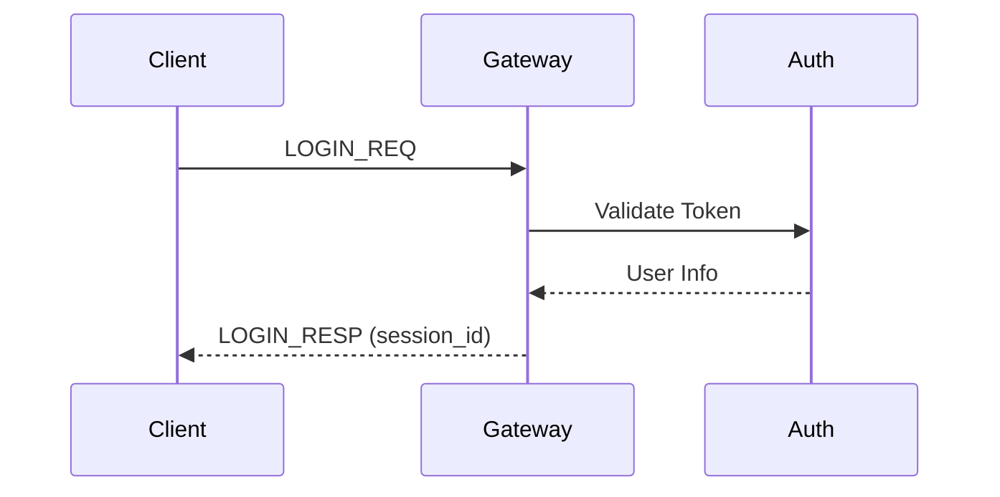
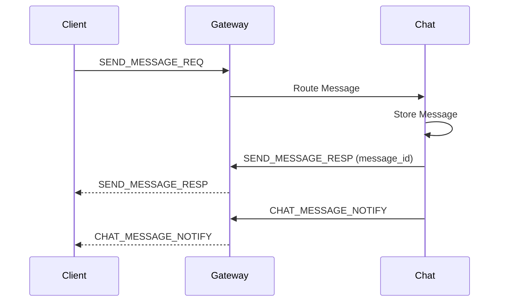

# API Overview

Chirp uses Protocol Buffers for its service protocol. This section provides an overview of the available APIs and how to use them.

## Protocol Basics

### Message Format

All messages use the following packet format:

```
┌───────────────┬───────────────┬───────────────────────┐
│   Length     │   MsgID      │   Protobuf Body       │
│  (4 bytes)   │  (2 bytes)   │   (variable)          │
└───────────────┴───────────────┴───────────────────────┘
```

- **Length**: Total packet length including headers
- **MsgID**: Message type identifier
- **Body**: Protocol Buffers encoded message

### Endpoints

| Service | TCP Port | WebSocket Port |
|---------|----------|----------------|
| Gateway | 5000 | 5001 |
| Auth | 6000 | - |
| Chat | 7000 | 7001 |
| Social | 8000 | 8001 |
| Voice | 9000 | 9001 |
| Notification | 5006 | - |
| Search | 5007 | - |

## Common Message Types

### Gateway Messages

| MsgID | Name | Direction |
|-------|------|-----------|
| 1001 | HEARTBEAT_PING | Client → Server |
| 1002 | HEARTBEAT_PONG | Server → Client |
| 1003 | LOGIN_REQ | Client → Server |
| 1004 | LOGIN_RESP | Server → Client |
| 1005 | KICK_NOTIFY | Server → Client |

### Chat Messages

| MsgID | Name | Direction |
|-------|------|-----------|
| 2001 | SEND_MESSAGE_REQ | Client → Server |
| 2002 | SEND_MESSAGE_RESP | Server → Client |
| 2003 | GET_HISTORY_REQ | Client → Server |
| 2004 | GET_HISTORY_RESP | Server → Client |
| 2005 | CHAT_MESSAGE_NOTIFY | Server → Client |
| 2006 | CREATE_GROUP_REQ | Client → Server |
| 2007 | CREATE_GROUP_RESP | Server → Client |
| 2008 | TYPING_INDICATOR | Bidirectional |

### Social Messages

| MsgID | Name | Direction |
|-------|------|-----------|
| 3001 | ADD_FRIEND_REQ | Client → Server |
| 3002 | ADD_FRIEND_RESP | Server → Client |
| 3003 | FRIEND_REQUEST_NOTIFY | Server → Client |
| 3017 | SET_PRESENCE_REQ | Client → Server |
| 3018 | SET_PRESENCE_RESP | Server → Client |
| 3021 | PRESENCE_NOTIFY | Server → Client |

### Voice Messages

| MsgID | Name | Direction |
|-------|------|-----------|
| 4001 | CREATE_ROOM_REQ | Client → Server |
| 4002 | CREATE_ROOM_RESP | Server → Client |
| 4003 | JOIN_ROOM_REQ | Client → Server |
| 4004 | JOIN_ROOM_RESP | Server → Client |
| 4005 | LEAVE_ROOM_REQ | Client → Server |
| 4006 | LEAVE_ROOM_RESP | Server → Client |
| 4010 | ICE_CANDIDATE_MSG | Bidirectional |
| 4011 | SDP_OFFER_MSG | Bidirectional |
| 4012 | SDP_ANSWER_MSG | Bidirectional |

## Authentication Flow



## Message Flow

### Sending a Message



## WebSocket Connection

WebSocket endpoints support real-time bidirectional messaging:

```javascript
// Connect to Gateway WebSocket
const ws = new WebSocket('ws://localhost:5001');

ws.onopen = () => {
  // Send login message
  ws.send(JSON.stringify({
    msg_id: 1003,
    body: base64Encode(loginRequest)
  }));
};

ws.onmessage = (event) => {
  const packet = parsePacket(event.data);
  handleMessage(packet);
};
```

## Error Codes

| Code | Name | Description |
|------|------|-------------|
| 0 | OK | Success |
| 1 | INTERNAL_ERROR | Server error |
| 2 | INVALID_PARAM | Invalid parameters |
| 3 | AUTH_FAILED | Authentication failed |
| 4 | SESSION_EXPIRED | Session expired |
| 5 | USER_NOT_FOUND | User not found |
| 6 | TARGET_OFFLINE | Recipient offline |
| 7 | RATE_LIMITED | Too many requests |

## Rate Limits

Default rate limits (configurable):

| Operation | Limit | Window |
|-----------|-------|--------|
| Messages | 100/sec | Rolling |
| Login | 10/min | Rolling |
| Presence Updates | 10/sec | Rolling |
| @everyone | 1/hour | Per user |

## Data Types

### Timestamps
All timestamps are milliseconds since Unix epoch (int64).

### IDs
- `message_id`: `msg_{timestamp}_{counter}`
- `session_id`: 32 hex characters
- `group_id`: `group_{timestamp}_{counter}`
- `room_id`: `room_{8_hex_chars}`
- `file_id`: `file_{16_random_chars}`

### Message Content
- TEXT: UTF-8 string
- EMOJI: UTF-8 emoji sequence
- VOICE: Binary audio data
- IMAGE: URL or base64
- SYSTEM: UTF-8 string

## Next Steps

- [Gateway API](./gateway.md) - Gateway service details
- [Chat API](./chat.md) - Chat service details
- [Social API](./social.md) - Social service details
- [Voice API](./voice.md) - Voice service details
- [Notification API](./notification.md) - Notification service details
