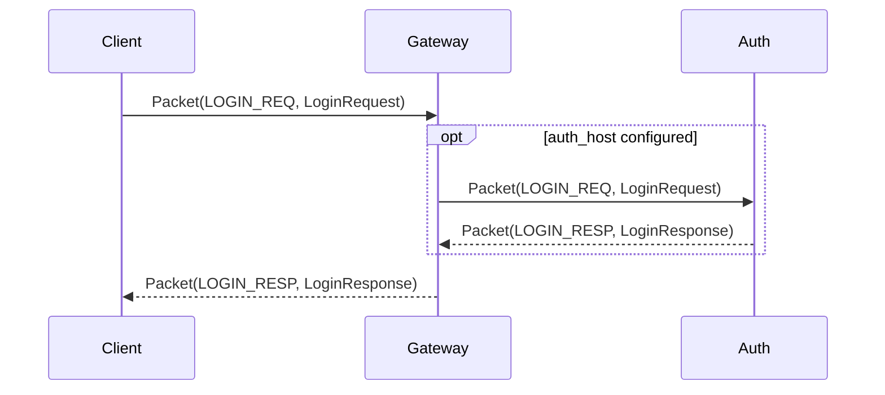
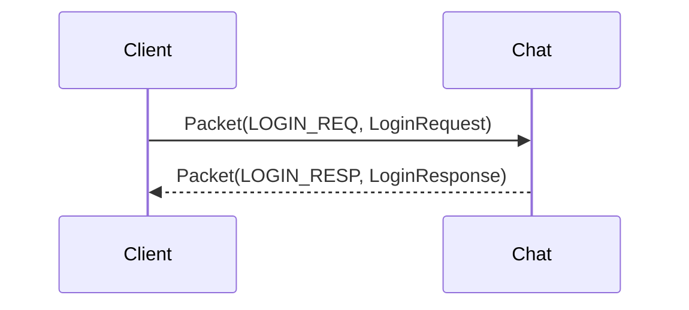
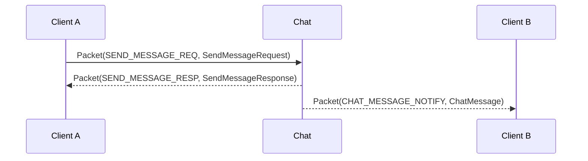

# API Overview

Chirp uses Protocol Buffers over TCP or WebSocket. The current supported protocol surface is centered on `chirp.gateway.Packet`.

For implementation status, read [Capability Matrix](../CAPABILITY_MATRIX.md). Some proto messages exist for roadmap or experimental services and should not be assumed supported by the default runtime.

## Packet Format

TCP and WebSocket both carry the same application payload:

```
TCP stream:
  [uint32_be payload_size][chirp.gateway.Packet protobuf bytes]

WebSocket binary frame payload:
  [uint32_be payload_size][chirp.gateway.Packet protobuf bytes]
```

`payload_size` is the number of bytes in the serialized `chirp.gateway.Packet`.

`MsgID` is not a separate network-frame header. It is inside `Packet`:

```protobuf
message Packet {
  MsgID msg_id = 1;
  int64 sequence = 2;
  bytes body = 3;
}
```

`body` contains the serialized protobuf message for the selected `msg_id`.

Example mapping:

| Packet `msg_id` | Packet `body` protobuf |
| --- | --- |
| `LOGIN_REQ` | `chirp.auth.LoginRequest` |
| `LOGIN_RESP` | `chirp.auth.LoginResponse` |
| `HEARTBEAT_PING` | `chirp.gateway.HeartbeatPing` |
| `HEARTBEAT_PONG` | `chirp.gateway.HeartbeatPong` |
| `SEND_MESSAGE_REQ` | `chirp.chat.SendMessageRequest` |
| `SEND_MESSAGE_RESP` | `chirp.chat.SendMessageResponse` |
| `GET_HISTORY_REQ` | `chirp.chat.GetHistoryRequest` |
| `GET_HISTORY_RESP` | `chirp.chat.GetHistoryResponse` |
| `CHAT_MESSAGE_NOTIFY` | `chirp.chat.ChatMessage` |

## Current Endpoints

| Service | TCP | WebSocket | Status | Notes |
| --- | --- | --- | --- | --- |
| Gateway | 5000 | 5001 | Supported | Login, logout, heartbeat, session registry, optional Redis kick |
| Auth | 6000 | - | Supported | Called by Gateway when `--auth_host` is configured |
| Chat | 7000 | 7001 | Supported | Direct chat entry for current smoke tests and SDK examples |
| Social | 8000 | 8001 | Experimental | Not part of the minimal verified path |
| Voice | 9000 | 9001 | Experimental | Signaling surface exists, not a full media backend guarantee |
| Notification | 5006 | - | Experimental | Placeholder/provider-dependent behavior |
| Search | 5007 | - | Experimental | Present in tree, not a core path |

## Core Message IDs

### Gateway/Auth

| MsgID | Name | Direction | Current path |
| --- | --- | --- | --- |
| 1001 | `HEARTBEAT_PING` | Client -> Gateway/Chat | Supported |
| 1002 | `HEARTBEAT_PONG` | Gateway/Chat -> Client | Supported |
| 1003 | `LOGIN_REQ` | Client -> Gateway/Chat | Supported |
| 1004 | `LOGIN_RESP` | Gateway/Chat -> Client | Supported |
| 1005 | `KICK_NOTIFY` | Gateway/Chat -> Client | Supported |
| 1006 | `LOGOUT_REQ` | Client -> Gateway/Chat | Supported |
| 1007 | `LOGOUT_RESP` | Gateway/Chat -> Client | Supported |

### Chat

| MsgID | Name | Direction | Current path |
| --- | --- | --- | --- |
| 2001 | `SEND_MESSAGE_REQ` | Client -> Chat | Supported via direct Chat endpoint |
| 2002 | `SEND_MESSAGE_RESP` | Chat -> Client | Supported |
| 2003 | `GET_HISTORY_REQ` | Client -> Chat | Supported |
| 2004 | `GET_HISTORY_RESP` | Chat -> Client | Supported |
| 2005 | `CHAT_MESSAGE_NOTIFY` | Chat -> Client | Supported |

Gateway currently ignores unimplemented business messages, including chat messages. Send chat packets to the Chat service unless gateway routing has been implemented.

## Login Flows

### Gateway Login



### Direct Chat Login



Current limitation: gateway login and direct chat login are separate session concepts. A client that logs in to Gateway is not automatically authenticated in Chat.

## Chat Message Flow



If the receiver is offline, Chat may store the message in Redis or in-memory fallback and return `TARGET_OFFLINE`; the message is replayed when the receiver logs in to Chat.

## WebSocket Usage

Use binary frames. Do not send JSON.

Pseudo-code:

```ts
const loginBody = LoginRequest.encode({
  token: 'player_1',
  deviceId: 'dev_1',
  platform: 'web'
}).finish()

const packet = Packet.encode({
  msgId: MsgID.LOGIN_REQ,
  sequence: 1n,
  body: loginBody
}).finish()

ws.send(concat(uint32be(packet.length), packet))
```

The server response is also a WebSocket binary frame whose payload starts with a 4-byte big-endian length prefix.

## Error Codes

The common response code enum is defined in `proto/common.proto`.

| Code | Name | Meaning |
| --- | --- | --- |
| 0 | `OK` | Success |
| 1 | `INTERNAL_ERROR` | Server error |
| 2 | `INVALID_PARAM` | Invalid request |
| 3 | `AUTH_FAILED` | Authentication failed |
| 4 | `SESSION_EXPIRED` | Session no longer valid |
| 5 | `USER_NOT_FOUND` | User does not exist |
| 6 | `TARGET_OFFLINE` | Recipient is not currently online |

## Related Docs

- [Overall Architecture](../architecture.md)
- [Capability Matrix](../CAPABILITY_MATRIX.md)
- [Top-level API Notes](../API.md)
