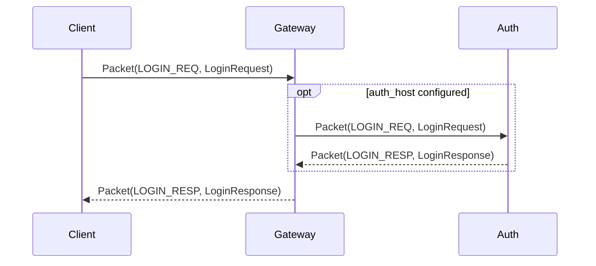
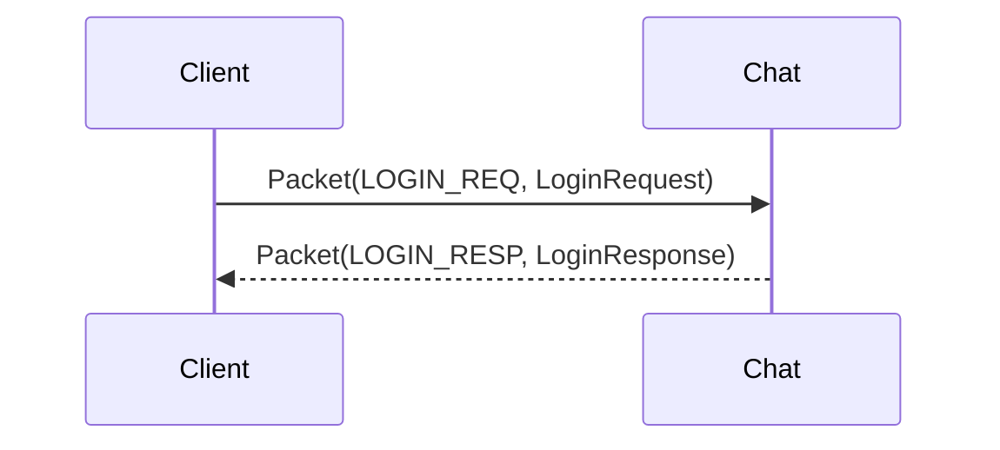
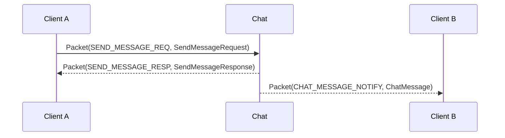

# API Overview

Chirp uses Protocol Buffers over TCP or WebSocket. The current supported protocol surface is centered on `chirp.gateway.Packet`.

For implementation status, read [Capability Matrix](../CAPABILITY_MATRIX.md). Some proto messages exist for roadmap or experimental services and should not be assumed supported by the default runtime.

## Packet Format

TCP and WebSocket both carry the same application payload:

```
TCP stream:
  [uint32_be payload_size][chirp.gateway.Packet protobuf bytes]

WebSocket binary frame payload:
  [uint32_be payload_size][chirp.gateway.Packet protobuf bytes]
```

`payload_size` is the number of bytes in the serialized `chirp.gateway.Packet`.

`MsgID` is not a separate network-frame header. It is inside `Packet`:

```protobuf
message Packet {
  MsgID msg_id = 1;
  int64 sequence = 2;
  bytes body = 3;
}
```

`body` contains the serialized protobuf message for the selected `msg_id`.

Example mapping:

| Packet `msg_id` | Packet `body` protobuf |
| --- | --- |
| `LOGIN_REQ` | `chirp.auth.LoginRequest` |
| `LOGIN_RESP` | `chirp.auth.LoginResponse` |
| `HEARTBEAT_PING` | `chirp.gateway.HeartbeatPing` |
| `HEARTBEAT_PONG` | `chirp.gateway.HeartbeatPong` |
| `SEND_MESSAGE_REQ` | `chirp.chat.SendMessageRequest` |
| `SEND_MESSAGE_RESP` | `chirp.chat.SendMessageResponse` |
| `GET_HISTORY_REQ` | `chirp.chat.GetHistoryRequest` |
| `GET_HISTORY_RESP` | `chirp.chat.GetHistoryResponse` |
| `CHAT_MESSAGE_NOTIFY` | `chirp.chat.ChatMessage` |

## Current Endpoints

| Service | TCP | WebSocket | Status | Notes |
| --- | --- | --- | --- | --- |
| Gateway | 5000 | 5001 | Supported | Login, logout, heartbeat, session registry, optional Redis kick |
| Auth | 6000 | - | Supported | Called by Gateway when `--auth_host` is configured |
| Chat | 7000 | 7001 | Supported | Direct chat entry for current smoke tests and SDK examples |
| Server Gateway | 8100 | - | Experimental | Trusted service-plane hub; see [Server Plane](../server_plane.md) |
| Social | 8000 | 8001 | Experimental | Not part of the minimal verified path |
| Voice | 9000 | 9001 | Experimental | Signaling surface exists, not a full media backend guarantee |
| Notification | 5006 | 5016 | Experimental | Device registry + push plane (6xxx); provider HTTP delivery is a logging stub |
| App Gateway | 5200 | 5201 | Experimental | Companion-app edge: auth/heartbeat + device-message forwarding to Notification |
| Search | 5007 | - | Experimental | Present in tree, not a core path |

## Core Message IDs

### Gateway/Auth

| MsgID | Name | Direction | Current path |
| --- | --- | --- | --- |
| 1001 | `HEARTBEAT_PING` | Client -> Gateway/Chat | Supported |
| 1002 | `HEARTBEAT_PONG` | Gateway/Chat -> Client | Supported |
| 1003 | `LOGIN_REQ` | Client -> Gateway/Chat | Supported |
| 1004 | `LOGIN_RESP` | Gateway/Chat -> Client | Supported |
| 1005 | `KICK_NOTIFY` | Gateway/Chat -> Client | Supported |
| 1006 | `LOGOUT_REQ` | Client -> Gateway/Chat | Supported |
| 1007 | `LOGOUT_RESP` | Gateway/Chat -> Client | Supported |

### Chat

| MsgID | Name | Direction | Current path |
| --- | --- | --- | --- |
| 2001 | `SEND_MESSAGE_REQ` | Client -> Chat | Supported via direct Chat endpoint |
| 2002 | `SEND_MESSAGE_RESP` | Chat -> Client | Supported |
| 2003 | `GET_HISTORY_REQ` | Client -> Chat | Supported |
| 2004 | `GET_HISTORY_RESP` | Chat -> Client | Supported |
| 2005 | `CHAT_MESSAGE_NOTIFY` | Chat -> Client | Supported |

Gateway currently ignores unimplemented business messages, including chat messages. Send chat packets to the Chat service unless gateway routing has been implemented.

### Server plane (5xxx)

`chirp_server_gateway` (TCP 8100) uses the same Packet framing on a separate
trust plane. Peers are game backends and internal services authenticated by
`service_id` + shared secret — never user accounts.

| MsgID | Name | Direction |
| --- | --- | --- |
| 5001 / 5002 | `SERVER_AUTH_REQ` / `SERVER_AUTH_RESP` | Service <-> Hub |
| 5003 / 5004 | `SERVER_HEARTBEAT_PING` / `PONG` | Service <-> Hub |
| 5005 / 5006 / 5007 | `INJECT_MESSAGE_REQ` / `RESP` / `NOTIFY` | Service -> Hub; NOTIFY forwarded to chat |
| 5008 / 5009 | `EVENT_PUBLISH_REQ` / `RESP` | Service -> Hub |
| 5010 | `EVENT_DELIVER_NOTIFY` | Hub -> target service |
| 5011 / 5012 | `EVENT_ACK_REQ` / `RESP` | Service <-> Hub |

Status: Experimental. The full contract (dial-out, at-least-once event
delivery, injection validation) lives in [Server Plane](../server_plane.md);
the complete msg-id-to-body mapping is in [Core](../CORE.md).

### Notification / device plane (6xxx)

Served by `chirp_notification` (TCP 5006 / WS 5016) and forwarded by
`chirp_app_gateway` (TCP 5200 / WS 5201). Bodies are `chirp.notification.*`
messages.

| MsgID | Name | Body |
| --- | --- | --- |
| 6001 / 6002 | `REGISTER_DEVICE_REQ` / `RESP` | `RegisterDeviceRequest` / `RegisterDeviceResponse` |
| 6003 / 6004 | `UNREGISTER_DEVICE_REQ` / `RESP` | `UnregisterDeviceRequest` / `UnregisterDeviceResponse` |
| 6005 / 6006 | `UPDATE_DEVICE_TOKEN_REQ` / `RESP` | `UpdateDeviceTokenRequest` / `UpdateDeviceTokenResponse` |
| 6007 / 6008 | `GET_USER_DEVICES_REQ` / `RESP` | `GetUserDevicesRequest` / `GetUserDevicesResponse` |
| 6009 / 6010 | `PUSH_NOTIFICATION_REQ` / `RESP` | `PushNotificationRequest` / `PushNotificationResponse` |

Ids 6011+ are reserved (badge / silent / preferences) and not implemented.

Auth rules:

- On `app_gateway`, 6xxx device messages require an authenticated session
  (`AUTH_FAILED` otherwise) and `user_id` is always overwritten with the
  authenticated user — clients cannot register or query for someone else.
  `UPDATE_DEVICE_TOKEN_REQ` addresses devices by `device_id` and has no
  `user_id` field, but still requires authentication.
- Direct `notification` access has no session concept; it is meant for
  internal services (e.g. chat's push bridge) on a trusted network.
- Provider HTTP delivery (APNs/FCM) currently runs through a logging
  `PushTransport` stub: requests are built and logged, and a device with a
  real token counts as "send failed" until a real transport is injected.

## Login Flows

### Gateway Login


```mermaid
sequenceDiagram
    participant C as Client
    participant G as Gateway
    participant A as Auth

    C->>G: Packet(LOGIN_REQ, LoginRequest)
    opt auth_host configured
        G->>A: Packet(LOGIN_REQ, LoginRequest)
        A-->>G: Packet(LOGIN_RESP, LoginResponse)
    end
    G-->>C: Packet(LOGIN_RESP, LoginResponse)
```

### Direct Chat Login


```mermaid
sequenceDiagram
    participant C as Client
    participant S as Chat

    C->>S: Packet(LOGIN_REQ, LoginRequest)
    S-->>C: Packet(LOGIN_RESP, LoginResponse)
```

Current limitation: gateway login and direct chat login are separate session concepts. A client that logs in to Gateway is not automatically authenticated in Chat.

## Chat Message Flow


```mermaid
sequenceDiagram
    participant A as Client A
    participant S as Chat
    participant B as Client B

    A->>S: Packet(SEND_MESSAGE_REQ, SendMessageRequest)
    S-->>A: Packet(SEND_MESSAGE_RESP, SendMessageResponse)
    S-->>B: Packet(CHAT_MESSAGE_NOTIFY, ChatMessage)
```

If the receiver is offline, Chat may store the message in Redis or in-memory fallback and return `TARGET_OFFLINE`; the message is replayed when the receiver logs in to Chat. Offline messages also trigger a device push through the notification service when chat is started with `--notification_host` (fire-and-forget; see the 6xxx section above).

## WebSocket Usage

Use binary frames. Do not send JSON.

Pseudo-code:

```ts
const loginBody = LoginRequest.encode({
  token: 'player_1',
  deviceId: 'dev_1',
  platform: 'web'
}).finish()

const packet = Packet.encode({
  msgId: MsgID.LOGIN_REQ,
  sequence: 1n,
  body: loginBody
}).finish()

ws.send(concat(uint32be(packet.length), packet))
```

The server response is also a WebSocket binary frame whose payload starts with a 4-byte big-endian length prefix.

## Error Codes

The common response code enum is defined in `proto/common.proto`.

| Code | Name | Meaning |
| --- | --- | --- |
| 0 | `OK` | Success |
| 1 | `INTERNAL_ERROR` | Server error |
| 2 | `INVALID_PARAM` | Invalid request |
| 3 | `AUTH_FAILED` | Authentication failed |
| 4 | `SESSION_EXPIRED` | Session no longer valid |
| 5 | `USER_NOT_FOUND` | User does not exist |
| 6 | `TARGET_OFFLINE` | Recipient is not currently online |
| 7 | `SERVER_UNAVAILABLE` | Server-plane target service is not connected, or its event queue is full |

## Related Docs

- [Overall Architecture](../architecture.md)
- [Capability Matrix](../CAPABILITY_MATRIX.md)
- [Core](../CORE.md)
