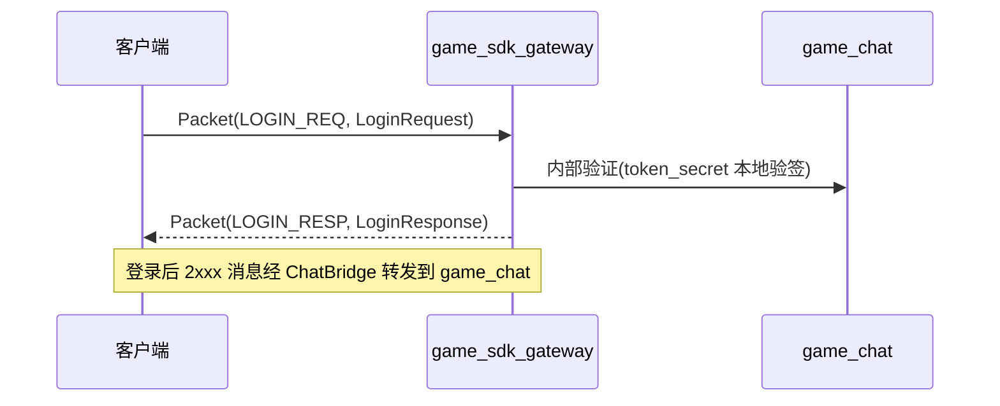
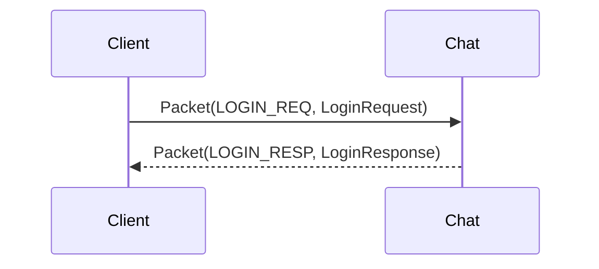
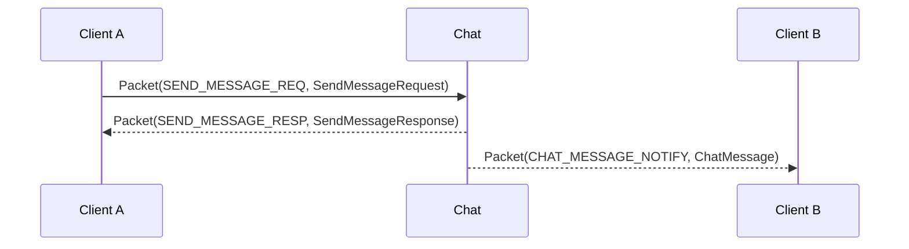

# API 总览

Chirp 在 TCP 或 WebSocket 上跑 Protocol Buffers。当前受支持的协议面围绕 `chirp.gateway.Packet` 展开。

实现状态请看 [能力矩阵](../CAPABILITY_MATRIX.md)。部分 proto 消息为路线图或实验性服务而存在,不要默认它们受默认运行时支持。

接入前建议先读 [接入避坑指南](../guide/integration-pitfalls.md)——发送节奏、消息长度、重复禁言、敏感词等服务端防线都会以专码拒收,裸协议接入方最容易在这些地方踩坑。

## 包格式

TCP 和 WebSocket 承载同一份应用载荷:

```
TCP stream:
  [uint32_be payload_size][chirp.gateway.Packet protobuf bytes]

WebSocket binary frame payload:
  [uint32_be payload_size][chirp.gateway.Packet protobuf bytes]
```

`payload_size` 是序列化后的 `chirp.gateway.Packet` 的字节数。

`MsgID` 不是独立的网络帧头,它在 `Packet` 里面:

```protobuf
message Packet {
  MsgID msg_id = 1;
  int64 sequence = 2;
  bytes body = 3;
}
```

`body` 装的是所选 `msg_id` 对应的序列化 protobuf 消息。

映射示例:

| Packet 的 `msg_id` | Packet 的 `body` protobuf |
| --- | --- |
| `LOGIN_REQ` | `chirp.auth.LoginRequest`(登录请求) |
| `LOGIN_RESP` | `chirp.auth.LoginResponse`(登录应答) |
| `HEARTBEAT_PING` | `chirp.gateway.HeartbeatPing`(心跳请求) |
| `HEARTBEAT_PONG` | `chirp.gateway.HeartbeatPong`(心跳应答) |
| `SEND_MESSAGE_REQ` | `chirp.chat.SendMessageRequest`(发送消息请求) |
| `SEND_MESSAGE_RESP` | `chirp.chat.SendMessageResponse`(发送消息应答) |
| `GET_HISTORY_REQ` | `chirp.chat.GetHistoryRequest`(拉取历史请求) |
| `GET_HISTORY_RESP` | `chirp.chat.GetHistoryResponse`(拉取历史应答) |
| `CHAT_MESSAGE_NOTIFY` | `chirp.chat.ChatMessage`(聊天消息通知) |

## 当前端点

服务按游戏平面 / App 平面组织,二进制命名带平面前缀(完整对照见 [能力矩阵](../CAPABILITY_MATRIX.md) 的二进制命名约定段)。

### 游戏平面(游戏客户端/游戏后端接入这里)

| 服务 | 二进制 | TCP | WebSocket | 状态 | 说明 |
| --- | --- | --- | --- | --- | --- |
| Game SDK Gateway | `chirp_game_sdk_gateway` | 5000 | 5001 | Supported | 登录、心跳、踢出、会话 claim;2xxx 聊天包经 ChatBridge 转发到 game_chat |
| Game Chat | `chirp_game_chat`(由 `services/shared/chat` 构建) | 7000 | 7001 | Supported | 聊天服务端;游戏后端签发 token + `--token_secret` 本地验签,自足闭环 |
| Game Server Gateway | `chirp_game_server_gateway` | 8100 | - | Supported | 游戏后端注入枢纽:消息注入 + 事件下发,`service_id` + secret 信任门 |
| Chat Peer 口 | (game_chat 的 `--hub_peer_port`) | 8200 | - | Supported | game_chat 作为 spoke 注册到 app_chat hub 的出站目标;见 [peer 协议](./peer_protocol.md) |

### App 平面(伴侣 App / 平台侧)

| 服务 | 二进制 | TCP | WebSocket | 状态 | 说明 |
| --- | --- | --- | --- | --- | --- |
| App SDK Gateway | `chirp_app_sdk_gateway` | 5200 | 5201 | Supported | 认证/心跳 + 6xxx 设备消息转发;2xxx 转发到 app_chat |
| App Chat(hub) | `chirp_app_chat`(同 `services/shared/chat` 构建) | 7000 | 7001 | Supported | App 平面聊天 hub:peer 注册、身份映射、频道订阅、跨平面 fan-out/回复、未读账本 |
| App Auth | `chirp_app_auth` | 6000 | - | Supported | App 平面账号/token;游戏平面不依赖它 |
| App Notification | `chirp_app_notification` | 5006 | 5016 | Supported | 设备注册表 + 推送面(6xxx);`--push_transport http` 启用真实 APNs/FCM HTTP 投递,默认 `logging` 只记日志 |

### 实验性服务

| 服务 | TCP | WebSocket | 状态 |
| --- | --- | --- | --- |
| Social | 8000 | 8001 | Experimental(好友/在线状态/黑名单,不在最小验证路径内) |
| Voice | 9000 | 9001 | Experimental(信令面存在,尚不构成完整媒体后端保证) |
| Search | 5007 | - | Experimental(代码在树里,不是核心路径) |

## 核心消息 ID

### 网关与认证(Gateway/Auth,1xxx)

| MsgID | 名称 | 方向 | 当前状态 |
| --- | --- | --- | --- |
| 1001 | `HEARTBEAT_PING` | 客户端 -> Gateway/Chat | Supported |
| 1002 | `HEARTBEAT_PONG` | Gateway/Chat -> 客户端 | Supported |
| 1003 | `LOGIN_REQ` | 客户端 -> Gateway/Chat | Supported |
| 1004 | `LOGIN_RESP` | Gateway/Chat -> 客户端 | Supported |
| 1005 | `KICK_NOTIFY` | Gateway/Chat -> 客户端 | Supported(同设备重登顶号) |
| 1006 / 1007 | `LOGOUT_REQ` / `LOGOUT_RESP` | 客户端 <-> 服务 | Supported |
| 1008-1019 | 注册/密码登录/刷新 token/会话管理/改密 | 客户端 <-> Auth | App 平面 auth 面 Supported;游戏平面不走这组 |

两个平面都接受 `LOGIN_REQ`;游戏平面的 token 由游戏后端按 HS256 JWT 签发、chat 以 `--token_secret` 本地验签。

### 聊天(Chat,2xxx)

发送链路在服务端经过一组顺序固定的防线(细节与默认阈值见 [接入避坑指南](../guide/integration-pitfalls.md)):登录校验 → 模糊限流(`RATE_LIMITED`)→ 内容长度(`CONTENT_TOO_LONG`)→ 发送节奏(`RATE_LIMITED`)→ 重复禁言(`RATE_LIMITED`)→ 敏感词(`WORD_FILTERED` 或静默替换)。

| MsgID | 名称 | 方向 | 说明 |
| --- | --- | --- | --- |
| 2001 / 2002 | `SEND_MESSAGE_REQ` / `RESP` | 客户端 -> Chat | 发送消息;`RESP` 带服务端 `message_id` 与业务码 |
| 2003 / 2004 | `GET_HISTORY_REQ` / `RESP` | 客户端 -> Chat | 拉取频道历史 |
| 2005 | `CHAT_MESSAGE_NOTIFY` | Chat -> 客户端 | 实时消息推送 |
| 2101-2216 | 群组全套 | 客户端 <-> Chat | 建/进/出/邀/踢/查 + 群事件 notify(2117-2121) |
| 2201 / 2202 | `MARK_READ_REQ` / `RESP` | 客户端 -> Chat | 标记已读(服务端游标) |
| 2203 / 2204 | `GET_READ_RECEIPTS_REQ` / `RESP` | 客户端 -> Chat | 消息已读回执查询 |
| 2205 / 2206 | `GET_UNREAD_COUNT_REQ` / `RESP` | 客户端 -> Chat | 未读数 |
| 2207 | `MESSAGE_READ_NOTIFY` | Chat -> 客户端 | 已读事件推送 |
| 2208 | `TYPING_INDICATOR_NOTIFY` | 客户端 <-> Chat | 正在输入(裸 notify,无响应) |
| 2211 / 2212 | `TRACK_MESSAGE_REQ` / `RESP` | 客户端 -> Chat | 投递跟踪 |
| 2215-2222 | 表情回应全套 | 客户端 <-> Chat | 加/删/查 + 增删 notify |
| 2223 / 2224 | `GET_TYPING_USERS_REQ` / `RESP` | 客户端 -> Chat | 谁在输入 |
| 2225-2232 | 编辑/删除全套 | 客户端 <-> Chat | 编辑、删除、批量删除 + 事件 notify |
| 2233 / 2234 | `GET_MENTION_SUGGESTIONS_REQ` / `RESP` | 客户端 -> Chat | @提及候选 |
| 2235-2238 | 频道屏蔽(免打扰) | 客户端 <-> Chat | `SET_CHANNEL_MUTE` / `GET_CHANNEL_MUTES`;仅 WORLD/GUILD/TEAM 可屏蔽 |
| 2239-2244 | 消息黑名单 | 客户端 <-> Chat | `BLOCK/UNBLOCK_MESSAGE_SENDER`、`GET_BLOCKED_SENDERS`;只作用于消息投递,与社交面 3011 黑名单互相独立 |

经 `chirp_game_sdk_gateway` / `chirp_app_sdk_gateway` 接入的客户端,2xxx 消息由 ChatBridge 转发到对应 chat 实例,语义与直连 chat 相同;游戏平面的跨平面拦截(内容前缀)与防线阈值同样生效。

### 社交/语音/实验面(3xxx/4xxx)

3001-3024(社交:好友/黑名单/在线状态)与 4001+(语音房)由实验性服务提供,不在受支持路径内;接入前先核对 [能力矩阵](../CAPABILITY_MATRIX.md)。

### 服务面(Server plane,5xxx)

`chirp_game_server_gateway`(TCP 8100)在另一个信任面上用同一套 Packet 帧。peer 是游戏后端和内部服务,以 `service_id` + 共享 secret 认证——从来不是用户账号。

| MsgID | 名称 | 方向 |
| --- | --- | --- |
| 5001 / 5002 | `SERVER_AUTH_REQ` / `SERVER_AUTH_RESP` | 服务 <-> 枢纽 |
| 5003 / 5004 | `SERVER_HEARTBEAT_PING` / `PONG` | 服务 <-> 枢纽 |
| 5005 / 5006 / 5007 | `INJECT_MESSAGE_REQ` / `RESP` / `NOTIFY` | 服务 -> 枢纽;NOTIFY 转发给 chat |
| 5008 / 5009 | `EVENT_PUBLISH_REQ` / `RESP` | 服务 -> 枢纽 |
| 5010 | `EVENT_DELIVER_NOTIFY` | 枢纽 -> 目标服务 |
| 5011 / 5012 | `EVENT_ACK_REQ` / `RESP` | 服务 <-> 枢纽 |
| 5013-5030 | 玩家身份绑定 / 频道订阅 / 未读账本 | 服务 <-> app_chat 主端口(已从 server_gateway 迁出,注意拨对端口) |
| 5050 / 5051 | `PEER_REGISTER_REQ` / `RESP` | game_chat(spoke)-> app_chat(hub) |
| 5052 | `CHANNEL_MESSAGE_NOTIFY` | spoke -> hub 频道消息上行 |
| 5053 | `PEER_INJECT_MESSAGE_NOTIFY` | hub -> spoke 跨平面回复注入 |

状态:5xxx 契约 Supported;5013-5030 应答在 **app_chat 主端口**(TCP 7000),不在 8100。完整契约(拨出、至少一次事件投递、注入校验、peer 协议)在[服务器平面](../server_plane.md)与 [peer 协议](./peer_protocol.md);完整的 msg-id 到 body 映射在 [核心文档](../CORE.md)。

### Notification / 设备面(6xxx)

由 `chirp_app_notification`(TCP 5006 / WS 5016)提供服务,经 `chirp_app_sdk_gateway`(TCP 5200 / WS 5201)转发。body 是 `chirp.app_notification.*` 消息。

| MsgID | 名称 | Body |
| --- | --- | --- |
| 6001 / 6002 | `REGISTER_DEVICE_REQ` / `RESP` | `RegisterDeviceRequest` / `RegisterDeviceResponse`(设备注册请求/应答) |
| 6003 / 6004 | `UNREGISTER_DEVICE_REQ` / `RESP` | `UnregisterDeviceRequest` / `UnregisterDeviceResponse`(设备注销请求/应答) |
| 6005 / 6006 | `UPDATE_DEVICE_TOKEN_REQ` / `RESP` | `UpdateDeviceTokenRequest` / `UpdateDeviceTokenResponse`(推送 token 更新请求/应答) |
| 6007 / 6008 | `GET_USER_DEVICES_REQ` / `RESP` | `GetUserDevicesRequest` / `GetUserDevicesResponse`(用户设备列表查询请求/应答) |
| 6009 / 6010 | `PUSH_NOTIFICATION_REQ` / `RESP` | `PushNotificationRequest` / `PushNotificationResponse`(推送请求/应答) |

6011+ 的 id 预留(角标 / 静默 / 偏好设置),尚未实现。

认证规则:

- 在 `app_sdk_gateway` 上,6xxx 设备消息要求已认证会话(否则 `AUTH_FAILED`),且 `user_id` 永远被改写为认证用户——客户端不能替别人注册或查询设备。`UPDATE_DEVICE_TOKEN_REQ` 用 `device_id` 寻址设备,没有 `user_id` 字段,但同样要求认证。
- 直连 `app_notification` 没有会话概念;它面向可信网络上的内部服务(比如 chat 的推送桥)。
- 真实 provider 投递:`--push_transport http` 经 HTTP(S) 投递 FCM/APNs(端点 `--fcm-endpoint` / `--apns-endpoint` / `--apns-sandbox`,私有 CA `--push_ca_file`,调试豁免 `--push_verify_tls off`);无 token 的设备显式记失败,不再静默记成功。默认 `--push_transport logging` 仅记日志。APNs 官方端点要求 HTTP/2,前置协议转换或走 provider 的 HTTP/1.1 兼容 API。

## 登录流程

### Gateway 登录(游戏平面)


```mermaid
sequenceDiagram
    participant C as 客户端
    participant G as game_sdk_gateway
    participant S as game_chat

    C->>G: Packet(LOGIN_REQ, LoginRequest)
    G->>S: 内部验证(token_secret 本地验签)
    G-->>C: Packet(LOGIN_RESP, LoginResponse)
    Note over C,G: 登录后 2xxx 消息经 ChatBridge 转发到 game_chat
```

同 `(user_id, device_id)` 重复登录会顶掉旧会话:旧连接收到 `KICK_NOTIFY`,新连接的 `LOGIN_RESP.kick_previous = true`。

### 直连 Chat 登录


```mermaid
sequenceDiagram
    participant C as Client
    participant S as Chat

    C->>S: Packet(LOGIN_REQ, LoginRequest)
    S-->>C: Packet(LOGIN_RESP, LoginResponse)
```

Gateway 登录与直连 Chat 登录是**两个独立的会话概念**:SDK(`sdks/core`)直连 chat 主端口,登录一次即完成连接与认证;自研客户端选一种路径接入,不要叠加。

## 聊天消息流程


```mermaid
sequenceDiagram
    participant A as Client A
    participant S as Chat
    participant B as Client B

    A->>S: Packet(SEND_MESSAGE_REQ, SendMessageRequest)
    S-->>A: Packet(SEND_MESSAGE_RESP, SendMessageResponse)
    S-->>B: Packet(CHAT_MESSAGE_NOTIFY, ChatMessage)
```

接收方离线时,Chat 把消息存进离线队列(内存兜底 200 条/用户,可选 Redis)并在 `SEND_MESSAGE_RESP` 回 `TARGET_OFFLINE`;接收方下次登录后补投。以 `--notification_host` 启动 chat 时,离线消息还会经 app_notification 触发一次设备推送(发完即忘;见上文 6xxx 一节)。

## WebSocket 用法

用二进制帧,不要发 JSON。

伪代码:

```ts
const loginBody = LoginRequest.encode({
  token: 'player_1',
  deviceId: 'dev_1',
  platform: 'web'
}).finish()

const packet = Packet.encode({
  msgId: MsgID.LOGIN_REQ,
  sequence: 1n,
  body: loginBody
}).finish()

ws.send(concat(uint32be(packet.length), packet))
```

服务端响应同样是 WebSocket 二进制帧,载荷以 4 字节大端长度前缀开头。

## 错误码

通用响应码枚举定义在 `proto/common.proto`。

| 码 | 名称 | 含义 |
| --- | --- | --- |
| 0 | `OK` | 成功 |
| 1 | `INTERNAL_ERROR` | 服务端错误 |
| 2 | `INVALID_PARAM` | 请求无效(缺字段、频道码非法、不可屏蔽频道等) |
| 3 | `AUTH_FAILED` | 认证失败(未登录、token 无效) |
| 4 | `SESSION_EXPIRED` | 会话已失效 |
| 5 | `USER_NOT_FOUND` | 用户不存在 |
| 6 | `TARGET_OFFLINE` | 接收方当前不在线(消息已入离线队列) |
| 7 | `SERVER_UNAVAILABLE` | 服务面目标服务未连接,或其事件队列已满;跨平面回复无在线 spoke 时同码 |
| 8 | `RATE_LIMITED` | 触发限流:登录/发送模糊闸、频道发送节奏、重复消息禁言 |
| 9 | `VERSION_MISMATCH` | peer 注册协议版本低于 hub 的 `min_peer_version` |
| 10 | `WORD_FILTERED` | 敏感词策略为 reject 时拒收(replace 策略静默替换后放行) |
| 11 | `CONTENT_TOO_LONG` | 内容超过频道码点上限(私聊 200 / 世界 100 / 系统公告 500) |

SDK 的传输层错误(`NotConnected`/`Timeout`/`Closed`/`Kicked`/`BadResponse`)与上表互相独立:`ec == OK` 不代表业务成功,必须再读 `resp.code()`。

## 相关文档

- [接入避坑指南](../guide/integration-pitfalls.md)——服务端防线的阈值、触发条件与客户端应对
- [整体架构](../architecture.md)
- [能力矩阵](../CAPABILITY_MATRIX.md)
- [核心文档](../CORE.md)
- [peer 注册协议](./peer_protocol.md)
