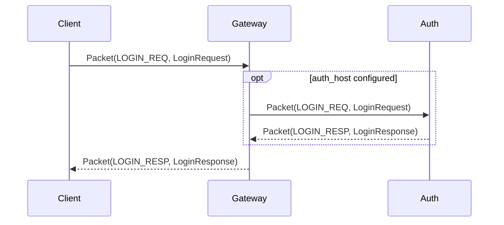
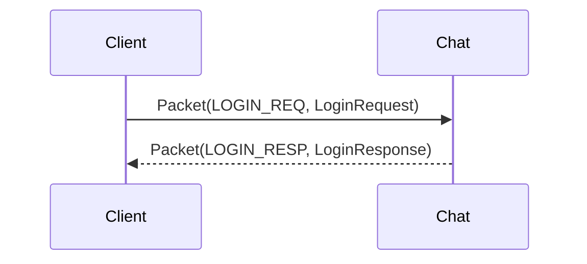
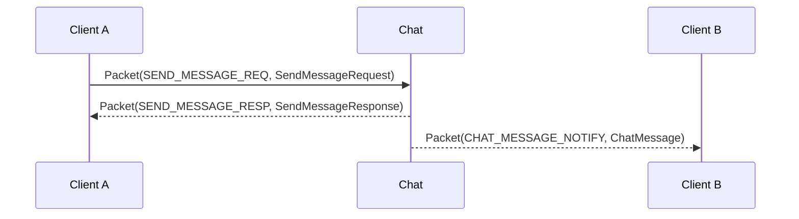

# API 总览

Chirp 在 TCP 或 WebSocket 上跑 Protocol Buffers。当前受支持的协议面围绕 `chirp.gateway.Packet` 展开。

实现状态请看 [Capability Matrix](../CAPABILITY_MATRIX.md)。部分 proto 消息为路线图或实验性服务而存在,不要默认它们受默认运行时支持。

## 包格式

TCP 和 WebSocket 承载同一份应用载荷:

```
TCP stream:
  [uint32_be payload_size][chirp.gateway.Packet protobuf bytes]

WebSocket binary frame payload:
  [uint32_be payload_size][chirp.gateway.Packet protobuf bytes]
```

`payload_size` 是序列化后的 `chirp.gateway.Packet` 的字节数。

`MsgID` 不是独立的网络帧头,它在 `Packet` 里面:

```protobuf
message Packet {
  MsgID msg_id = 1;
  int64 sequence = 2;
  bytes body = 3;
}
```

`body` 装的是所选 `msg_id` 对应的序列化 protobuf 消息。

映射示例:

| Packet `msg_id` | Packet `body` protobuf |
| --- | --- |
| `LOGIN_REQ` | `chirp.auth.LoginRequest` |
| `LOGIN_RESP` | `chirp.auth.LoginResponse` |
| `HEARTBEAT_PING` | `chirp.gateway.HeartbeatPing` |
| `HEARTBEAT_PONG` | `chirp.gateway.HeartbeatPong` |
| `SEND_MESSAGE_REQ` | `chirp.chat.SendMessageRequest` |
| `SEND_MESSAGE_RESP` | `chirp.chat.SendMessageResponse` |
| `GET_HISTORY_REQ` | `chirp.chat.GetHistoryRequest` |
| `GET_HISTORY_RESP` | `chirp.chat.GetHistoryResponse` |
| `CHAT_MESSAGE_NOTIFY` | `chirp.chat.ChatMessage` |

## 当前端点

| 服务 | TCP | WebSocket | 状态 | 说明 |
| --- | --- | --- | --- | --- |
| Gateway | 5000 | 5001 | Supported | 登录、登出、心跳、会话注册表,可选 Redis 踢线 |
| Auth | 6000 | - | Supported | 配置 `--auth_host` 时由 Gateway 调用 |
| Chat | 7000 | 7001 | Supported | 当前冒烟测试与 SDK 示例的直连聊天入口 |
| Server Gateway | 8100 | - | Experimental | 可信服务面枢纽;见 [Server Plane](../server_plane.md) |
| Social | 8000 | 8001 | Experimental | 不在最小验证路径内 |
| Voice | 9000 | 9001 | Experimental | 信令面存在,尚不构成完整媒体后端保证 |
| Notification | 5006 | 5016 | Experimental | 设备注册表 + 推送面(6xxx);provider HTTP 投递为日志占位 |
| App Gateway | 5200 | 5201 | Experimental | 伴侣应用边缘:认证/心跳 + 设备消息转发到 Notification |
| Search | 5007 | - | Experimental | 代码在树里,不是核心路径 |

## 核心消息 ID

### Gateway/Auth

| MsgID | 名称 | 方向 | 当前状态 |
| --- | --- | --- | --- |
| 1001 | `HEARTBEAT_PING` | 客户端 -> Gateway/Chat | Supported |
| 1002 | `HEARTBEAT_PONG` | Gateway/Chat -> 客户端 | Supported |
| 1003 | `LOGIN_REQ` | 客户端 -> Gateway/Chat | Supported |
| 1004 | `LOGIN_RESP` | Gateway/Chat -> 客户端 | Supported |
| 1005 | `KICK_NOTIFY` | Gateway/Chat -> 客户端 | Supported |
| 1006 | `LOGOUT_REQ` | 客户端 -> Gateway/Chat | Supported |
| 1007 | `LOGOUT_RESP` | Gateway/Chat -> 客户端 | Supported |

### Chat

| MsgID | 名称 | 方向 | 当前状态 |
| --- | --- | --- | --- |
| 2001 | `SEND_MESSAGE_REQ` | 客户端 -> Chat | 经 Chat 直连端点受支持 |
| 2002 | `SEND_MESSAGE_RESP` | Chat -> 客户端 | Supported |
| 2003 | `GET_HISTORY_REQ` | 客户端 -> Chat | Supported |
| 2004 | `GET_HISTORY_RESP` | Chat -> 客户端 | Supported |
| 2005 | `CHAT_MESSAGE_NOTIFY` | Chat -> 客户端 | Supported |

Gateway 目前会忽略未实现的业务消息,包括聊天消息。除非网关路由已实现,请把聊天包发给 Chat 服务。

### Server plane(5xxx)

`chirp_server_gateway`(TCP 8100)在另一个信任面上用同一套 Packet 帧。
peer 是游戏后端和内部服务,以 `service_id` + 共享 secret 认证——从来不是
用户账号。

| MsgID | 名称 | 方向 |
| --- | --- | --- |
| 5001 / 5002 | `SERVER_AUTH_REQ` / `SERVER_AUTH_RESP` | 服务 <-> 枢纽 |
| 5003 / 5004 | `SERVER_HEARTBEAT_PING` / `PONG` | 服务 <-> 枢纽 |
| 5005 / 5006 / 5007 | `INJECT_MESSAGE_REQ` / `RESP` / `NOTIFY` | 服务 -> 枢纽;NOTIFY 转发给 chat |
| 5008 / 5009 | `EVENT_PUBLISH_REQ` / `RESP` | 服务 -> 枢纽 |
| 5010 | `EVENT_DELIVER_NOTIFY` | 枢纽 -> 目标服务 |
| 5011 / 5012 | `EVENT_ACK_REQ` / `RESP` | 服务 <-> 枢纽 |

状态:Experimental。完整契约(拨出、至少一次事件投递、注入校验)在
[Server Plane](../server_plane.md);完整的 msg-id 到 body 映射在
[Core](../CORE.md)。

### Notification / 设备面(6xxx)

由 `chirp_notification`(TCP 5006 / WS 5016)提供服务,经
`chirp_app_gateway`(TCP 5200 / WS 5201)转发。body 是
`chirp.notification.*` 消息。

| MsgID | 名称 | Body |
| --- | --- | --- |
| 6001 / 6002 | `REGISTER_DEVICE_REQ` / `RESP` | `RegisterDeviceRequest` / `RegisterDeviceResponse` |
| 6003 / 6004 | `UNREGISTER_DEVICE_REQ` / `RESP` | `UnregisterDeviceRequest` / `UnregisterDeviceResponse` |
| 6005 / 6006 | `UPDATE_DEVICE_TOKEN_REQ` / `RESP` | `UpdateDeviceTokenRequest` / `UpdateDeviceTokenResponse` |
| 6007 / 6008 | `GET_USER_DEVICES_REQ` / `RESP` | `GetUserDevicesRequest` / `GetUserDevicesResponse` |
| 6009 / 6010 | `PUSH_NOTIFICATION_REQ` / `RESP` | `PushNotificationRequest` / `PushNotificationResponse` |

6011+ 的 id 预留(角标 / 静默 / 偏好设置),尚未实现。

认证规则:

- 在 `app_gateway` 上,6xxx 设备消息要求已认证会话(否则 `AUTH_FAILED`),
  且 `user_id` 永远被改写为认证用户——客户端不能替别人注册或查询设备。
  `UPDATE_DEVICE_TOKEN_REQ` 用 `device_id` 寻址设备,没有 `user_id` 字段,
  但同样要求认证。
- 直连 `notification` 没有会话概念;它面向可信网络上的内部服务
  (比如 chat 的推送桥)。
- provider HTTP 投递(APNs/FCM)当前经日志占位 `PushTransport` 运行:
  请求会被构建并记录日志,持真实 token 的设备在真实传输层注入之前都算
  "发送失败"。

## 登录流程

### Gateway 登录


```mermaid
sequenceDiagram
    participant C as Client
    participant G as Gateway
    participant A as Auth

    C->>G: Packet(LOGIN_REQ, LoginRequest)
    opt auth_host configured
        G->>A: Packet(LOGIN_REQ, LoginRequest)
        A-->>G: Packet(LOGIN_RESP, LoginResponse)
    end
    G-->>C: Packet(LOGIN_RESP, LoginResponse)
```

### 直连 Chat 登录


```mermaid
sequenceDiagram
    participant C as Client
    participant S as Chat

    C->>S: Packet(LOGIN_REQ, LoginRequest)
    S-->>C: Packet(LOGIN_RESP, LoginResponse)
```

当前限制:Gateway 登录和直连 Chat 登录是两个独立的会话概念。登录了 Gateway 的客户端不会因此在 Chat 里自动完成认证。

## 聊天消息流程


```mermaid
sequenceDiagram
    participant A as Client A
    participant S as Chat
    participant B as Client B

    A->>S: Packet(SEND_MESSAGE_REQ, SendMessageRequest)
    S-->>A: Packet(SEND_MESSAGE_RESP, SendMessageResponse)
    S-->>B: Packet(CHAT_MESSAGE_NOTIFY, ChatMessage)
```

接收方离线时,Chat 可把消息存进 Redis 或内存兜底并返回 `TARGET_OFFLINE`;接收方登录 Chat 后重放。以 `--notification_host` 启动 chat 时,离线消息还会经 notification 服务触发一次设备推送(发完即忘;见上文 6xxx 一节)。

## WebSocket 用法

用二进制帧,不要发 JSON。

伪代码:

```ts
const loginBody = LoginRequest.encode({
  token: 'player_1',
  deviceId: 'dev_1',
  platform: 'web'
}).finish()

const packet = Packet.encode({
  msgId: MsgID.LOGIN_REQ,
  sequence: 1n,
  body: loginBody
}).finish()

ws.send(concat(uint32be(packet.length), packet))
```

服务端响应同样是 WebSocket 二进制帧,载荷以 4 字节大端长度前缀开头。

## 错误码

通用响应码枚举定义在 `proto/common.proto`。

| 码 | 名称 | 含义 |
| --- | --- | --- |
| 0 | `OK` | 成功 |
| 1 | `INTERNAL_ERROR` | 服务端错误 |
| 2 | `INVALID_PARAM` | 请求无效 |
| 3 | `AUTH_FAILED` | 认证失败 |
| 4 | `SESSION_EXPIRED` | 会话已失效 |
| 5 | `USER_NOT_FOUND` | 用户不存在 |
| 6 | `TARGET_OFFLINE` | 接收方当前不在线 |
| 7 | `SERVER_UNAVAILABLE` | 服务面目标服务未连接,或其事件队列已满 |

## 相关文档

- [Overall Architecture](../architecture.md)
- [Capability Matrix](../CAPABILITY_MATRIX.md)
- [Core](../CORE.md)
