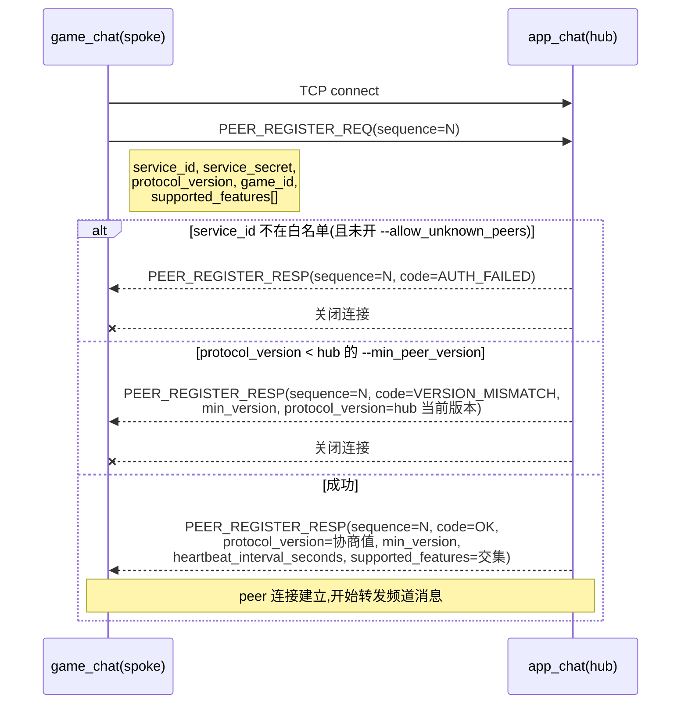

# Chat Peer 注册协议(5050-5053)

最后核对:2026-09-22,对齐 `proto/gateway.proto` 与 `libs/network/chat_peer_{hub,link}.{h,cc}`(chat 的 basic 与 enhanced 两个形态都接线)。

`game_chat`(spoke)与 `app_chat`(hub)是同一个 `chirp_chat` 二进制,通过启动参数选择角色。spoke 通过内置的 peer 注册协议接入 hub,注册、白名单、版本协商都是 chat 的原生能力——没有外部桥接进程。本文是这条链路的协议级事实来源;整体架构见[整体架构](../architecture.md)。

## 帧与信封

peer 链路与客户端链路使用同一套二进制帧:

```text
TCP 流:[uint32_be payload_size][chirp.gateway.Packet protobuf bytes]
```

`Packet{msg_id, sequence, body}`,`body` 按下表解析:

| msg_id | 值 | 方向 | body |
| --- | --- | --- | --- |
| `PEER_REGISTER_REQ` | 5050 | spoke → hub | `chirp.gateway.PeerRegisterReq` |
| `PEER_REGISTER_RESP` | 5051 | hub → spoke | `chirp.gateway.PeerRegisterResp` |
| `CHANNEL_MESSAGE_NOTIFY` | 5052 | spoke → hub | `chirp.gateway.ChannelMessageNotify` |
| `PEER_INJECT_MESSAGE_NOTIFY` | 5053 | hub → spoke | `chirp.gateway.PeerInjectMessageNotify` |

所有 4 个 id 都在 server-plane(5xxx)块内,只对 trusted peer 开放,客户端永远不会发送。

## 握手



规则:

- 注册在连接生命周期内有效。连接断开,spoke 必须重新走完整握手——hub 不恢复旧注册状态。
- 同一 `service_id` 第二次注册会挤掉第一次(`ChatPeerHub` 覆盖旧条目)。这使重连语义简单:spoke 崩了立刻重连即可,旧连接会被新注册顶掉。
- `PEER_REGISTER_RESP.sequence` 回显 `PEER_REGISTER_REQ.sequence`,spoke 端可据此关联请求/响应。

## 消息字段

### PeerRegisterReq(spoke → hub,5050)

| 字段 | 类型 | 含义 |
| --- | --- | --- |
| `service_id` | string | 游戏标识,如 `game_42`;同一 id 二次注册顶替首次 |
| `service_secret` | string | 共享密钥,对应 hub 端 `--allowed_peers` 中配置的值 |
| `protocol_version` | int32 | spoke 当前协议版本;协商结果为 `min(hub_version, spoke_version)` |
| `game_id` | string | 频道命名空间;hub 会把该 peer 所有频道自动加 `<game_id>:` 前缀。**不得包含 `:`** |
| `supported_features` | repeated `PeerCapability` | spoke 支持的能力位;会话最终能力为两侧交集 |

### PeerRegisterResp(hub → spoke,5051)

| 字段 | 类型 | 含义 |
| --- | --- | --- |
| `code` | `chirp.common.ErrorCode` | `OK` / `AUTH_FAILED` / `VERSION_MISMATCH`,见下文错误码 |
| `protocol_version` | int32 | `OK` 时为协商值;`VERSION_MISMATCH` 时为 hub 当前版本(供 spoke 参考升级) |
| `min_version` | int32 | hub 的 `--min_peer_version` 当前值 |
| `heartbeat_interval_seconds` | int32 | hub 分配的心跳节奏;spoke 沉默约 2× 此周期会被 hub 剔除 |
| `supported_features` | repeated `PeerCapability` | 协商后交集;spoke 必须只使用交集内的能力 |

### ChannelMessageNotify(spoke → hub,5052)

| 字段 | 类型 | 含义 |
| --- | --- | --- |
| `game_id` | string | 冗余字段,hub 用它与注册信息交叉校验 |
| `channel_id` | string | **裸频道 id**(spoke 不加前缀);hub 收到后自动加 `<game_id>:` |
| `message` | `chirp.chat.ChatMessage` | 游戏侧原始消息,原样转发;hub 据此扇出 |

### PeerInjectMessageNotify(hub → spoke,5053)

| 字段 | 类型 | 含义 |
| --- | --- | --- |
| `channel_id` | string | 裸频道 id(已剥离 `<game_id>:` 前缀) |
| `sender_id` | string | hub 解析 `player_id → game_user_id` 后的游戏侧用户 id;spoke 永远不会看到 `player_id` |
| `content` | bytes | 消息内容 |
| `client_msg_id` | string | App 客户端的幂等键(可选);spoke 可用于去重 |

命名说明:`PEER_INJECT_MESSAGE_NOTIFY`(5053)与 server-gateway 链路的 `INJECT_MESSAGE_NOTIFY`(5007)语义不同——前者跨平面,后者同平面;`PEER_` 前缀专门用来区分。

## 能力位

```protobuf
enum PeerCapability {
  RELAY_READ_RECEIPTS = 0;     // hub 向 spoke 转发已读回执变更
  RELAY_TYPING = 1;            // hub 向 spoke 转发正在输入指示
  RELAY_PRESENCE = 2;          // hub 向 spoke 转发在线/离线状态
  RELAY_OFFLINE_MESSAGES = 3;  // spoke 玩家登录时,hub 拉取离线历史上行
}
```

- 握手双方交换自己支持的能力集,会话使用**交集**。
- 新能力递增 `protocol_version` 并加位;旧 peer 不认识某位就不会发,也不会收到——无破坏性变更。
- 当前 `protocol_version = 1`,能力位已全部定义但**尚未在代码中激活**(详见下文"实现状态")。

## 错误码

| code | 值 | 触发条件 | spoke 行为 |
| --- | --- | --- | --- |
| `OK` | 0 | 握手成功 | 进入已注册态,开始转发 |
| `AUTH_FAILED` | 3 | `service_id` 不在 `--allowed_peers` 中且 `--allow_unknown_peers 0`;或 `service_secret` 不匹配 | 不应盲目重试,先排查配置 |
| `VERSION_MISMATCH` | 9 | `protocol_version < hub --min_peer_version` | 读 `min_version` + `protocol_version`(hub 当前版本),升级 spoke 后重连 |

## 心跳与超时

- `PEER_REGISTER_RESP.heartbeat_interval_seconds` 由 hub 分配,spoke 以此周期发 `HEARTBEAT_PING`,hub 回 `HEARTBEAT_PONG`。
- spoke 沉默约 2× 周期,hub 剔除该 peer(`ChatPeerHub` 的 idle timer)。
- hub 崩溃或网络断开时,spoke 端按固定延迟重连并重新注册;由 `ChatPeerLink` 内置的重连循环负责。

## 白名单与访问控制(hub 侧 CLI)

| flag | 默认 | 含义 |
| --- | --- | --- |
| `--hub_mode` | `0` | `1` 启用 hub 角色,在 peer 端口上接受 peer 注册;`0` 时 hub 完全关闭 |
| `--hub_peer_port` | `8200` | peer 链路独立监听端口。主客户端端口(`--port`)**不再**接受 `PEER_REGISTER_REQ`,5050 打到主端口会被静默丢弃 |
| `--allowed_peers` | 空 | 逗号分隔的 `service_id:secret` 对,如 `game_42:s3cr3t,game_99:hunter2`。**空 = 拒绝所有** |
| `--min_peer_version` | `1` | 接受的最低 `protocol_version`;低于此值返回 `VERSION_MISMATCH` |
| `--allow_unknown_peers` | `0` | `1` 时白名单之外的 peer 也可注册(开放注册模式,仅限内网调试) |

## Spoke 侧 CLI

| flag | 默认 | 含义 |
| --- | --- | --- |
| `--app_chat_host` | 空 | hub 地址;空 = 不启用 spoke 角色 |
| `--app_chat_port` | `8200` | hub 的 **peer 端口**(`--hub_peer_port`),不是主客户端端口 |
| `--game_service_id` | 空 | 本 peer 的 `service_id`;空 = 不启用 spoke |
| `--game_service_secret` | 空 | 共享密钥,须与 hub 的 `--allowed_peers` 中该 id 对应值一致 |
| `--game_id` | 空 | 频道命名空间;空 = 不启用 spoke |

spoke 角色需要 `app_chat_host`、`game_service_id`、`game_id` 三个同时非空才激活,缺一则完全关闭。

## 部署示例

 hub(`app_chat`):

```bash
./chirp_chat \
  --port 7000 --ws_port 7001 \
  --hub_mode 1 --hub_peer_port 8200 \
  --allowed_peers "game_42:s3cr3t_42,game_99:s3cr3t_99" \
  --min_peer_version 1
```

spoke(`game_chat` for game 42):

```bash
./chirp_chat \
  --port 7100 --ws_port 7101 \
  --token_secret <game_jwt_secret> \
  --app_chat_host app-chat.internal --app_chat_port 8200 \
  --game_service_id game_42 --game_service_secret s3cr3t_42 \
  --game_id game_42
```

要点:

- hub 与 spoke 是**同一个二进制**,只是 flag 不同。
- `--game_service_secret` 不应出现在任何客户端二进制或日志中;通过环境/密钥管理注入。
- 同一 `game_id` 建议只部署一个 spoke;多实例同时以同一 `service_id` 注册会互相顶替。

## 跨平面消息流(协议视角)

### spoke → hub:频道消息上行

```text
游戏客户端 --SEND_MESSAGE_REQ--> game_sdk_gateway --pipe--> game_chat
game_chat 持久化 + 本地广播
game_chat(spoke) --CHANNEL_MESSAGE_NOTIFY--> app_chat(hub)
hub 查询订阅者,为每个 App 玩家注入私信副本到 <game_id>:<channel_id>
```

### hub → spoke:玩家回复下行

```text
App 玩家 --SEND_MESSAGE_REQ(<game_id>:<channel_id>)--> app_chat(hub)
hub 检测前缀 → 解析 player_id → game_user_id
hub --PEER_INJECT_MESSAGE_NOTIFY--> game_chat(spoke)
spoke 当作普通注入消息持久化 + 广播给游戏侧成员
```

spoke 侧看不到 `player_id`;hub 侧看不到 `game_user_id` 明文(除了注册时由游戏后端通过 `BIND_PLAYER_IDENTITY` 主动绑定的映射)。两个身份空间互不泄漏。

## 实现状态

对齐 `TODO.md` 与 `CAPABILITY_MATRIX.md`(2026-09-22):

| 模块 | 状态 |
| --- | --- |
| proto 定义(5050-5053、能力位、错误码) | 已落地 |
| hub 侧注册/白名单/版本协商/顶替 | `libs/network/chat_peer_hub.cc`,有单测覆盖(`chat_peer_tests`) |
| spoke 侧连接/注册/心跳/重连 | `libs/network/chat_peer_link.cc`(strand 化),有单测覆盖(`chat_peer_tests`) |
| chat 接线(basic + enhanced 两形态) | 已落地:`main.cc` 与 `main_enhanced.cc` 都接 `ChatPeerHub`/`ChatPeerLink`;旧的 `services/shared/chat/src/peer_{hub,spoke}.{h,cc}` 半成品(单次读、无心跳、无重连,且从未编译通过)已删除 |
| `--hub_mode` / `--hub_peer_port` / `--allowed_peers` 等 hub CLI | 已落地(两形态) |
| `--app_chat_host` 等 spoke CLI | 已落地(两形态) |
| 能力位协商(交集生效) | 握手已交换,**实际能力尚未在代码中激活**——交集为空时仍会注册成功,能力位定义待用 |
| `CHANNEL_MESSAGE_NOTIFY` 上行 + hub 扇出 | spoke 上行已通(非 PRIVATE 频道,注册后 best-effort);hub 侧的"按订阅扇出到 App 玩家"仍依赖 `chirp_game_server_gateway` 的 WP-8 功能,待搬迁到 `app_chat`(TODO.md P1),当前 hub 只记录上行 |
| `PEER_INJECT_MESSAGE_NOTIFY` 下行 | spoke 侧已消费,注入走与玩家发消息相同的 store/deliver 尾段(离线队列含) |
| `heartbeat_interval_seconds` 心跳剔除 | 已实现:hub 按 2× 周期 idle 剔除(`ChatPeerHub` idle timer),spoke 按协商周期发 `HEARTBEAT_PING` |
| 真链路 E2E(hub + spoke 同进程真实联通) | `chat_peer_tests` 的 `EndToEndAgainstRealHub`:真 `ChatPeerLink` 注册进真 `ChatPeerHub`,上行/下行往返断言;进程级 smoke 编排仍未纳入脚本 |

未实现的能力位(`RELAY_READ_RECEIPTS` / `RELAY_TYPING` / `RELAY_PRESENCE` / `RELAY_OFFLINE_MESSAGES`)在协议上已预留,接入时**不需要**再 bump `protocol_version`——旧的 peer 看到交集为空会自动停用对应功能。

## 变更约束

协议演进遵守以下规则:

1. 新消息 id 只能加到 5xxx 块末尾(当前下一个是 5054),不复用已删除 id。
2. 新能力 = 新 `PeerCapability` 枚举值 + bump hub 的 `protocol_version`;spoke 可选择不实现。
3. 已有字段编号不复用、不改类型;废弃字段用 `reserved` 标记。
4. `service_id` 与 `game_id` 不允许包含 `:`;`game_id` 同时不允许为空字符串。
5. 破坏性变更必须走 `VERSION_MISMATCH` 拒绝路径,不允许静默降级。
