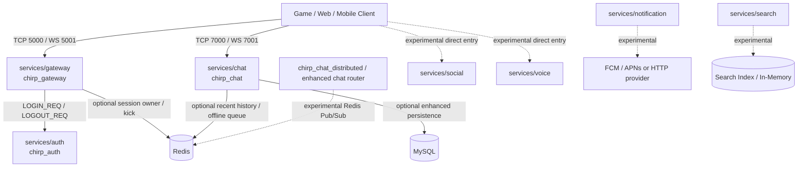
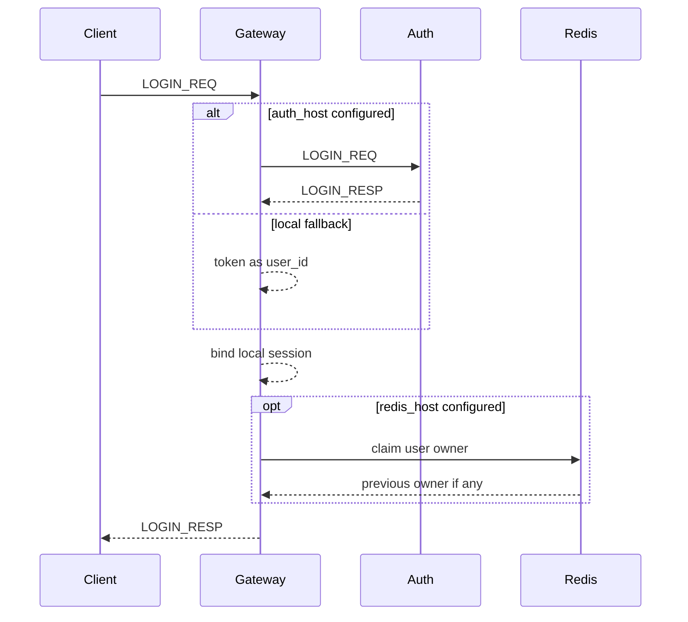
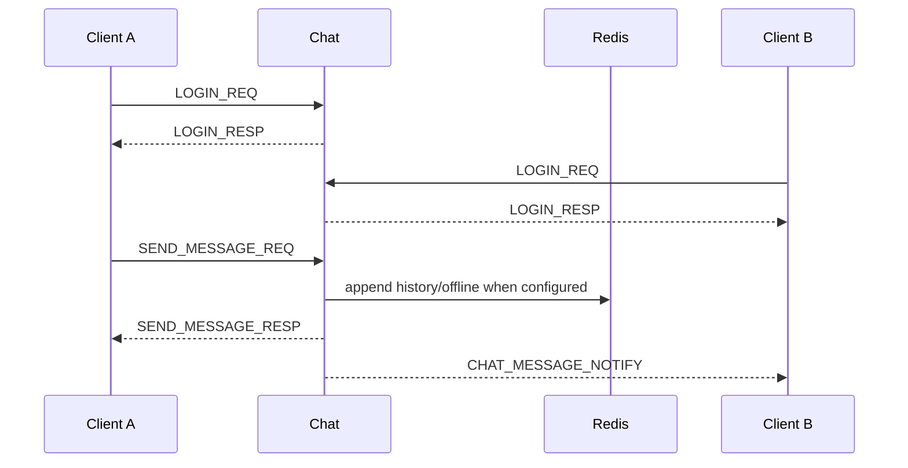
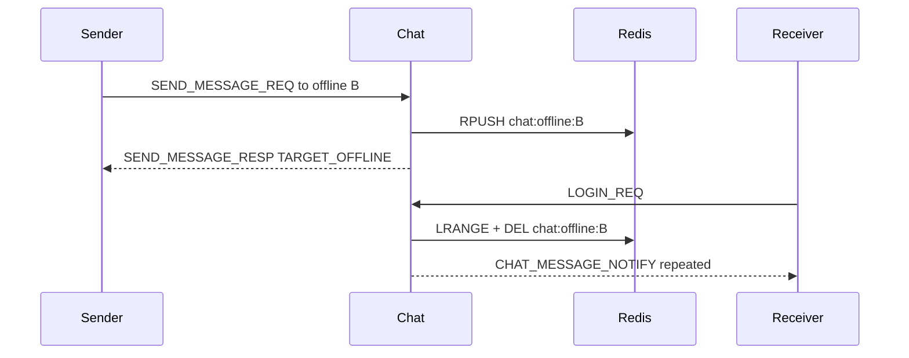
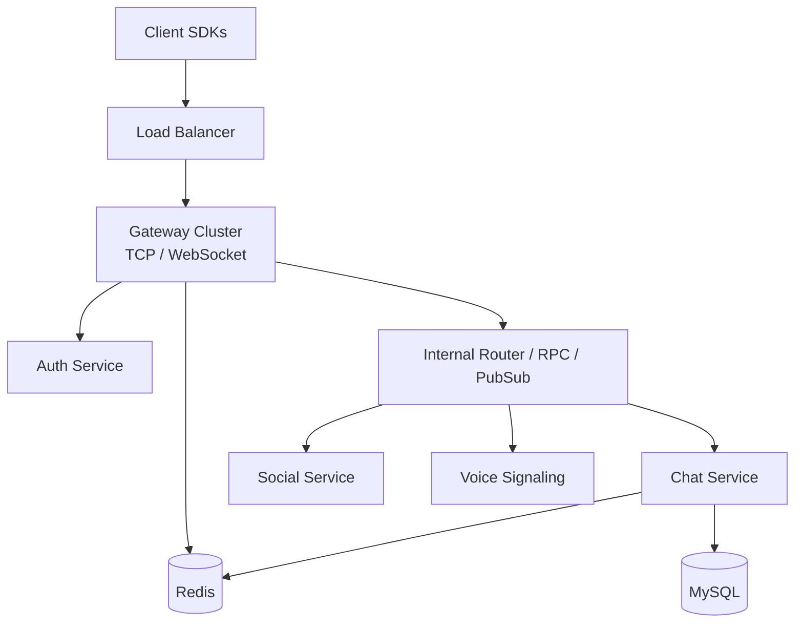

# Chirp Overall Architecture

Last reviewed: 2026-06-11

This document describes the current repository architecture, not the full roadmap. The current supported path is a runnable `gateway + auth + chat` backend skeleton. Social, voice, notification, search, multi-engine SDKs, mobile app, and admin dashboard exist in the tree, but they should be treated as experimental or demo surfaces unless the [Capability Matrix](./CAPABILITY_MATRIX.md) says otherwise.

## Executive Summary

The architecture is reasonable for the current stage if Chirp is positioned as a game-oriented realtime communication skeleton:

- A shared protobuf envelope gives every service a consistent client protocol.
- The network library centralizes TCP, WebSocket, length-prefix framing, and Redis helpers.
- `gateway` owns edge login/session concerns and can use Redis for multi-instance session ownership.
- `chat` can run independently for direct chat validation and has a path toward Redis/MySQL-backed storage.
- The monorepo layout makes protocol, backend, SDK, and smoke-test changes easy to evolve together.

It is not yet reasonable to present the project as a complete unified communication platform:

- `gateway` currently does not forward chat/social/voice business packets. It handles login, logout, heartbeat, and session kick flow.
- `chat` has its own TCP/WebSocket entrypoint and its own lightweight login/session registry. This is useful for development, but it means the current runtime is not a single unified edge architecture.
- Many protocol messages and docs describe richer group, read receipt, voice, social, notification, and search behavior than the default verified path proves.
- Distributed chat, enhanced auth, and hybrid storage are conditional or alternate paths, not one fully hardened production topology.

## Current Runtime Topology



Important interpretation:

- `gateway` and `chat` are both client-facing services today.
- `gateway` is not yet a universal business router.
- `chat` direct access is the practical path for current chat smoke tests and the C++ SDK example.
- Redis is optional for local validation, but required for meaningful multi-instance gateway session behavior and distributed chat routing experiments.
- MySQL is optional and only changes the built auth/chat implementation when the matching native dependencies are found by CMake.

## Repository Layers

| Layer | Paths | Current role |
| --- | --- | --- |
| Protocol | `proto/*.proto`, generated `proto/cpp`, `proto/go` | Shared message IDs and message schemas |
| Common library | `libs/common` | Logger, JWT/base64/sha256 helpers, metrics primitives |
| Network library | `libs/network` | ASIO TCP/WS sessions, length-prefixed framing, Redis RESP client, Redis Pub/Sub router |
| Core services | `services/gateway`, `services/auth`, `services/chat` | Supported backend skeleton |
| Experimental services | `services/social`, `services/voice`, `services/notification`, `services/search` | Useful implementation surface, not core verified path |
| SDKs | `sdks/core`, `sdks/unity`, `sdks/unreal` | Integration base and wrappers, currently experimental |
| Apps/tools | `apps/*`, `tools/benchmark` | Demos, smoke clients, benchmarks, archive helpers |
| Delivery | `docker-compose.yml`, `deploy/`, `scripts/`, `tests/` | Local orchestration, cluster sketches, build and smoke validation |

## Protocol Baseline

Both TCP and WebSocket use the same application-level framing:

```
TCP stream:
  [uint32_be payload_size][chirp.gateway.Packet protobuf bytes]

WebSocket:
  binary frame payload = [uint32_be payload_size][chirp.gateway.Packet protobuf bytes]
```

`chirp.gateway.Packet` is the business envelope:

```protobuf
message Packet {
  MsgID msg_id = 1;
  int64 sequence = 2;
  bytes body = 3;
}
```

`body` contains the serialized concrete protobuf message for `msg_id`, such as `chirp.auth.LoginRequest`, `chirp.chat.SendMessageRequest`, or `chirp.gateway.HeartbeatPing`.

This means `MsgID` is not a separate 2-byte field in the network frame. It is inside the protobuf `Packet`.

## Core Service Responsibilities

### Gateway

`services/gateway` is the edge session service for the current login path.

It currently handles:

- TCP and WebSocket listeners.
- `LOGIN_REQ`, `LOGIN_RESP`.
- `LOGOUT_REQ`, `LOGOUT_RESP`.
- `HEARTBEAT_PING`, `HEARTBEAT_PONG`.
- Local session registry.
- Optional Redis-backed session owner mapping for multi-instance kick.
- Optional Auth RPC call to `services/auth`.

It currently does not handle:

- Forwarding `SEND_MESSAGE_REQ` to chat.
- Routing social, voice, notification, or search messages.
- Service discovery.
- Centralized authorization for all business services.

### Auth

`services/auth` has two build-time modes:

- Basic mode: default fallback when MySQL/libsodium are unavailable. It validates the lightweight token flow used by local smoke tests.
- Enhanced mode: selected when MySQL and libsodium are available. It includes registration, password login, refresh tokens, session storage, rate limiting, and brute-force protection paths.

The same target name, `chirp_auth`, is used for the selected implementation. `chirp_auth_enhanced` is a compatibility alias when enhanced mode is available.

### Chat

`services/chat` is the most mature business service.

Basic mode currently supports:

- TCP and WebSocket direct entry.
- Lightweight `LOGIN_REQ` where token is treated as `user_id`.
- Private `SEND_MESSAGE_REQ`.
- `CHAT_MESSAGE_NOTIFY` for online recipients.
- Offline queue fallback.
- `GET_HISTORY_REQ`.
- Optional Redis list storage for history and offline messages.

Enhanced/distributed paths add:

- Hybrid Redis/MySQL message storage when MySQL is available.
- Redis Pub/Sub `MessageRouter`.
- Delivery tracking and pagination scaffolding.
- Separate `chirp_chat_distributed` target.

Current limitation: direct chat login and gateway login are separate session concepts. A client that logs in through `gateway` is not automatically authenticated in `chat`.

## Data Flow

### Gateway Login Flow



### Direct Chat Flow



### Offline Message Flow



## Is The Architecture Reasonable?

Yes, with a narrow product definition:

- It is a reasonable foundation for a game-chat prototype, protocol experiments, SDK integration work, and local smoke testing.
- It is reasonable to keep `chat` independently runnable while the gateway routing contract is still being designed.
- It is reasonable to use Redis first for session ownership, offline queues, and Pub/Sub because it keeps the early distributed design simple.
- It is reasonable for MySQL support to be conditional at this stage, as long as documentation clearly marks what changes when dependencies exist.

No, if the intended promise is a production-grade, unified realtime platform today:

- A single client session should not have to log in separately to `gateway` and `chat`.
- Public service entrypoints need a clear security model. If clients can directly reach `chat`, `chat` must become a first-class edge service with full auth, rate limiting, and abuse controls.
- If `gateway` is meant to be the only edge, it must route or proxy chat/social/voice traffic and own the end-to-end session contract.
- Capacity numbers, stable SDK claims, and production operations docs need measured evidence before being presented as guarantees.

## Recommended Direction

The cleanest target architecture is a unified edge gateway:



Recommended migration steps:

1. Keep documenting the current direct `chat` path as supported for local validation.
2. Decide whether `chat` remains public or becomes internal-only behind `gateway`.
3. If `gateway` becomes the only public edge, implement forwarding for chat packets before expanding social/voice routing.
4. Unify login/session semantics so `LOGIN_REQ` creates one authenticated identity that downstream services trust.
5. Move runtime configuration docs to the real command-line flags first, then add environment/config-file support only after code supports it.
6. Add smoke tests for the documented topology before claiming it as supported.

## Documentation Rules Going Forward

Use these rules when updating docs:

- `Supported` means the default documented path is buildable and smoke-testable.
- `Experimental` means code exists, but the path is conditional, alternate, or not part of the minimal verified runtime.
- `Demo` means useful for exploration, not a backend contract.
- `Stub` means incomplete or mock-driven.

When in doubt, link back to [Capability Matrix](./CAPABILITY_MATRIX.md) instead of making broad stability claims.
