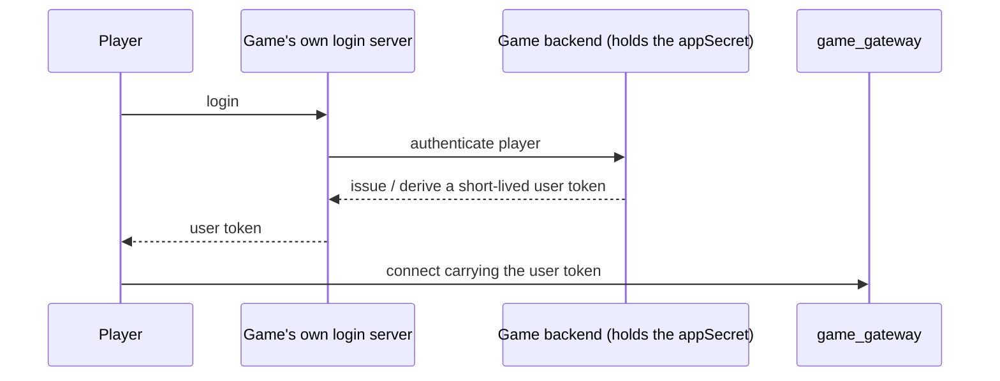
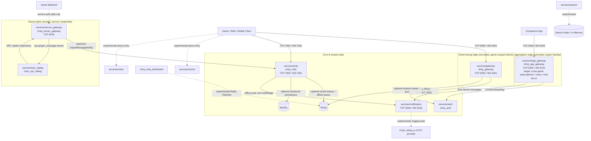
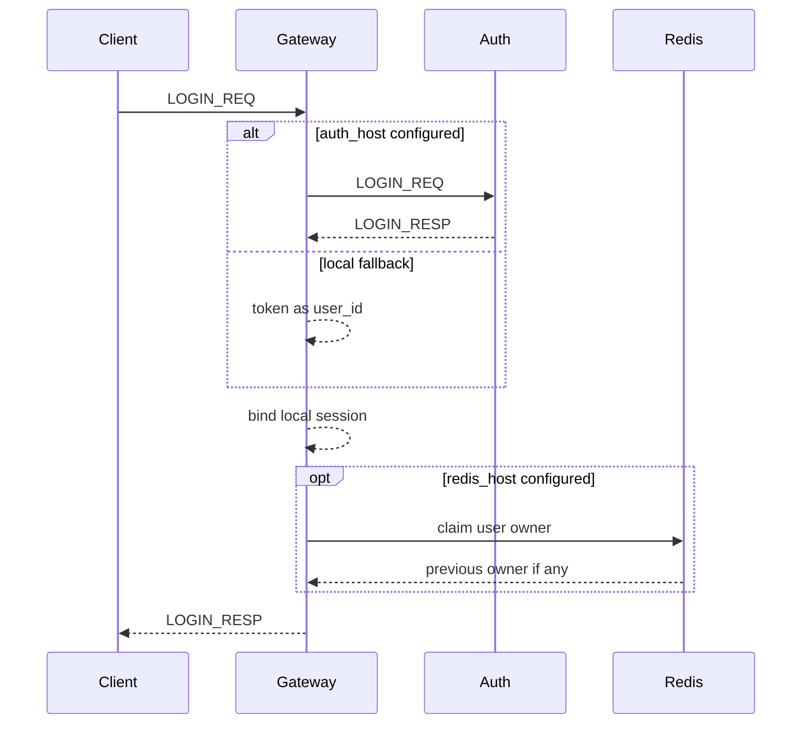
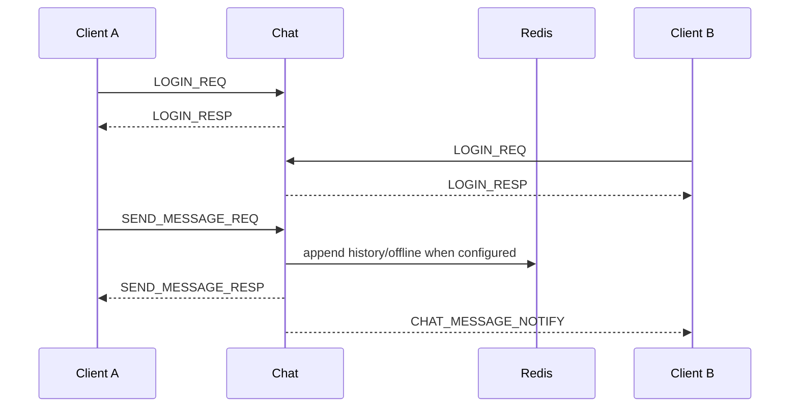
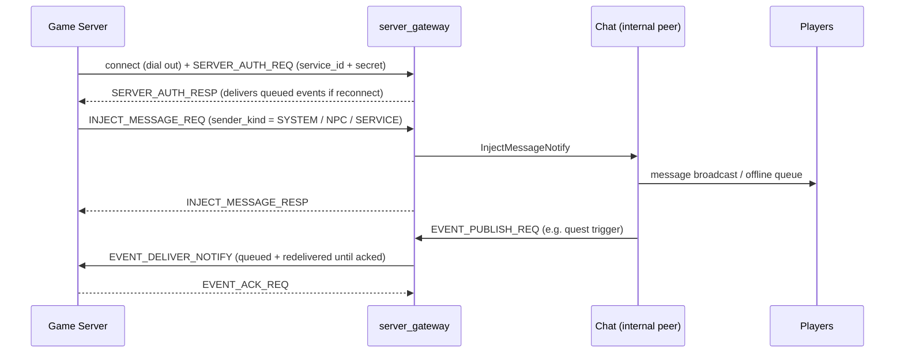

# Chirp Overall Architecture

Last reviewed: 2026-09-14

This document describes the repository architecture, including the decided target topology and the migration path toward it. The currently supported path is a runnable `gateway + auth + chat` backend skeleton. Social, voice, notification, search, multi-engine SDKs, mobile app, and admin dashboard exist in the tree, but they should be treated as experimental or demo surfaces unless the [Capability Matrix](./CAPABILITY_MATRIX.md) says otherwise.

## Executive Summary

The architecture is reasonable for the current stage if Chirp is positioned as a game-oriented realtime communication skeleton:

- A shared protobuf envelope gives every service a consistent client protocol.
- The network library centralizes TCP, WebSocket, length-prefix framing, and Redis helpers.
- `gateway` owns edge login/session concerns and can use Redis for multi-instance session ownership.
- `chat` can run independently for direct chat validation and has a path toward Redis/MySQL-backed storage.
- The monorepo layout makes protocol, backend, SDK, and smoke-test changes easy to evolve together.

It is not yet reasonable to present the project as a complete unified communication platform:

- `gateway` currently does not forward chat/social/voice business packets. It handles login, logout, heartbeat, and session kick flow.
- `chat` has its own TCP/WebSocket entrypoint and its own lightweight login/session registry. This is useful for development, but it means the current runtime is not a single unified edge architecture.
- Many protocol messages and docs describe richer group, read receipt, voice, social, notification, and search behavior than the default verified path proves.
- Distributed chat, enhanced auth, and hybrid storage are conditional or alternate paths, not one fully hardened production topology.

## Access Topology: Three Independent Edges

Chirp has three access points with different trust models, transports, and lifecycles. The decided topology (2026-09) gives each its own edge service. **Edges are independent; the core underneath is shared.**

| Access point | Edge | Transport | Identity | Network reality |
| --- | --- | --- | --- | --- |
| Game client | `game_gateway` (evolved from `services/gateway`) | TCP + Packet | **game-scoped** user token (issued by that game's backend) | lives and dies with the game process |
| Companion app | `app_gateway` (experimental) | WebSocket/TCP + optional TLS/wss (`--tls_port`/`--ws_tls_port`, `--tls_cert`/`--tls_key`) | **player identity** (platform-scoped), linked to N game identities | mobile network: reconnects, NAT timeouts, backgrounding |
| Game backend | `server_gateway` | outbound long connection; broker fallback | `service_id` + service secret | always-on trusted service, usually in a private subnet |

### Game-facing plane vs player aggregation plane

The two untrusted edges are not the same edge tuned differently — they serve two different planes:

- **The game-facing plane is not aggregating.** The SDK, `game_gateway`, the chat plane it enters, and the `server_gateway` integration serve **game integrations**: one deployment may carry a single game or several titles from the same operator (each with its own `service_id` and backend-issued, game-scoped user tokens), and identity/channel/history data stays game-scoped. What this plane never does is aggregate a player's experience **across** games — an integration only sees the games it serves.
- **The app plane aggregates players.** A player plays multiple games. `app_gateway` authenticates the **player** (a platform-scoped identity, not any single game's user) and is the home for cross-game capabilities: subscribing to / following channels of the games they play, reading those games' in-game chat from one place, and cross-game voice team-up where a room can mix players from different games.

Design consequences of the split (target model; see the open decision below):

1. **Identity binding registry.** The player identity and each game identity must be linked. The natural assertion point is the game backend: it knows "platform user X is game user Y", and links via the server plane (the same trust plane that already carries `service_id`). Chirp stores the bindings; edges never guess them.
2. **Subscription + fan-in routing.** The app needs a subscription registry (`player → {game, channel}`) and a routing path that fans per-game chat traffic into the player's aggregated feed, with unified unread counts across games. (2026-09: live — the registry (slice 2), hub-side fan-in delivery — game-tagged injects fanned out to subscribers as private copies through chat's delivery tail (slice 3), and the unified unread badge ledger with mark-read/summary self-service RPCs (slice 4).)
3. **Voice identity is player-scoped.** Cross-game team-up rooms belong to the player plane; membership and signaling identity are the player, not a game user. The per-game voice plane (4xxx) stays game-scoped.
4. **Channels and history carry a game namespace.** Aggregation is only possible if per-game data is namespaced before it reaches the player plane.

Open decision (resolved together with the P1 session-core work): **how the app plane reaches per-game chat data** — a shared multi-tenant core with game-namespaced channels, or federated per-game chirp stacks bridged into the app plane. The repository currently runs one shared core, so the multi-tenant namespace direction is the default assumption; federation remains the fallback if per-game isolation requirements demand it.

Rules that make independence work:

- **Edges are thin**: connection management, protocol adaptation, auth forwarding, heartbeat. No business state lives in an edge.
- **The core is shared**: auth, the device-level session/Presence registry, the identity-binding registry, chat, and notification (the app edge's offline push bridge). The same **player** being in-game (via a game identity) and on the app (via the player identity) simultaneously is a core scenario, so cross-device delivery, kick policy, binding lookup, and unified unread counts are resolved in the core, not in any edge.
- **The game backend plane never uses user identity** and never touches the player edges. A game server that logs into a player gateway would have to masquerade as a user: it would pollute session semantics, break kick/presence, and distort rate-limiting designed for untrusted peers.

### Credential model: service credentials vs user tokens

The three edges use two different kinds of credentials. They answer different questions and are not interchangeable:

- **Service credentials** (`service_id` + shared secret, i.e. appkey/appSecret-style) identify **the integrating backend** — "which game or service are you". They are long-lived, must be stored securely, and are only ever used server-to-server on the server plane. They must never ship inside a client: anything bundled into a game client or app binary is effectively public (reverse engineering, packet capture), and a leaked service credential compromises the entire integration.
- **User tokens** identify **one user session** — "which player is behind this connection". They are short-lived and revocable, so leakage has a bounded blast radius. Clients only ever hold user tokens, never service credentials.

The typical issuance flow for a game client:


```mermaid
sequenceDiagram
    participant P as Player
    participant LS as Game's own login server
    participant GB as Game backend (holds the appSecret)
    participant GW as game_gateway

    P->>LS: login
    LS->>GB: authenticate player
    GB-->>LS: issue / derive a short-lived user token
    LS-->>P: user token
    P->>GW: connect carrying the user token
```

How a user token is verified is an implementation choice, not a protocol requirement:

| Scheme | Verification | Cost |
| --- | --- | --- |
| Opaque token + Redis lookup | Every service queries Redis per token | One network hop per verification |
| Signed token (HMAC or JWT) | Local signature check, zero network hops | Revocation waits for expiry (mitigate with a short TTL) |
| Hybrid | Signed token + Redis revocation/device state | Slightly more complex |

**Current decision (2026-09):** signed tokens — the auth service issues HS256 JWTs (`sub` + mandatory `exp`) and edge services verify them locally with the same `libs/common` JWT helpers. The deployment convention is secret alignment: `chirp_auth --jwt_secret` and the edge services' `--token_secret` carry the same value, and a client's original token traverses gateway → ChatBridge → chat verbatim, verified at both ends with no conversion step. The auth-enhanced scaffold fallback (token-as-user-id) is behind `--allow_scaffold_login` (default off). Opaque and hybrid variants stay deferred (TODO.md P3); hybrid can layer on later without a protocol change.

### Why the shared core is not a single point of failure

"Shared core" means a shared data model and shared libraries — not a single process:

- **Edges are stateless.** Any number of `game_gateway` / `app_gateway` instances can run behind a load balancer; losing one only drops its current connections, which reconnect elsewhere.
- **Auth is only on the login path.** If token verification is a local signature check (see above), an auth outage blocks *new logins* while existing sessions — messages, heartbeats, kick — keep working untouched.
- **The session registry degrades, it does not halt.** Redis (Sentinel/Cluster) is the source of truth for `user → device → edge instance` state; if it is unavailable, an edge falls back to its local in-memory registry — the same behavior `gateway` already exhibits when `redis_host` is unset. The failure mode is *degradation* (no cross-instance kick, no cross-device sync), not *outage* (messaging keeps working).
- **The alternative is worse.** Per-service session registries — the current shape, where `gateway` and `chat` each keep their own — trade a manageable availability concern for an unmanageable consistency split: the same player can be "online" in one service and "offline" in another, and cross-device delivery/kick/unread semantics become unanswerable. A single source of truth with graceful degradation is strictly more robust than N conflicting registries.

### Edge comparison: what differs, what is shared

The three access points share a common skeleton but differ on almost every operational dimension. This matrix is the evidence base for the three-edge decision:

| Dimension | Game client | Companion app | Game backend |
| --- | --- | --- | --- |
| Identity granularity | Game-scoped user session (game's own user + device); deployments follow integrations (one integration may cover several titles) | Player session (platform identity) + device push token, linked to N game identities | Service identity (**never a user**) |
| Credential | Short-lived user token | Short-lived user token | Long-lived appkey/appSecret (`service_id` + secret) |
| Connection direction | Dial-in | Dial-in | **Dial-out** (no callback port into private subnets) |
| Transport | TCP preferred (no WS frame/masking overhead), WS offered on the same edge | WS common — for **web-version reachability, middlebox traversal, and L7 infrastructure**, not because WS suits mobile networks (WS rides on TCP; NAT timeouts and radio wakeups hit both equally). Process death on mobile is absorbed by APNs/FCM push, not by transport choice | TCP; Redis Streams broker fallback |
| Network environment | Public internet; mobile games included — transport choice is the integrator's tradeoff, not an edge property | Mobile: NAT timeouts, backgrounding, restrictive proxies | Private subnet, stable |
| Process lifecycle | Lives and dies with the game process | Killable by the OS at any time; push is the fallback | Always-on daemon |
| Message pattern | High-frequency, low-latency: chat, heartbeat, state sync | Low-frequency IM; **offline push is the critical path** | System injection + event callbacks |
| Offline semantics | Pull offline queue / history on next login | APNs/FCM push brings the user back | Events persist and redeliver on reconnect **until acked** |
| Trust & rate limiting | Untrusted: strict rate/size limits | Untrusted: same + TLS | Trusted intranet: credential auth, no user-level limits |
| Msg-id blocks | 1xxx / 2xxx (+ 3xxx/4xxx) | 1xxx + 6xxx | 5xxx |
| SDK shape | Engine plugins (Unity/Unreal/C++) | Flutter + CallKit/FCM system integration | Embedded client lib, or plain `XADD` from any language |
| Reconnect recovery | Reconnect + re-login | Reconnect + backoff + push fallback | Reconnect + replay of unacked events |

What all three share (the shared core's scope):

- The same wire framing: `[uint32_be size][chirp.gateway.Packet]` — and each edge listens on TCP and WS simultaneously carrying the same payload, so transport is the integrator's choice, not an edge-defining property.
- The same connection lifecycle skeleton: authenticate on the first frame within a timeout, heartbeat, reconnect.
- The same destination: auth, session/presence, the binding registry, chat, notification. The same **player** playing in-game (game identity) and chatting from the app (player identity) simultaneously is a core scenario, not an edge case.
- Idempotency keys for retries: `sequence` on client requests, `inject_id` / `event_id` on the server plane.

Design conclusions drawn from the matrix:

1. **Game client vs app share the connection skeleton, not the identity plane** — both are untrusted user-token edges with the same lifecycle needs, so the *connection* skeleton should be one shared edge library with per-edge configuration (heartbeat cadence, push bridge, TLS), not copied code (tracked as P0 in TODO.md) — the code already shows the duplication: `app_gateway` reuses the gateway's session registry and auth client by compiling its sources. But the *business* surface differs fundamentally: the game edge serves one game's deployment and its game-scoped identity; the app edge is the player aggregation plane (subscriptions, cross-game fan-in, cross-game voice). Do not collapse them into "the same edge, different tuning".
2. **The game backend differs in trust model fundamentally** — non-user identity, credentials that must never ship in a client, opposite connection direction, at-least-once semantics. Any shortcut that reuses a player edge for game servers corrupts session semantics.
3. **The sharing boundary is exactly four things**: the envelope/framing, the codec, the session core, and base libraries. Transport tuning, reconnect policy, rate limits, and offline semantics are edge-private.

### Server plane design

- **Dial-out, not call-in.** Game servers open the connection to `server_gateway` (agent model). Chirp never needs inbound access into game networks, and game servers in private subnets need no public callback endpoint.
- **Protocol.** Same Packet framing, a dedicated `5xxx` msg-id block. The first frame on any connection must be `SERVER_AUTH_REQ` carrying `service_id` + secret; unauthenticated connections are closed after a short timeout.
- **Long connection first, broker second.** The long connection provides push semantics with in-connection ack/retry. Integrations that cannot host a long-connection client use a broker fallback (Redis Streams: consumer groups + ack + replay). Raw pub/sub is avoided because it loses events across restarts.
- **Non-user sender identities.** Injected messages carry `SenderKind`: `SYSTEM` (announcements), `NPC` (in-game AI), `SERVICE` (game logic such as trade state). The chat data model must accept these identities under permission rules distinct from user accounts.
- **At-least-once downlink.** Events pushed to a game service are queued per target service and redelivered on reconnect until acknowledged. Queue overflow rejects new publishes rather than silently dropping older events.

### Platform and I/O backend

- **Target platform is Linux only.** Backend CI already runs Linux only (`cmake-multi-platform.yml` builds on ubuntu; the sole macOS job builds the iOS app shell, which is an Apple toolchain constraint, not a backend target).
- **Reactor encapsulation.** All socket I/O goes through `libs/network` on ASIO. The reactor stays an implementation detail behind that library: services never construct reactors directly.
- **io_uring backend: dropped from the roadmap (2026-09).** epoll via ASIO meets current throughput targets with headroom; ASIO's io_uring support does not cover every service the codebase uses, so a backend switch would buy complexity without a measured win. Revisit only with real epoll-bound bottleneck evidence.

## Current Runtime Topology

What actually runs today:


```mermaid
flowchart TB
    Client["Game / Web / Mobile Client"]
    App["Companion App"]
    GameBackend["Game Backend"]

    subgraph gameedge["Game-facing edge (untrusted, game-scoped tokens)"]
      Gateway["services/gateway<br/>chirp_gateway<br/>TCP 5000 / WS 5001"]
    end

    subgraph appedge["Player aggregation edge (untrusted, player identity)"]
      AppGateway["services/app_gateway<br/>chirp_app_gateway<br/>TCP 5200 / WS 5201<br/>target: cross-game subscriptions / voice / chat fan-in"]
    end

    subgraph plane["Server plane (trusted, service credentials)"]
      ServerGateway["services/server_gateway<br/>chirp_server_gateway<br/>TCP 8100"]
      NpcDialog["services/npc_dialog<br/>chirp_npc_dialog"]
    end

    subgraph core["Core & shared state"]
      Auth["services/auth<br/>chirp_auth"]
      Chat["services/chat<br/>chirp_chat<br/>TCP 7000 / WS 7001"]
      Notification["services/notification<br/>TCP 5006 / WS 5016"]
      Redis[("Redis")]
      MySQL[("MySQL")]
    end

    Client -- "TCP 5000 / WS 5001" --> Gateway
    Client -- "TCP 7000 / WS 7001" --> Chat
    App -- "TCP 5200 / WS 5201" --> AppGateway

    Gateway -- "LOGIN_REQ / LOGOUT_REQ" --> Auth
    Gateway -- "optional session owner / kick" --> Redis
    AppGateway -- "LOGIN forwarding" --> Auth
    AppGateway -- "6xxx device messages" --> Notification

    Chat -- "optional recent history / offline queue" --> Redis
    Chat -- "optional enhanced persistence" --> MySQL
    Chat -- "offline push via PushBridge" --> Notification

    GameBackend -. "service auth (dial out)" .-> ServerGateway
    ServerGateway -- "injections (InjectMessageNotify)" --> Chat
    ServerGateway -- "npc.player_message events" --> NpcDialog
    NpcDialog -- "NPC replies (injections)" --> ServerGateway

    ChatDist["chirp_chat_distributed"] -. "experimental Redis Pub/Sub" .-> Redis
    Client -. "experimental direct entry" .-> Social["services/social"]
    Client -. "experimental direct entry" .-> Voice["services/voice"]
    Notification -. "experimental, logging stub" .-> ExternalPush["FCM / APNs or HTTP provider"]
    Search["services/search"] -. "experimental" .-> Index[("Search Index / In-Memory")]
```

Important interpretation:

- `gateway` and `chat` are both client-facing services today; the game backend plane runs as `server_gateway` (hub, TCP 8100) plus plane clients — `chat` as an internal node and `npc_dialog` as the first event consumer, with a process-level smoke (`./test_services.sh --smoke-npc`). Game backends still integrate through the protocol, not a shipped reference client.
- `app_gateway` (TCP 5200 / WS 5201) is live as an experimental companion-app edge: gateway-style auth/heartbeat plus 6xxx device-message forwarding to notification. Chat business packets are not accepted there (that is migration step 4). Its **target role is the player aggregation plane** — the player identity linked to N games, cross-game channel subscriptions, aggregated in-game chat, and cross-game voice team-up (see "Game-facing plane vs player aggregation plane" above). The registry foundation is real: identity bindings (WP-8 slice 1) live on the server plane, and with `--sg_host` configured the edge forwards 5021-5026 subscription calls from authenticated players to the hub, pinning `player_id` (WP-8 slice 2). Fan-in delivery is live on the hub (WP-8 slice 3): a `game_id`-tagged injection fans out to the channel's subscribers as private copies through chat's normal delivery tail. Unified unread is live (WP-8 slice 4): the hub's badge ledger counts delivered fan-in copies, and the edge forwards 5027/5029 mark-read/summary calls so players clear and read their own badges.
- `gateway` is not yet a universal business router.
- `chat` direct access is the practical path for current chat smoke tests and the C++ SDK example.
- Redis is optional for local validation, but required for meaningful multi-instance gateway session behavior and distributed chat routing experiments.
- MySQL is optional and only changes the built auth/chat implementation when the matching native dependencies are found by CMake.

## Repository Layers

| Layer | Paths | Current role |
| --- | --- | --- |
| Protocol | `proto/*.proto`, generated `proto/cpp`, `proto/go` | Shared message IDs and message schemas |
| Common library | `libs/common` | Logger, JWT/base64/sha256 helpers, metrics primitives |
| Network library | `libs/network` | ASIO TCP/WS sessions, length-prefixed framing, Redis RESP client, Redis Pub/Sub router; the future reactor-encapsulation point |
| Core services | `services/gateway`, `services/auth`, `services/chat`, `services/server_gateway` | Supported backend skeleton |
| Experimental services | `services/social`, `services/voice`, `services/notification`, `services/search`, `services/npc_dialog` | Useful implementation surface, not core verified path |
| SDKs | `sdks/core`, `sdks/unity`, `sdks/unreal` | Integration base and wrappers, currently experimental |
| Apps/tools | `apps/*`, `tools/benchmark` | Demos, smoke clients, benchmarks, archive helpers |
| Delivery | `docker-compose.yml`, `deploy/`, `scripts/`, `tests/` | Local orchestration, cluster sketches, build and smoke validation |
| Quality gates | `tests/unit`, `scripts/run_coverage.sh`, `test_services.sh` | 25 unit suites at 100% line coverage per the repo coverage script (documented exclusions only); CI hard-fails any package under 98%; seven process-level smokes (`--smoke`, `--smoke-chat`, `--smoke-sdk`, `--smoke-npc`, `--smoke-edge`, `--smoke-jwt`, `--smoke-redis`) |

## Protocol Baseline

Both TCP and WebSocket use the same application-level framing:

```
TCP stream:
  [uint32_be payload_size][chirp.gateway.Packet protobuf bytes]

WebSocket:
  binary frame payload = [uint32_be payload_size][chirp.gateway.Packet protobuf bytes]
```

`chirp.gateway.Packet` is the business envelope:

```protobuf
message Packet {
  MsgID msg_id = 1;
  int64 sequence = 2;
  bytes body = 3;
}
```

`body` contains the serialized concrete protobuf message for `msg_id`, such as `chirp.auth.LoginRequest`, `chirp.chat.SendMessageRequest`, or `chirp.gateway.HeartbeatPing`.

This means `MsgID` is not a separate 2-byte field in the network frame. It is inside the protobuf `Packet`.

Message-ID blocks are planned per access point so no single enum grows without bounds: `1xxx` auth/session, `2xxx` chat, `3xxx` social, `4xxx` voice, `5xxx` server plane (game backend).

## Core Service Responsibilities

### Gateway (game client edge, in evolution)

`services/gateway` is the edge session service for the current login path.

It currently handles:

- TCP and WebSocket listeners.
- `LOGIN_REQ`, `LOGIN_RESP`.
- `LOGOUT_REQ`, `LOGOUT_RESP`.
- `HEARTBEAT_PING`, `HEARTBEAT_PONG`.
- Local session registry.
- Optional Redis-backed session owner mapping for multi-instance kick.
- Optional Auth RPC call to `services/auth`.

It currently does not handle:

- Forwarding `SEND_MESSAGE_REQ` to chat.
- Routing social, voice, notification, or search messages.
- Service discovery.
- Centralized authorization for all business services.

Its target role is `game_gateway`: the game-client edge of the three-edge topology, eventually absorbing the direct chat entry so clients only know edges.

### Auth

`services/auth` has two build-time modes:

- Basic mode: default fallback when MySQL/libsodium are unavailable. It validates the lightweight token flow used by local smoke tests.
- Enhanced mode: selected when MySQL and libsodium are available. It includes registration, password login, refresh tokens, session storage, rate limiting, and brute-force protection paths. In enhanced mode a `LOGIN_REQ` token must be a valid access token (HS256 JWT with `exp`, issued under `--jwt_secret`) or an active session id; the development scaffold fallback (token taken as user id) requires `--allow_scaffold_login 1` and is off by default, so a tightened deployment answers `AUTH_FAILED` to scaffold tokens.

The same target name, `chirp_auth`, is used for the selected implementation. `chirp_auth_enhanced` is a compatibility alias when enhanced mode is available.

### Chat

`services/chat` is the most mature business service.

Basic mode currently supports:

- TCP and WebSocket direct entry.
- Lightweight `LOGIN_REQ` where token is treated as `user_id`.
- Private messages, group lifecycle and roles, read receipts, typing indicators, reactions, message edit/delete with moderator support, and @mention parsing/autocomplete.
- Offline queue fallback.
- Optional Redis list storage for history and offline messages.

Enhanced/distributed paths add:

- Hybrid Redis/MySQL message storage when MySQL is available.
- Redis Pub/Sub `MessageRouter`.
- Delivery tracking and pagination scaffolding.
- Separate `chirp_chat_distributed` target.

Current limitation: direct chat login and gateway login are separate session concepts. A client that logs in through `gateway` is not automatically authenticated in `chat`. In the target topology chat becomes an internal service; it must also learn to accept server-plane injected messages carrying non-user sender identities.

### Server Gateway (game backend edge)

`services/server_gateway` (`chirp_server_gateway`) is the trusted service plane hub:

- Authenticates game backends (and internal services such as chat) via `service_id` + secret on a dedicated listener.
- Uplink: forwards message injections toward the chat service (`INJECT_MESSAGE_REQ` in, `InjectMessageNotify` out) with non-user sender identities.
- Downlink: reliable event delivery to connected services with per-service queues, acks, and redelivery on reconnect.
- No user-session semantics: it does not participate in login/kick/presence for players.

See the `5xxx` msg-id block in `proto/gateway.proto` and `proto/server_gateway.proto` for the wire contract.

## Data Flow

### Gateway Login Flow


```mermaid
sequenceDiagram
    participant C as Client
    participant G as Gateway
    participant A as Auth
    participant R as Redis

    C->>G: LOGIN_REQ
    alt auth_host configured
        G->>A: LOGIN_REQ
        A-->>G: LOGIN_RESP
    else local fallback
        G-->>G: token as user_id
    end
    G-->>G: bind local session
    opt redis_host configured
        G->>R: claim user owner
        R-->>G: previous owner if any
    end
    G-->>C: LOGIN_RESP
```

### Direct Chat Flow


```mermaid
sequenceDiagram
    participant A as Client A
    participant C as Chat
    participant R as Redis
    participant B as Client B

    A->>C: LOGIN_REQ
    C-->>A: LOGIN_RESP
    B->>C: LOGIN_REQ
    C-->>B: LOGIN_RESP
    A->>C: SEND_MESSAGE_REQ
    C->>R: append history/offline when configured
    C-->>A: SEND_MESSAGE_RESP
    C-->>B: CHAT_MESSAGE_NOTIFY
```

### Server Plane Flow (target)


```mermaid
sequenceDiagram
    participant GS as Game Server
    participant SG as server_gateway
    participant CH as Chat (internal peer)
    participant P as Players

    GS->>SG: connect (dial out) + SERVER_AUTH_REQ (service_id + secret)
    SG-->>GS: SERVER_AUTH_RESP (delivers queued events if reconnect)
    GS->>SG: INJECT_MESSAGE_REQ (sender_kind = SYSTEM / NPC / SERVICE)
    SG->>CH: InjectMessageNotify
    CH->>P: message broadcast / offline queue
    SG-->>GS: INJECT_MESSAGE_RESP
    CH->>SG: EVENT_PUBLISH_REQ (e.g. quest trigger)
    SG->>GS: EVENT_DELIVER_NOTIFY (queued + redelivered until acked)
    GS-->>SG: EVENT_ACK_REQ
```

## Migration Path

From the current runtime to the three-edge topology, in order:

1. **Server plane hub** (`chirp_server_gateway`): greenfield, no legacy constraints; unblocks NPC quest callbacks, system/trade message injection. Chat consumes injections as an internal peer.
2. **Device-level session core**: upgrade the existing Redis session registry from "user → instance" to "user → device → edge instance". Prerequisite for the app edge and for cross-device semantics. **Done (2026-09):** claim keys are `chirp:sess:<user>\x1F<device>` and kick payloads carry the device, so different devices of one player coexist across edge instances while a re-login on the same device still displaces it; known limitations: the claim is three Redis commands (no atomicity), and the key-format change ships without a compatibility layer (pre-device keys age out within the claim TTL).
3. **App edge** (`app_gateway`): WebSocket-first with mobile tuning (heartbeat, reconnect backoff) plus the notification service as a real APNs/FCM push bridge. **Partial delivery (2026-09):** `chirp_app_gateway` serves auth/heartbeat/device-forwarding on TCP 5200 / WS 5201 and chat's offline queue triggers pushes through notification; still missing are TLS, mobile tuning, real provider delivery (the `PushTransport` seam is backed by a logging stub), and cross-game voice. The registry half of the player-aggregation model is real on the server plane: identity bindings (WP-8 slice 1), channel subscriptions with self-service (slice 2), hub-side fan-in delivery (slice 3), and the unified unread badge ledger with self-service mark-read/summary (slice 4) (see "Game-facing plane vs player aggregation plane").
4. **Game edge consolidation**: `game_gateway` absorbs the direct chat entry so clients only know edges; chat becomes internal-only. **Done (2026-09):** the gateway forwards chat business packets (2xxx) to chat over per-client internal connections — a client's successful gateway login dials one pipe that authenticates with `SERVER_AUTH_REQ` (the same service-secret trust gate the server plane uses) and replays the client's login (token + device passthrough), then relays frames verbatim in both directions (every push chat emits for a user arrives on that user's own connection, so no seq correlation is needed). A dropped or rejected pipe kicks the client (`KICK_NOTIFY`) so it reconnects and reattaches; chat's per-IP login limiter exempts trusted gateway pipes so one gateway address cannot exhaust the budget. **Unified login semantics landed (2026-09):** auth-enhanced and chat verify the same HS256 JWT contract (secret alignment is the deployment convention; `--smoke-jwt` proves the full gateway→chat passthrough and that scaffold tokens are rejected). Known limits: the internal connection carries no application-layer heartbeat (chat has no idle timeout, matching the direct path), each client holds one chat connection, and the auth-issued `session_id` is still a placeholder (`<user>_sess`), not a durable session. The direct chat entry stays buildable and smoke-tested (`--smoke-edge` covers both paths).

At every step the currently supported direct path stays buildable and smoke-tested until its replacement is verified.

## Is The Architecture Reasonable?

Yes, with the three-edge decision applied:

- Separating the game backend plane from the player edges resolves the trust-model mismatch: trusted services authenticate with service credentials over their own protocol, and never masquerade as users.
- Independent edges with a shared core match the product: the same user plays on the game client and chats from the app, so session/Presence must be shared, while transports and lifecycles legitimately differ per edge.
- Dial-out long connections for game backends fit real deployments (private subnets, no public callback endpoints) and give push semantics; the Redis Streams fallback covers integrations that cannot host a connection client.

What remains unreasonable today, and is being closed by the migration path:

- Clients currently authenticate separately to `gateway` and `chat`.
- Public service entrypoints still need the full security model (rate limiting, abuse controls) before client-direct chat can be presented as a hardened edge.
- Capacity numbers, stable SDK claims, and production operations docs need measured evidence before being presented as guarantees.

## Documentation Rules Going Forward

Use these rules when updating docs:

- `Supported` means the default documented path is buildable and smoke-testable.
- `Experimental` means code exists, but the path is conditional, alternate, or not part of the minimal verified runtime.
- `Demo` means useful for exploration, not a backend contract.
- `Stub` means incomplete or mock-driven.

When in doubt, link back to [Capability Matrix](./CAPABILITY_MATRIX.md) instead of making broad stability claims.
