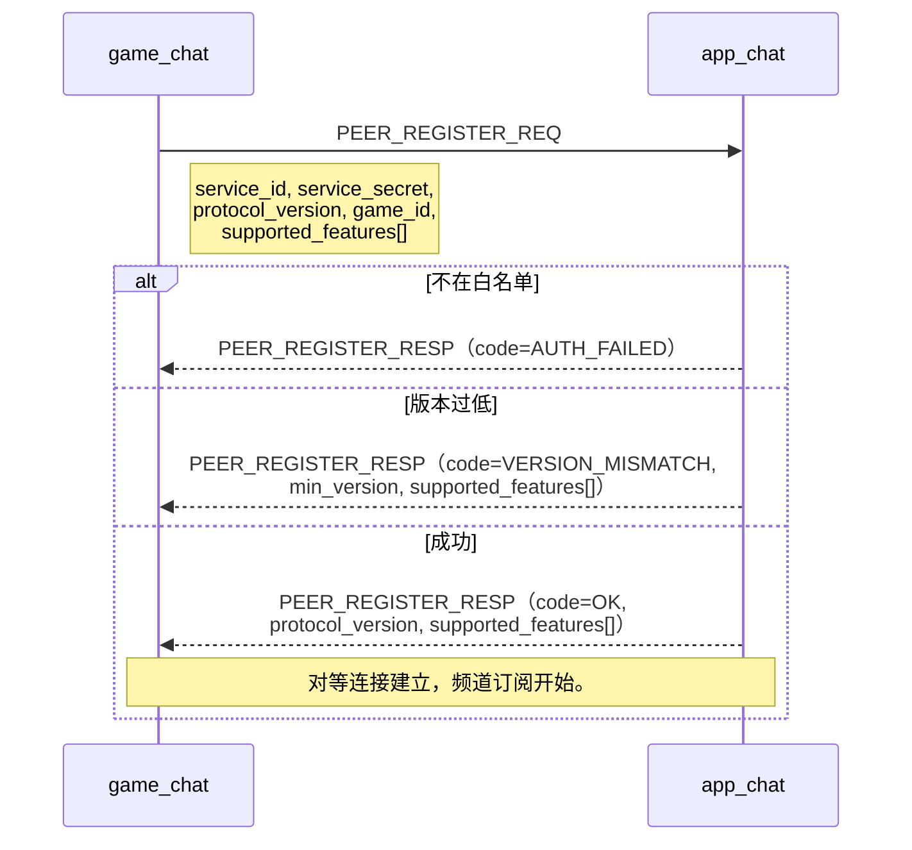
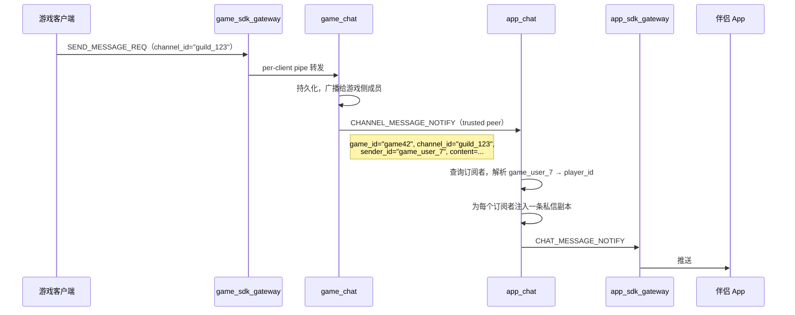
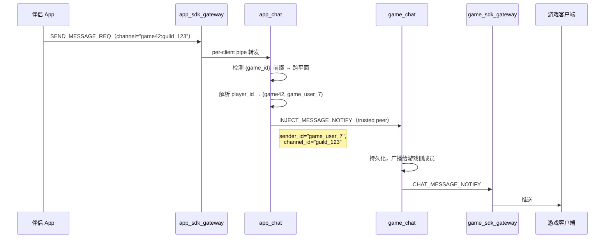
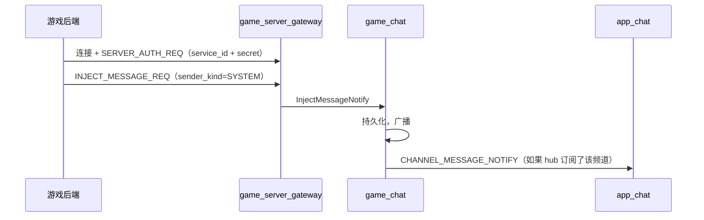

# Chirp 整体架构

最后审查：2026-09-21

Chirp 是面向游戏的实时通信后端。游戏平面和 App 平面是两套独立系统，各自有独立的边缘和独立的 chat 服务。跨平面通信是 chat 的原生能力——两个 chirp_chat 实例直连，通过内置的注册协议、版本协商和访问控制完成接入。

## 概要

- 两个平面，两个 chat 实例。`game_chat` 服务游戏客户端；`app_chat` 服务伴侣 App。同一个二进制，不同部署。
- `app_chat` 是 hub。`game_chat` 实例通过内置的对等注册协议接入，支持白名单和版本协商。
- `game_server_gateway` 是轻量的游戏后端注入枢纽。
- 边缘（`game_sdk_gateway`、`app_sdk_gateway`）是无状态连接管理器。
- 游戏平面完全自足，不依赖 App 平面的任何组件。单独部署"只做游戏聊天"是一等公民。
- 两个平面的认证完全隔离：游戏平面由游戏后端签发 token，game_chat 本地验证；App 平面由 `app_auth` 签发/验证平台用户令牌。

## 设计原则

1. **两个平面，不是一个共享核心。** 游戏平面面向游戏、高频、低延迟。App 平面面向玩家、低频、重聚合。
2. **同协议，同二进制。** `game_chat` 和 `app_chat` 是同一个 `chirp_chat` 二进制。跨平面通信使用 chat 原生的 trusted-peer 协议——没有翻译层，没有外部桥接进程。
3. **Hub-spoke 接入模型。** `app_chat` 是 hub。每个 `game_chat` 注册接入。hub 通过白名单和凭证验证控制谁能连接。
4. **边缘薄。** 连接管理、协议适配、认证转发、心跳。边缘不持有业务状态。
5. **平面之间零依赖。** 游戏平面不依赖 App 平面的任何组件（包括认证）。App 平面通过注册协议接入游戏平面，不是反过来。
6. **可信平面用服务凭证，不可信边缘用用户令牌。** 不混用。

## 拓扑

```mermaid
flowchart TB
    subgraph game_plane["游戏平面（独立部署单元）"]
      GC1["游戏客户端 A"] -->|TCP/WS| GG1["game_sdk_gateway #1"]
      GC2["游戏客户端 B"] -->|TCP/WS| GG2["game_sdk_gateway #2"]
      GG1 -->|per-client pipe| GCHAT["game_chat"]
      GG2 -->|per-client pipe| GCHAT
      GB["游戏后端"] -->|出站连接，服务凭证| SG["game_server_gateway"]
      SG -->|注入| GCHAT
      GCHAT -->|事件| SG
      GG1 & GG2 -->|LOGIN_REQ| GCHAT
      Note right of GCHAT: 本地验证 token（--token_secret）<br/>不依赖外部认证服务
    end

    subgraph app_plane["App 平面（可选附加）"]
      APP1["伴侣 App"] -->|WS/TLS| AG1["app_sdk_gateway #1"]
      APP2["伴侣 App"] -->|WS/TLS| AG2["app_sdk_gateway #2"]
      AG1 -->|per-client pipe| ACHAT["app_chat（hub）"]
      AG2 -->|per-client pipe| ACHAT
      AG1 & AG2 -->|LOGIN_REQ| APPAUTH["app_auth"]
      AG1 & AG2 -->|会话 claim| R1[("Redis")]
      ACHAT -->|推送触发| NT["app_notification"]
      APPAUTH --> R1
    end

    GCHAT -->|"PEER_REGISTER_REQ + 白名单"| ACHAT
    GCHAT -->|"频道消息"| ACHAT
    ACHAT -->|"玩家回复"| GCHAT
```

图示说明：

- **游戏平面是自足闭环。** `game_sdk_gateway + game_chat` 是完整的游戏聊天部署。游戏后端签发 token，game_chat 本地验证，不依赖 `app_auth` 或任何 App 平面组件。
- **App 平面是可选附加。** 需要伴侣 App 时才部署。`app_auth` 只服务 App 平面。
- **跨平面是 chat 原生能力。** 两个 chirp_chat 实例直连，使用同一套 trusted-peer 协议。注册、版本协商、白名单都内建在 chat 服务中。

## 游戏平面

| 职责 | 归属 | 说明 |
| --- | --- | --- |
| 边缘 | `game_sdk_gateway` | TCP + WS 监听，登录/登出/心跳、踢出。无状态。 |
| Chat | `game_chat` | 部署为游戏平面的 `chirp_chat`。持有游戏内频道、历史、离线队列。本地验证 token。作为 spoke 注册到 `app_chat`。 |
| 认证 | game_chat 本地 | 游戏后端签发 HS256 JWT（`--token_secret`），game_chat 本地校验。不需要外部认证服务。 |
| 会话 claim | Redis | `chirp:sess:<user>\x1F<device>` per 边缘实例。 |
| 后端注入 | `game_server_gateway` | 可信枢纽；游戏后端以 `service_id` + secret 出站连接。只负责消息注入 + 事件下发。可选。 |

部署形态：`game_sdk_gateway + game_chat` 即为完整部署。需要游戏后端注入时加 `game_server_gateway`。chat 本身需要扩展时，换成分布式 chat 构建。

## App 平面

| 职责 | 归属 | 说明 |
| --- | --- | --- |
| 边缘 | `app_sdk_gateway` | WS 优先，可选 TLS，移动网络调优心跳。无状态。 |
| Chat | `app_chat` | 部署为 hub 的 `chirp_chat`。接受 `game_chat` 注册，聚合跨游戏频道，投递给伴侣 App。持有身份绑定、频道订阅、未读计数。 |
| 认证 | `app_auth` | 签发/验证平台用户令牌（player_id）。只服务 App 平面，与游戏平面无关。 |
| 推送 | `app_notification` | 玩家离线时推送到手机（APNs/FCM）。独立服务，因为推送有厂商限制、合并、限流等特殊运行时特征。 |

部署形态：`app_sdk_gateway + app_chat + app_auth + app_notification`。任意数量 `app_sdk_gateway` 实例，一个 `app_chat`。

## 对等注册协议

`game_chat` 启动时，通过内置的对等注册握手接入 `app_chat`。注册、访问控制、版本协商都是 chat 的原生能力。协议级字段、错误码、CLI 与实现状态详见 [Chat Peer 注册协议](api/peer_protocol.md)。

### 握手


```mermaid
sequenceDiagram
    participant G as game_chat
    participant A as app_chat

    G->>A: PEER_REGISTER_REQ
    Note right of G: service_id, service_secret,<br/>protocol_version, game_id,<br/>supported_features[]

    alt 不在白名单
        A-->>G: PEER_REGISTER_RESP（code=AUTH_FAILED）
    else 版本过低
        A-->>G: PEER_REGISTER_RESP（code=VERSION_MISMATCH,<br/>min_version, supported_features[]）
    else 成功
        A-->>G: PEER_REGISTER_RESP（code=OK,<br/>protocol_version, supported_features[]）
        Note over G,A: 对等连接建立，频道订阅开始。
    end
```

### 注册字段

| 字段 | 方向 | 含义 |
| --- | --- | --- |
| `service_id` | game → app | 游戏标识（如 `game_42`） |
| `service_secret` | game → app | 该游戏接入的共享密钥 |
| `protocol_version` | 双向 | 整数版本号；双方协商最高共同支持版本 |
| `game_id` | game → app | 游戏命名空间；该 peer 的所有频道在 hub 中自动加 `{game_id}:` 前缀 |
| `supported_features` | 双向 | 可选能力位掩码（已读回执转发、正在输入转发、在线状态同步等） |

### 白名单与访问控制

`app_chat` 维护允许接入的对等方白名单：

| 配置项 | 默认值 | 含义 |
| --- | --- | --- |
| `--allowed_peers` | （无） | 逗号分隔的 `service_id:secret` 对。空 = 拒绝所有。 |
| `--min_peer_version` | 1 | 接受的最低 `protocol_version`。 |
| `--allow_unknown_peers` | 0 | 是否接受不在白名单中的对等方（开放注册模式）。 |

规则：
- 不在 `--allowed_peers` 中（且 `--allow_unknown_peers` 关闭）的对等方被拒绝，返回 `AUTH_FAILED`。
- `protocol_version` 低于 `--min_peer_version` 的对等方被拒绝，返回 `VERSION_MISMATCH`；响应中携带 hub 的最低版本。
- 注册成功后，对等连接在连接生命周期内有效。断线重连需重新注册。
- 同一 `service_id` 的第二次注册挤掉第一次。

### 版本协商

双方在握手时交换 `protocol_version` 和 `supported_features`。协商版本为 `min(hub_version, spoke_version)`。交集之外的能力在该会话中禁用。

| 能力位 | 含义 |
| --- | --- |
| `RELAY_READ_RECEIPTS` | hub 转发已读回执变更给 spoke |
| `RELAY_TYPING` | hub 转发正在输入指示给 spoke |
| `RELAY_PRESENCE` | hub 转发在线/离线状态给 spoke |
| `RELAY_OFFLINE_MESSAGES` | spoke 在玩家登录时推送离线消息历史给 hub |

新增能力时，递增 `protocol_version` 并添加能力位。不理解该位的旧 peer 不使用它——无破坏性变更。

## 跨平面消息流

### game_chat → app_chat：频道消息桥接


```mermaid
sequenceDiagram
    participant C as 游戏客户端
    participant G as game_sdk_gateway
    participant GC as game_chat
    participant AC as app_chat
    participant AG as app_sdk_gateway
    participant A as 伴侣 App

    C->>G: SEND_MESSAGE_REQ（channel_id="guild_123"）
    G->>GC: per-client pipe 转发
    GC->>GC: 持久化，广播给游戏侧成员
    GC->>AC: CHANNEL_MESSAGE_NOTIFY（trusted peer）
    Note right of GC: game_id="game42", channel_id="guild_123",<br/>sender_id="game_user_7", content=...
    AC->>AC: 查询订阅者，解析 game_user_7 → player_id
    AC->>AC: 为每个订阅者注入一条私信副本
    AC->>AG: CHAT_MESSAGE_NOTIFY
    AG->>A: 推送
```

`game_chat` 把每条频道消息发给已注册的 hub peer。hub（`app_chat`）负责扇出：

1. 查询哪些玩家订阅了 `(game_id, channel_id)`。
2. 解析发送者的 `game_user_id → player_id`。
3. 为每个订阅者注入一条私信副本到 app chat，频道自动加 `{game_id}:{channel_id}` 前缀。

游戏侧不知道订阅者、扇出或玩家身份。它只是把频道消息发给 hub。

### app_chat → game_chat：玩家回复


```mermaid
sequenceDiagram
    participant A as 伴侣 App
    participant AG as app_sdk_gateway
    participant AC as app_chat
    participant GC as game_chat
    participant G as game_sdk_gateway
    participant C as 游戏客户端

    A->>AG: SEND_MESSAGE_REQ（channel="game42:guild_123"）
    AG->>AC: per-client pipe 转发
    AC->>AC: 检测 {game_id}: 前缀 → 跨平面
    AC->>AC: 解析 player_id → (game42, game_user_7)
    AC->>GC: INJECT_MESSAGE_NOTIFY（trusted peer）
    Note right of AC: sender_id="game_user_7",<br/>channel_id="guild_123"
    GC->>GC: 持久化，广播给游戏侧成员
    GC->>G: CHAT_MESSAGE_NOTIFY
    G->>C: 推送
```

玩家向带 `{game_id}:` 前缀的频道发消息时，`app_chat`：

1. 检测跨平面前缀。
2. 解析 `player_id → game_user_id`。
3. 将消息注入到该 `game_id` 对应的已注册 `game_chat` peer。

游戏侧收到的是普通注入——它不知道消息来自 App 玩家。

### 游戏后端注入系统消息


```mermaid
sequenceDiagram
    participant GB as 游戏后端
    participant SG as game_server_gateway
    participant GC as game_chat
    participant AC as app_chat

    GB->>SG: 连接 + SERVER_AUTH_REQ（service_id + secret）
    GB->>SG: INJECT_MESSAGE_REQ（sender_kind=SYSTEM）
    SG->>GC: InjectMessageNotify
    GC->>GC: 持久化，广播
    GC->>AC: CHANNEL_MESSAGE_NOTIFY（如果 hub 订阅了该频道）
```

## 身份与命名空间

两个身份空间，一个映射点：

- **游戏平面** 使用 `game_user_id`。游戏后端签发游戏作用域的短期用户令牌，game_chat 本地验证。游戏平面完全不知道 `player_id` 的存在。
- **App 平面** 使用 `player_id`。`app_auth` 签发平台用户令牌。
- **映射在 `app_chat` 内部。** 游戏后端在玩家通过游戏自己的登录服务器认证后，调 `app_chat` 的 `BIND_PLAYER_IDENTITY` RPC 断言 `player_id ↔ (game_id, game_user_id)`。映射存在 `app_chat` 内部（Redis 后端）。

频道命名空间：

- `game_chat` 内部，频道是裸的：`guild_123`、`world`、`team_42`。
- `app_chat` 内部，跨平面频道带前缀：`<game_id>:guild_123`。App 本地频道（玩家间私聊、App 侧群组）不带前缀。
- 前缀由 `app_chat` 在收到已注册 `game_chat` peer 的消息时自动添加（使用注册握手中的 `game_id`）。spoke 看不到前缀。

## 凭证模型

两种凭证，不可互换：

| 种类 | 标识 | 生命周期 | 使用位置 |
| --- | --- | --- | --- |
| 服务凭证（`service_id` + secret） | 后端组件 | 长期 | `game_server_gateway` peer、`game_chat → app_chat` 注册、gateway → chat trusted pipes |
| 用户令牌（HS256 JWT） | 单个用户会话 | 短期 | 游戏客户端 → `game_sdk_gateway`（游戏后端签发，game_chat 本地验证）、App → `app_sdk_gateway`（`app_auth` 签发） |

规则：

- 服务凭证永远不会出现在客户端二进制中。
- 用户令牌永远不会出现在可信平面上。
- 两个平面的用户令牌完全隔离：游戏平面的 token 由游戏后端签发，App 平面的 token 由 `app_auth` 签发，两者的 secret 互不相关。
- game_chat 用 `--token_secret` 本地验证游戏用户令牌，不依赖任何外部服务。

## 故障与降级

| 组件故障 | 影响范围 |
| --- | --- |
| 一个 `game_sdk_gateway` 实例 | 其当前连接断开；客户端重连到其他实例。 |
| `game_chat` | 游戏平面消息停止。App 平面继续运行（跨游戏消息停止，但 App 本地消息正常）。 |
| `game_server_gateway` | 游戏后端无法注入消息。玩家聊天不受影响。 |
| 一个 `app_sdk_gateway` 实例 | 其当前连接断开；客户端重连到其他实例。 |
| `app_chat` | App 平面消息停止。游戏平面不受影响。`game_chat` peer 检测到连接断开，带退避重试注册。 |
| `app_auth` | App 平面新登录被阻断。已有会话不受影响（JWT 本地验证）。游戏平面完全不受影响。 |
| `app_notification` | 离线推送停止。在线消息不受影响。 |
| Redis（游戏平面） | 会话 claim 降级为单实例（无跨实例踢出）。 |
| Redis（App 平面） | `app_chat` 的身份绑定/订阅/未读数据不可用。会话 claim 降级。 |

游戏平面的任何故障都不会影响 App 平面，反之亦然（`app_chat` 故障只影响跨平面消息，不影响游戏平面本地运行）。

## 水平扩展

- **边缘**（`game_sdk_gateway`、`app_sdk_gateway`）：无状态；在负载均衡器后扩展。跨实例踢出通过 Redis claim。
- **`app_auth`**：无状态；在负载均衡器后扩展。
- **`game_server_gateway`**：每个游戏后端集成一个。
- **Chat**：单写入者设计。需要扩展 chat 本身时，换成分布式 chat 构建。
- **`game_chat` 到 `app_chat` 连接**：每个 `game_chat` 实例维持一条到 `app_chat` 的持久连接。多个 `game_chat` 实例各自用 `service_id` 注册；hub 同时接受所有连接。

## 仓库分层

| 层 | 路径 | 角色 |
| --- | --- | --- |
| 协议 | `proto/*.proto` | 共享信封和 msg-id 块 |
| 公共库 | `libs/common` | 日志、JWT、base64、指标 |
| 网络库 | `libs/network` | ASIO TCP/WS 会话、帧协议、Redis 客户端、trusted-peer 辅助 |
| 游戏平面 | `services/game/` | |
| | `services/game/sdk_gateway/` | 游戏客户端边缘（`game_sdk_gateway`） |
| | `services/game/chat/` | 游戏内聊天（`game_chat`，同一 chat 二进制） |
| | `services/game/server_gateway/` | 游戏后端注入枢纽（`game_server_gateway`，可选） |
| App 平面 | `services/app/` | |
| | `services/app/sdk_gateway/` | App 客户端边缘（`app_sdk_gateway`） |
| | `services/app/chat/` | App 平面 hub（`app_chat`，同一 chat 二进制） |
| | `services/app/auth/` | App 平面认证（`app_auth`） |
| | `services/app/notification/` | 后台推送（`app_notification`） |
| SDK | `sdks/*` | 客户端集成 |
| 应用/工具 | `apps/*`、`tools/*` | 演示、smoke 客户端、基准测试 |
| 交付 | `docker-compose.yml`、`deploy/`、`scripts/` | 编排与验证 |

## 协议基线

所有边缘和可信 peer 使用相同的帧格式：

```
TCP 流:    [uint32_be payload_size][chirp.gateway.Packet protobuf bytes]
WebSocket: binary frame payload = [uint32_be payload_size][chirp.gateway.Packet protobuf bytes]
```

`chirp.gateway.Packet` 携带 `msg_id`、`sequence`、`body`。消息 ID 块：

| 块 | 平面 | 用途 |
| --- | --- | --- |
| 1xxx | 双方 | 认证 / 会话 / 心跳 |
| 2xxx | 双方 | 聊天（客户端 ↔ chat 业务消息） |
| 3xxx | 游戏 | 社交 |
| 4xxx | 游戏 | 语音 |
| 5xxx | 可信 | 服务平面（`game_server_gateway`、chat 对等注册） |
| 6xxx | App | 设备 / 通知 |

### 对等注册新增 msg-id

| ID | 消息 | 方向 |
| --- | --- | --- |
| 5050 | `PEER_REGISTER_REQ` | spoke → hub |
| 5051 | `PEER_REGISTER_RESP` | hub → spoke（含 hub 分配的心跳周期 `heartbeat_interval_seconds`，spoke 静默约 2× 周期即被剔除） |
| 5052 | `CHANNEL_MESSAGE_NOTIFY` | spoke → hub（频道消息上行，hub 扇出） |
| 5053 | `PEER_INJECT_MESSAGE_NOTIFY` | hub → spoke（玩家回复注入；命名带 `PEER_` 前缀，与 server_gateway 链路的 5007 `INJECT_MESSAGE_NOTIFY` 区分） |

字段表、错误码表、能力位协商与 CLI 详见 [Chat Peer 注册协议](api/peer_protocol.md)。

## 架构承诺

- 游戏平面和 App 平面是独立部署单元。游戏平面可以完全独立运行，不依赖 App 平面的任何组件。
- 跨平面通信是 chat 的原生能力，不是外部桥接进程。
- Hub（`app_chat`）通过白名单和版本协商控制接入。
- 两个平面的认证完全隔离：游戏平面由游戏后端负责，App 平面由 `app_auth` 负责。
- 玩家身份和游戏身份永远不会混淆。映射存在 `app_chat` 内部。
- 边缘不持有业务状态。Chat 不持有跨平面状态。
