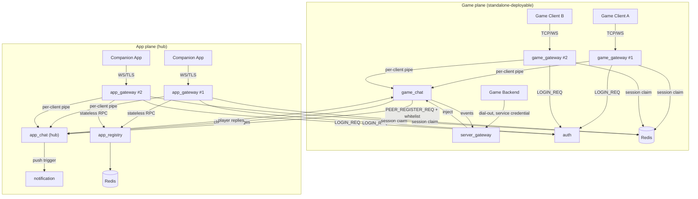
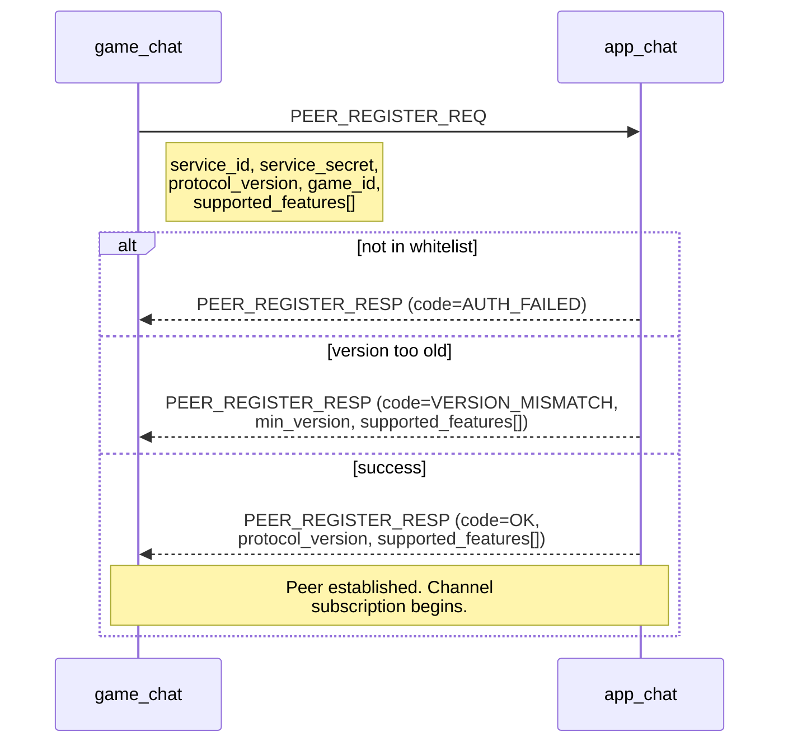
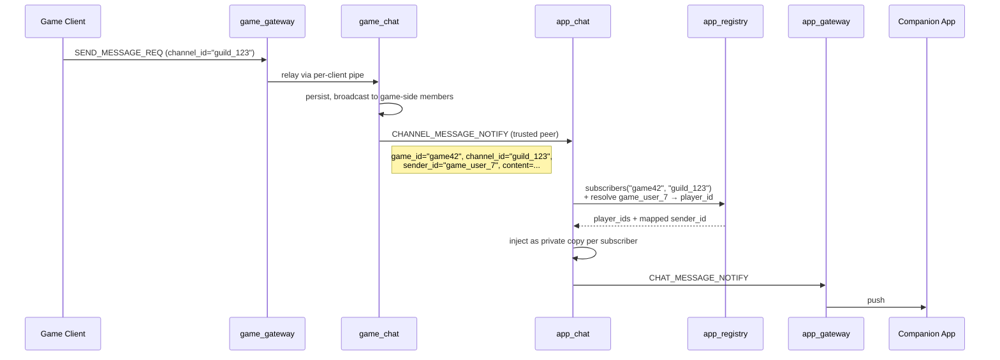
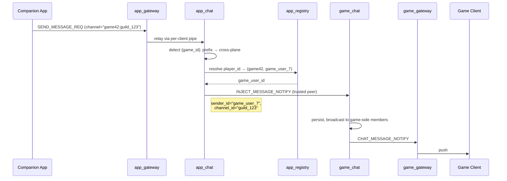
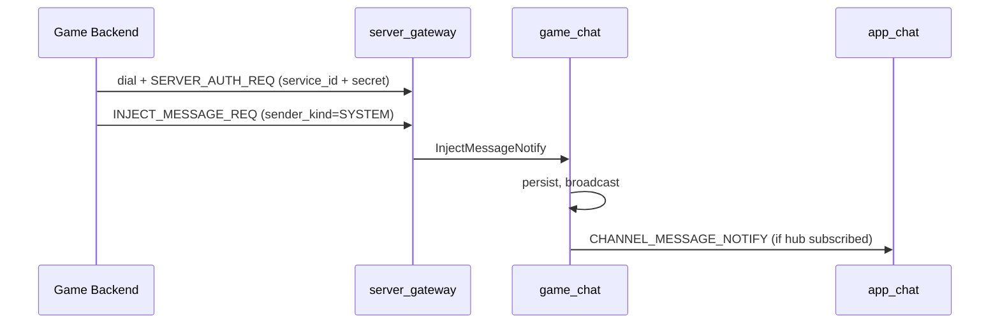

# Chirp Overall Architecture

Last reviewed: 2026-09-21

Chirp is a game-oriented realtime communication backend. The game plane and the app plane are two independent systems, each with its own edge and its own chat service. Cross-plane communication is a first-class chat capability — two chirp_chat instances connect directly using the same protocol, with built-in registration, version negotiation, and access control.

## Executive Summary

- Two planes, two chat instances. `game_chat` serves game clients; `app_chat` serves companion apps. Same binary, different deployments.
- `app_chat` is the hub. `game_chat` instances register into it using a built-in peer registration protocol with whitelist and version negotiation.
- `app_registry` is a stateless RPC service owning player identity bindings, channel subscriptions, and the unread badge ledger. Its state lives in Redis.
- `server_gateway` is a thin game-backend injection hub. It does not carry player aggregation state.
- Edges (`game_gateway`, `app_gateway`) are stateless connection managers.
- Deploying "just game chat" is a first-class shape: `game_gateway + game_chat + auth` is a closed system with no app-plane dependency.

## Design Principles

1. **Two planes, not one shared core.** The game plane is game-scoped, high-frequency, latency-sensitive. The app plane is player-scoped, low-frequency, aggregation-heavy.
2. **Same protocol, same binary.** `game_chat` and `app_chat` are the same `chirp_chat` binary. Cross-plane communication uses the chat's native trusted-peer protocol — no translation layer, no external bridge process.
3. **Hub-spoke access model.** `app_chat` is the hub. Each `game_chat` registers into it. The hub controls who can connect via whitelist and credential verification.
4. **Edges are thin.** Connection management, protocol adaptation, auth forwarding, heartbeat. No business state in an edge.
5. **State lives in one place per concern.** Sessions in Redis (per edge), subscriptions and identity in Redis (via `app_registry`), messages in the owning chat.
6. **Trusted planes use service credentials, untrusted edges use user tokens.** Never mix them.

## Topology


```mermaid
flowchart TB
    subgraph game_plane["Game plane (standalone-deployable)"]
      GC1["Game Client A"] -->|TCP/WS| GG1["game_gateway #1"]
      GC2["Game Client B"] -->|TCP/WS| GG2["game_gateway #2"]
      GG1 -->|per-client pipe| GCHAT["game_chat"]
      GG2 -->|per-client pipe| GCHAT
      GB["Game Backend"] -->|dial-out, service credential| SG["server_gateway"]
      SG -->|inject| GCHAT
      GCHAT -->|events| SG
      GG1 & GG2 -->|LOGIN_REQ| AUTH["auth"]
      GG1 & GG2 -->|session claim| R1[("Redis")]
    end

    subgraph app_plane["App plane (hub)"]
      APP1["Companion App"] -->|WS/TLS| AG1["app_gateway #1"]
      APP2["Companion App"] -->|WS/TLS| AG2["app_gateway #2"]
      AG1 -->|per-client pipe| ACHAT["app_chat (hub)"]
      AG2 -->|per-client pipe| ACHAT
      AG1 & AG2 -->|LOGIN_REQ| AUTH
      AG1 & AG2 -->|session claim| R1
      AG1 & AG2 -->|stateless RPC| AREG["app_registry"]
      ACHAT -->|push trigger| NT["notification"]
      AREG --> R2[("Redis")]
    end

    GCHAT -->|"PEER_REGISTER_REQ + whitelist"| ACHAT
    GCHAT -->|"channel messages"| ACHAT
    ACHAT -->|"player replies"| GCHAT
```

Reading the diagram:

- **Game plane is a closed system.** `game_gateway + game_chat + auth` is a fully functional game-chat deployment. No app-plane dependency.
- **App plane is the hub.** `app_chat` accepts connections from `game_chat` instances, aggregates cross-game messages, and delivers them to companion apps.
- **Cross-plane is a chat capability, not an external component.** Two `chirp_chat` instances connect directly using the same trusted-peer protocol. Registration, version negotiation, and whitelist are built into the chat service.

## The Two Planes

### Game plane

| Concern | Owner | Notes |
| --- | --- | --- |
| Edge | `game_gateway` | TCP + WS listeners, login/logout/heartbeat, kick on reclaim. Stateless. |
| Chat | `game_chat` | The `chirp_chat` binary deployed for the game plane. Owns game-scoped channels, history, offline queues. Acts as a spoke that registers into `app_chat`. |
| Auth | `auth` | Issues/verifies HS256 JWT user tokens. Shared across planes. |
| Session claim | Redis | `chirp:sess:<user>\x1F<device>` per edge instance. |
| Backend injection | `server_gateway` | Trusted hub; game backends dial out with `service_id` + secret. Only responsibility: message injection + event downlink. |

Deployment shape: one `game_chat` behind any number of `game_gateway` instances. When chat itself needs to scale, swap in the distributed chat build.

### App plane

| Concern | Owner | Notes |
| --- | --- | --- |
| Edge | `app_gateway` | WS-first, optional TLS, mobile-tuned heartbeat. Stateless. |
| Chat | `app_chat` | The `chirp_chat` binary deployed as the hub. Accepts `game_chat` registrations, aggregates cross-game channels, delivers to companion apps. |
| Player registry | `app_registry` | Stateless RPC frontend over Redis. Owns identity bindings, channel subscriptions, unread badge ledger. |
| Push | `notification` | APNs/FCM bridge. |

Deployment shape: any number of `app_gateway` instances, any number of `app_registry` instances, one `app_chat`.

## Peer Registration Protocol

When a `game_chat` instance starts, it registers into `app_chat` using a built-in peer registration handshake. This replaces the previous `chat_bridge` external process — registration, access control, and version negotiation are chat capabilities, not glue code.

### Handshake


```mermaid
sequenceDiagram
    participant G as game_chat
    participant A as app_chat

    G->>A: PEER_REGISTER_REQ
    Note right of G: service_id, service_secret,<br/>protocol_version, game_id,<br/>supported_features[]

    alt not in whitelist
        A-->>G: PEER_REGISTER_RESP (code=AUTH_FAILED)
    else version too old
        A-->>G: PEER_REGISTER_RESP (code=VERSION_MISMATCH,<br/>min_version, supported_features[])
    else success
        A-->>G: PEER_REGISTER_RESP (code=OK,<br/>protocol_version, supported_features[])
        Note over G,A: Peer established. Channel<br/>subscription begins.
    end
```

### Registration fields

| Field | Direction | Meaning |
| --- | --- | --- |
| `service_id` | game → app | Game identifier (e.g. `game_42`) |
| `service_secret` | game → app | Shared secret for this game's integration |
| `protocol_version` | both | Integer version; both sides negotiate the highest mutually supported version |
| `game_id` | game → app | The game's namespace; all channels from this peer are prefixed with `{game_id}:` in the hub |
| `supported_features` | both | Bitmask of optional capabilities (read receipt relay, typing relay, presence sync, etc.) |

### Whitelist and access control

`app_chat` maintains a whitelist of allowed peers:

| Config | Default | Meaning |
| --- | --- | --- |
| `--allowed_peers` | (none) | Comma-separated `service_id:secret` pairs. Empty = reject all. |
| `--min_peer_version` | 1 | Minimum `protocol_version` accepted. |
| `--allow_unknown_peers` | 0 | Whether to accept peers not in the whitelist (open registration mode). |

Rules:
- A peer not in `--allowed_peers` (and `--allow_unknown_peers` is off) is rejected with `AUTH_FAILED`.
- A peer whose `protocol_version` is below `--min_peer_version` is rejected with `VERSION_MISMATCH`; the response carries the hub's minimum so the peer knows what to upgrade to.
- Once registered, a peer is authenticated for the lifetime of its connection. Reconnecting re-registers.
- A second registration from the same `service_id` displaces the first (same semantics as `server_gateway`'s service registry).

### Version negotiation

Both sides exchange their `protocol_version` and `supported_features` during handshake. The negotiated version is `min(hub_version, spoke_version)`. Features not in the intersection are disabled for that session.

| Feature bit | Meaning |
| --- | --- |
| `RELAY_READ_RECEIPTS` | Hub forwards read receipt changes to spoke |
| `RELAY_TYPING` | Hub forwards typing indicators to spoke |
| `RELAY_PRESENCE` | Hub forwards online/offline status to spoke |
| `RELAY_OFFLINE_MESSAGES` | Spoke pushes offline message history to hub on player login |

When a new feature is added, bump `protocol_version` and add a feature bit. Old peers that do not understand the bit simply do not use it — no breaking change.

## Cross-Plane Message Flow

### game_chat → app_chat: channel message bridging


```mermaid
sequenceDiagram
    participant C as Game Client
    participant G as game_gateway
    participant GC as game_chat
    participant AC as app_chat
    participant AR as app_registry
    participant AG as app_gateway
    participant A as Companion App

    C->>G: SEND_MESSAGE_REQ (channel_id="guild_123")
    G->>GC: relay via per-client pipe
    GC->>GC: persist, broadcast to game-side members
    GC->>AC: CHANNEL_MESSAGE_NOTIFY (trusted peer)
    Note right of GC: game_id="game42", channel_id="guild_123",<br/>sender_id="game_user_7", content=...
    AC->>AR: subscribers("game42", "guild_123")<br/>+ resolve game_user_7 → player_id
    AR-->>AC: player_ids + mapped sender_id
    AC->>AC: inject as private copy per subscriber
    AC->>AG: CHAT_MESSAGE_NOTIFY
    AG->>A: push
```

`game_chat` sends every channel message to its registered hub peer. The hub (`app_chat`) does the fan-out:

1. Asks `app_registry` which players subscribe to `(game_id, channel_id)`.
2. Resolves `game_user_id → player_id` for the sender.
3. Injects one private copy per subscriber into the app chat, with the channel namespaced as `{game_id}:{channel_id}`.

The game side does not know about subscribers, fan-out, or player identity. It just sends its channel message to the hub.

### app_chat → game_chat: player reply


```mermaid
sequenceDiagram
    participant A as Companion App
    participant AG as app_gateway
    participant AC as app_chat
    participant AR as app_registry
    participant GC as game_chat
    participant G as game_gateway
    participant C as Game Client

    A->>AG: SEND_MESSAGE_REQ (channel="game42:guild_123")
    AG->>AC: relay via per-client pipe
    AC->>AC: detect {game_id}: prefix → cross-plane
    AC->>AR: resolve player_id → (game42, game_user_7)
    AR-->>AC: game_user_id
    AC->>GC: INJECT_MESSAGE_NOTIFY (trusted peer)
    Note right of AC: sender_id="game_user_7",<br/>channel_id="guild_123"
    GC->>GC: persist, broadcast to game-side members
    GC->>G: CHAT_MESSAGE_NOTIFY
    G->>C: push
```

When a player sends a message to a `{game_id}:`-prefixed channel, `app_chat`:

1. Detects the cross-plane prefix.
2. Resolves `player_id → game_user_id` via `app_registry`.
3. Injects the message into the registered `game_chat` peer for that `game_id`.

The game side receives it as a normal injection — it does not know the message came from an app player.

### Game backend injects a system message


```mermaid
sequenceDiagram
    participant GB as Game Backend
    participant SG as server_gateway
    participant GC as game_chat
    participant AC as app_chat

    GB->>SG: dial + SERVER_AUTH_REQ (service_id + secret)
    GB->>SG: INJECT_MESSAGE_REQ (sender_kind=SYSTEM)
    SG->>GC: InjectMessageNotify
    GC->>GC: persist, broadcast
    GC->>AC: CHANNEL_MESSAGE_NOTIFY (if hub subscribed)
```

`server_gateway` injects into `game_chat` as before. If the channel has app-plane subscribers, the message flows to the hub automatically.

## Identity and Namespace

Two identity spaces, one mapping point:

- **Game plane** uses `game_user_id`. Game backends issue short-lived user tokens scoped to their game. `game_chat` and `game_gateway` never see any other identity form.
- **App plane** uses `player_id`. The platform issues user tokens to players. `app_chat` and `app_gateway` never see `game_user_id`.
- **`app_registry` owns the binding.** The game backend asserts `player_id ↔ (game_id, game_user_id)` after authenticating the player on its own login server.

Channel namespace:

- Inside `game_chat`, channels are bare: `guild_123`, `world`, `team_42`.
- Inside `app_chat`, cross-plane channels are prefixed: `<game_id>:guild_123`. App-local channels (player-to-player DMs, app-side groups) are unprefixed.
- The prefix is applied by `app_chat` when it receives a message from a registered `game_chat` peer (using the `game_id` from the registration handshake). The spoke never sees the prefix.

## Credential Model

Two kinds of credentials, never interchangeable:

| Kind | Identifies | Lifetime | Where used |
| --- | --- | --- | --- |
| Service credential (`service_id` + secret) | A backend component | Long-lived | `server_gateway` peers, `game_chat → app_chat` registration, gateway → chat trusted pipes |
| User token (HS256 JWT) | One user session | Short-lived | Game client → `game_gateway`, app → `app_gateway` |

Rules:

- Service credentials never ship in a client binary.
- User tokens never appear on trusted planes.
- Each plane has its own service secrets. `game_chat` only trusts the game-plane gateway secret; `app_chat` has its own whitelist for incoming `game_chat` registrations.
- `auth` issues user tokens for both planes; each chat verifies locally with the shared HS256 secret.

## Failure and Degradation

| Component failure | Blast radius |
| --- | --- |
| One `game_gateway` instance | Its current connections drop; clients reconnect to a peer instance. |
| `game_chat` | Game-plane messaging halts. App-plane continues (game-bridged messages stop, but app-local messaging works). |
| One `app_gateway` instance | Same as above, for app clients. |
| `app_chat` | App-plane messaging halts. Game plane unaffected. `game_chat` peers see the connection drop and retry registration with backoff. |
| `app_registry` | App-plane subscription/unread/identity lookups fail; `app_chat` keeps serving cached data until TTL expires. Game plane unaffected. |
| `auth` | New logins blocked on both planes. Existing sessions unaffected (JWT verified locally). |
| Redis (game plane) | Session claim degrades to per-instance (no cross-instance kick). Chat storage unaffected unless optional Redis history was enabled. |
| Redis (app plane) | `app_registry` becomes unavailable. Session claim degrades. App-local chat unaffected unless optional Redis history was enabled. |

No failure in the app plane can take down the game plane. That is the point of the split.

## Horizontal Scaling

- **Edges** (`game_gateway`, `app_gateway`): stateless; scale behind a load balancer. Cross-instance kick via Redis claim.
- **`app_registry`**: stateless; scale behind a load balancer.
- **`server_gateway`**: one per game backend integration. Multiple game backends each dial their own `service_id`.
- **Chats**: single-writer by design. To scale chat itself, swap in the distributed build behind the same edge protocol.
- **`game_chat` to `app_chat` connections**: each `game_chat` instance maintains one persistent connection to `app_chat`. Multiple `game_chat` instances (for different games, or distributed chat) each register with their own `service_id`; the hub accepts all of them concurrently.

## Repository Layers

| Layer | Paths | Role |
| --- | --- | --- |
| Protocol | `proto/*.proto` | Shared envelope and msg-id blocks |
| Common library | `libs/common` | Logger, JWT, base64, metrics |
| Network library | `libs/network` | ASIO TCP/WS sessions, framing, Redis client, trusted-peer helper |
| Game plane | `services/gateway`, `services/chat` (deployed as `game_chat`), `services/auth`, `services/server_gateway` | Standalone game-chat deployment |
| App plane | `services/app_gateway`, `services/chat` (deployed as `app_chat`), `services/app_registry`, `services/notification` | Player aggregation plane |
| SDKs | `sdks/*` | Client integrations |
| Apps/tools | `apps/*`, `tools/*` | Demos, smoke clients, benchmarks |
| Delivery | `docker-compose.yml`, `deploy/`, `scripts/` | Orchestration and validation |

## Protocol Baseline

All edges and trusted peers use the same framing:

```
TCP stream:   [uint32_be payload_size][chirp.gateway.Packet protobuf bytes]
WebSocket:    binary frame payload = [uint32_be payload_size][chirp.gateway.Packet protobuf bytes]
```

`chirp.gateway.Packet` carries `msg_id`, `sequence`, `body`. Message-ID blocks:

| Block | Plane | Purpose |
| --- | --- | --- |
| 1xxx | both | auth / session / heartbeat |
| 2xxx | both | chat (client ↔ chat business messages) |
| 3xxx | game | social |
| 4xxx | game | voice |
| 5xxx | trusted | service-plane (`server_gateway`, chat peer registration) |
| 6xxx | app | device / notification |

### New msg-ids for peer registration

| ID | Message | Direction |
| --- | --- | --- |
| 5050 | `PEER_REGISTER_REQ` | spoke → hub |
| 5051 | `PEER_REGISTER_RESP` | hub → spoke |
| 5052 | `CHANNEL_MESSAGE_NOTIFY` | hub ↔ spoke |
| 5053 | `INJECT_MESSAGE_NOTIFY` | spoke → hub (player reply) |

These extend the existing 5xxx trusted-peer block. A `chirp_chat` instance configured as a spoke uses 5050/5052/5053; configured as a hub uses 5051/5052. The same binary, different config.

## What This Architecture Commits To

- The game plane and the app plane are separate deployables. Either can exist without the other.
- Cross-plane communication is a built-in chat capability, not an external bridge process. Two `chirp_chat` instances connect directly using the same protocol.
- The hub (`app_chat`) controls access via whitelist and version negotiation. Game providers register into the platform; the platform decides who is allowed.
- Player identity and game identity are never conflated. The binding lives in `app_registry`; every cross-plane message passes through it.
- Edges carry no business state. Chats carry no cross-plane state. Registries carry no session state.
