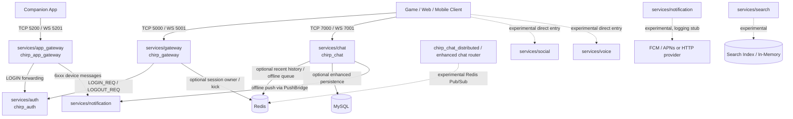
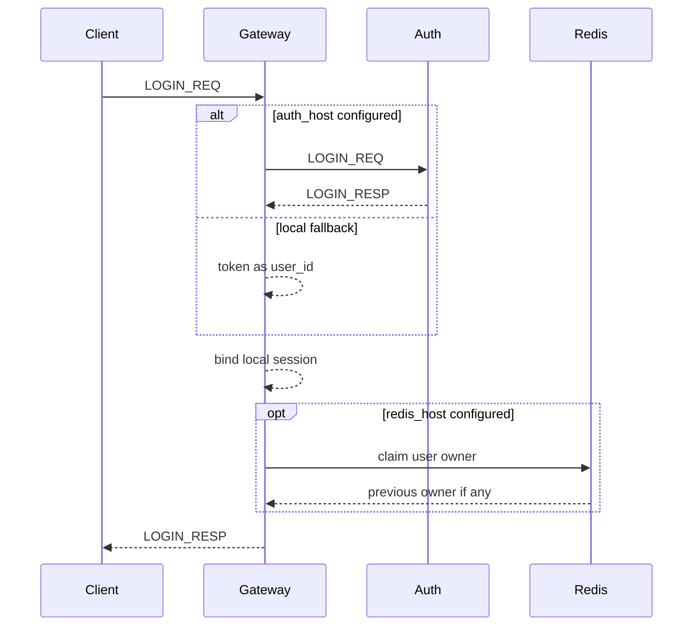
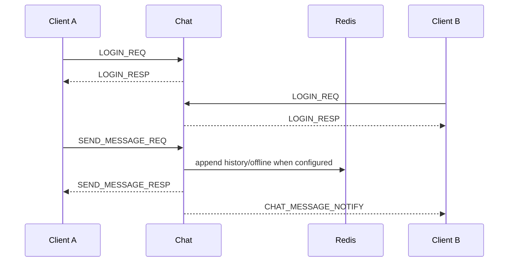
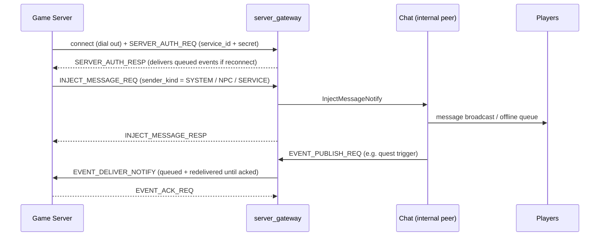

# Chirp Overall Architecture

Last reviewed: 2026-09-12

This document describes the repository architecture, including the decided target topology and the migration path toward it. The currently supported path is a runnable `gateway + auth + chat` backend skeleton. Social, voice, notification, search, multi-engine SDKs, mobile app, and admin dashboard exist in the tree, but they should be treated as experimental or demo surfaces unless the [Capability Matrix](./CAPABILITY_MATRIX.md) says otherwise.

## Executive Summary

The architecture is reasonable for the current stage if Chirp is positioned as a game-oriented realtime communication skeleton:

- A shared protobuf envelope gives every service a consistent client protocol.
- The network library centralizes TCP, WebSocket, length-prefix framing, and Redis helpers.
- `gateway` owns edge login/session concerns and can use Redis for multi-instance session ownership.
- `chat` can run independently for direct chat validation and has a path toward Redis/MySQL-backed storage.
- The monorepo layout makes protocol, backend, SDK, and smoke-test changes easy to evolve together.

It is not yet reasonable to present the project as a complete unified communication platform:

- `gateway` currently does not forward chat/social/voice business packets. It handles login, logout, heartbeat, and session kick flow.
- `chat` has its own TCP/WebSocket entrypoint and its own lightweight login/session registry. This is useful for development, but it means the current runtime is not a single unified edge architecture.
- Many protocol messages and docs describe richer group, read receipt, voice, social, notification, and search behavior than the default verified path proves.
- Distributed chat, enhanced auth, and hybrid storage are conditional or alternate paths, not one fully hardened production topology.

## Access Topology: Three Independent Edges

Chirp has three access points with different trust models, transports, and lifecycles. The decided topology (2026-09) gives each its own edge service. **Edges are independent; the core underneath is shared.**

| Access point | Edge | Transport | Identity | Network reality |
| --- | --- | --- | --- | --- |
| Game client | `game_gateway` (evolved from `services/gateway`) | TCP + Packet | user token | lives and dies with the game process |
| Companion app | `app_gateway` (experimental) | WebSocket/TCP (TLS planned) | user token | mobile network: reconnects, NAT timeouts, backgrounding |
| Game backend | `server_gateway` | outbound long connection; broker fallback | `service_id` + service secret | always-on trusted service, usually in a private subnet |

Rules that make independence work:

- **Edges are thin**: connection management, protocol adaptation, auth forwarding, heartbeat. No business state lives in an edge.
- **The core is shared**: auth, the device-level session/Presence registry, chat, and notification (the app edge's offline push bridge). Same user on the game client and the app simultaneously is a core scenario, so cross-device delivery, kick policy, and unified unread counts are resolved in the core, not in any edge.
- **The game backend plane never uses user identity** and never touches the player edges. A game server that logs into a player gateway would have to masquerade as a user: it would pollute session semantics, break kick/presence, and distort rate-limiting designed for untrusted peers.

### Server plane design

- **Dial-out, not call-in.** Game servers open the connection to `server_gateway` (agent model). Chirp never needs inbound access into game networks, and game servers in private subnets need no public callback endpoint.
- **Protocol.** Same Packet framing, a dedicated `5xxx` msg-id block. The first frame on any connection must be `SERVER_AUTH_REQ` carrying `service_id` + secret; unauthenticated connections are closed after a short timeout.
- **Long connection first, broker second.** The long connection provides push semantics with in-connection ack/retry. Integrations that cannot host a long-connection client use a broker fallback (Redis Streams: consumer groups + ack + replay). Raw pub/sub is avoided because it loses events across restarts.
- **Non-user sender identities.** Injected messages carry `SenderKind`: `SYSTEM` (announcements), `NPC` (in-game AI), `SERVICE` (game logic such as trade state). The chat data model must accept these identities under permission rules distinct from user accounts.
- **At-least-once downlink.** Events pushed to a game service are queued per target service and redelivered on reconnect until acknowledged. Queue overflow rejects new publishes rather than silently dropping older events.

### Platform and I/O backend

- **Target platform is Linux only.** Backend CI already runs Linux only (`cmake-multi-platform.yml` builds on ubuntu; the sole macOS job builds the iOS app shell, which is an Apple toolchain constraint, not a backend target).
- **Reactor encapsulation.** All socket I/O goes through `libs/network` on ASIO. The reactor stays an implementation detail behind that library: services never construct reactors directly.
- **io_uring is a planned optional backend**, not a rewrite: ASIO supports it natively (`ASIO_HAS_IO_URING` + linking `liburing`, using `asio::io_uring` as the execution context), so the work is a `libs/network` facade with a backend switch plus per-backend smoke coverage. Recorded caveats: requires kernel ≥ 5.1 (≥ 5.10 recommended); container seccomp profiles may block io_uring syscalls; not every ASIO service is io_uring-complete. epoll therefore remains the default and io_uring ships opt-in behind configuration. Current throughput targets are not epoll-bound; this is scheduled after the server plane.

## Current Runtime Topology

What actually runs today:


```mermaid
graph TD
    Client[Game / Web / Mobile Client]

    Client -- TCP 5000 / WS 5001 --> Gateway[services/gateway<br/>chirp_gateway]
    Gateway -- LOGIN_REQ / LOGOUT_REQ --> Auth[services/auth<br/>chirp_auth]
    Gateway -- optional session owner / kick --> Redis[(Redis)]

    Client -- TCP 7000 / WS 7001 --> Chat[services/chat<br/>chirp_chat]
    Chat -- optional recent history / offline queue --> Redis
    Chat -- optional enhanced persistence --> MySQL[(MySQL)]
    Chat -- offline push via PushBridge --> Notification2[services/notification]

    App[Companion App] -- TCP 5200 / WS 5201 --> AppGateway[services/app_gateway<br/>chirp_app_gateway]
    AppGateway -- LOGIN forwarding --> Auth
    AppGateway -- 6xxx device messages --> Notification2

    ChatDist[chirp_chat_distributed / enhanced chat router] -. experimental Redis Pub/Sub .-> Redis

    Client -. experimental direct entry .-> Social[services/social]
    Client -. experimental direct entry .-> Voice[services/voice]
    Notification[services/notification] -. experimental, logging stub .-> ExternalPush[FCM / APNs or HTTP provider]
    Search[services/search] -. experimental .-> Index[(Search Index / In-Memory)]
```

Important interpretation:

- `gateway` and `chat` are both client-facing services today; the game backend plane does not exist yet as runtime, only as protocol and service skeleton.
- `app_gateway` (TCP 5200 / WS 5201) is live as an experimental companion-app edge: gateway-style auth/heartbeat plus 6xxx device-message forwarding to notification. Chat business packets are not accepted there (that is migration step 4).
- `gateway` is not yet a universal business router.
- `chat` direct access is the practical path for current chat smoke tests and the C++ SDK example.
- Redis is optional for local validation, but required for meaningful multi-instance gateway session behavior and distributed chat routing experiments.
- MySQL is optional and only changes the built auth/chat implementation when the matching native dependencies are found by CMake.

## Repository Layers

| Layer | Paths | Current role |
| --- | --- | --- |
| Protocol | `proto/*.proto`, generated `proto/cpp`, `proto/go` | Shared message IDs and message schemas |
| Common library | `libs/common` | Logger, JWT/base64/sha256 helpers, metrics primitives |
| Network library | `libs/network` | ASIO TCP/WS sessions, length-prefixed framing, Redis RESP client, Redis Pub/Sub router; the future reactor-encapsulation point |
| Core services | `services/gateway`, `services/auth`, `services/chat`, `services/server_gateway` | Supported backend skeleton |
| Experimental services | `services/social`, `services/voice`, `services/notification`, `services/search` | Useful implementation surface, not core verified path |
| SDKs | `sdks/core`, `sdks/unity`, `sdks/unreal` | Integration base and wrappers, currently experimental |
| Apps/tools | `apps/*`, `tools/benchmark` | Demos, smoke clients, benchmarks, archive helpers |
| Delivery | `docker-compose.yml`, `deploy/`, `scripts/`, `tests/` | Local orchestration, cluster sketches, build and smoke validation |

## Protocol Baseline

Both TCP and WebSocket use the same application-level framing:

```
TCP stream:
  [uint32_be payload_size][chirp.gateway.Packet protobuf bytes]

WebSocket:
  binary frame payload = [uint32_be payload_size][chirp.gateway.Packet protobuf bytes]
```

`chirp.gateway.Packet` is the business envelope:

```protobuf
message Packet {
  MsgID msg_id = 1;
  int64 sequence = 2;
  bytes body = 3;
}
```

`body` contains the serialized concrete protobuf message for `msg_id`, such as `chirp.auth.LoginRequest`, `chirp.chat.SendMessageRequest`, or `chirp.gateway.HeartbeatPing`.

This means `MsgID` is not a separate 2-byte field in the network frame. It is inside the protobuf `Packet`.

Message-ID blocks are planned per access point so no single enum grows without bounds: `1xxx` auth/session, `2xxx` chat, `3xxx` social, `4xxx` voice, `5xxx` server plane (game backend).

## Core Service Responsibilities

### Gateway (game client edge, in evolution)

`services/gateway` is the edge session service for the current login path.

It currently handles:

- TCP and WebSocket listeners.
- `LOGIN_REQ`, `LOGIN_RESP`.
- `LOGOUT_REQ`, `LOGOUT_RESP`.
- `HEARTBEAT_PING`, `HEARTBEAT_PONG`.
- Local session registry.
- Optional Redis-backed session owner mapping for multi-instance kick.
- Optional Auth RPC call to `services/auth`.

It currently does not handle:

- Forwarding `SEND_MESSAGE_REQ` to chat.
- Routing social, voice, notification, or search messages.
- Service discovery.
- Centralized authorization for all business services.

Its target role is `game_gateway`: the game-client edge of the three-edge topology, eventually absorbing the direct chat entry so clients only know edges.

### Auth

`services/auth` has two build-time modes:

- Basic mode: default fallback when MySQL/libsodium are unavailable. It validates the lightweight token flow used by local smoke tests.
- Enhanced mode: selected when MySQL and libsodium are available. It includes registration, password login, refresh tokens, session storage, rate limiting, and brute-force protection paths.

The same target name, `chirp_auth`, is used for the selected implementation. `chirp_auth_enhanced` is a compatibility alias when enhanced mode is available.

### Chat

`services/chat` is the most mature business service.

Basic mode currently supports:

- TCP and WebSocket direct entry.
- Lightweight `LOGIN_REQ` where token is treated as `user_id`.
- Private messages, group lifecycle and roles, read receipts, typing indicators, reactions, message edit/delete with moderator support, and @mention parsing/autocomplete.
- Offline queue fallback.
- Optional Redis list storage for history and offline messages.

Enhanced/distributed paths add:

- Hybrid Redis/MySQL message storage when MySQL is available.
- Redis Pub/Sub `MessageRouter`.
- Delivery tracking and pagination scaffolding.
- Separate `chirp_chat_distributed` target.

Current limitation: direct chat login and gateway login are separate session concepts. A client that logs in through `gateway` is not automatically authenticated in `chat`. In the target topology chat becomes an internal service; it must also learn to accept server-plane injected messages carrying non-user sender identities.

### Server Gateway (game backend edge)

`services/server_gateway` (`chirp_server_gateway`) is the trusted service plane hub:

- Authenticates game backends (and internal services such as chat) via `service_id` + secret on a dedicated listener.
- Uplink: forwards message injections toward the chat service (`INJECT_MESSAGE_REQ` in, `InjectMessageNotify` out) with non-user sender identities.
- Downlink: reliable event delivery to connected services with per-service queues, acks, and redelivery on reconnect.
- No user-session semantics: it does not participate in login/kick/presence for players.

See the `5xxx` msg-id block in `proto/gateway.proto` and `proto/server_gateway.proto` for the wire contract.

## Data Flow

### Gateway Login Flow


```mermaid
sequenceDiagram
    participant C as Client
    participant G as Gateway
    participant A as Auth
    participant R as Redis

    C->>G: LOGIN_REQ
    alt auth_host configured
        G->>A: LOGIN_REQ
        A-->>G: LOGIN_RESP
    else local fallback
        G-->>G: token as user_id
    end
    G-->>G: bind local session
    opt redis_host configured
        G->>R: claim user owner
        R-->>G: previous owner if any
    end
    G-->>C: LOGIN_RESP
```

### Direct Chat Flow


```mermaid
sequenceDiagram
    participant A as Client A
    participant C as Chat
    participant R as Redis
    participant B as Client B

    A->>C: LOGIN_REQ
    C-->>A: LOGIN_RESP
    B->>C: LOGIN_REQ
    C-->>B: LOGIN_RESP
    A->>C: SEND_MESSAGE_REQ
    C->>R: append history/offline when configured
    C-->>A: SEND_MESSAGE_RESP
    C-->>B: CHAT_MESSAGE_NOTIFY
```

### Server Plane Flow (target)


```mermaid
sequenceDiagram
    participant GS as Game Server
    participant SG as server_gateway
    participant CH as Chat (internal peer)
    participant P as Players

    GS->>SG: connect (dial out) + SERVER_AUTH_REQ (service_id + secret)
    SG-->>GS: SERVER_AUTH_RESP (delivers queued events if reconnect)
    GS->>SG: INJECT_MESSAGE_REQ (sender_kind = SYSTEM / NPC / SERVICE)
    SG->>CH: InjectMessageNotify
    CH->>P: message broadcast / offline queue
    SG-->>GS: INJECT_MESSAGE_RESP
    CH->>SG: EVENT_PUBLISH_REQ (e.g. quest trigger)
    SG->>GS: EVENT_DELIVER_NOTIFY (queued + redelivered until acked)
    GS-->>SG: EVENT_ACK_REQ
```

## Migration Path

From the current runtime to the three-edge topology, in order:

1. **Server plane hub** (`chirp_server_gateway`): greenfield, no legacy constraints; unblocks NPC quest callbacks, system/trade message injection. Chat consumes injections as an internal peer.
2. **Device-level session core**: upgrade the existing Redis session registry from "user → instance" to "user → device → edge instance". Prerequisite for the app edge and for cross-device semantics.
3. **App edge** (`app_gateway`): WebSocket-first with mobile tuning (heartbeat, reconnect backoff) plus the notification service as a real APNs/FCM push bridge. **Partial delivery (2026-09):** `chirp_app_gateway` serves auth/heartbeat/device-forwarding on TCP 5200 / WS 5201 and chat's offline queue triggers pushes through notification; still missing are TLS, mobile tuning, and real provider delivery (the `PushTransport` seam is backed by a logging stub).
4. **Game edge consolidation**: `game_gateway` absorbs the direct chat entry so clients only know edges; chat becomes internal-only.

At every step the currently supported direct path stays buildable and smoke-tested until its replacement is verified.

## Is The Architecture Reasonable?

Yes, with the three-edge decision applied:

- Separating the game backend plane from the player edges resolves the trust-model mismatch: trusted services authenticate with service credentials over their own protocol, and never masquerade as users.
- Independent edges with a shared core match the product: the same user plays on the game client and chats from the app, so session/Presence must be shared, while transports and lifecycles legitimately differ per edge.
- Dial-out long connections for game backends fit real deployments (private subnets, no public callback endpoints) and give push semantics; the Redis Streams fallback covers integrations that cannot host a connection client.

What remains unreasonable today, and is being closed by the migration path:

- Clients currently authenticate separately to `gateway` and `chat`.
- Public service entrypoints still need the full security model (rate limiting, abuse controls) before client-direct chat can be presented as a hardened edge.
- Capacity numbers, stable SDK claims, and production operations docs need measured evidence before being presented as guarantees.

## Documentation Rules Going Forward

Use these rules when updating docs:

- `Supported` means the default documented path is buildable and smoke-testable.
- `Experimental` means code exists, but the path is conditional, alternate, or not part of the minimal verified runtime.
- `Demo` means useful for exploration, not a backend contract.
- `Stub` means incomplete or mock-driven.

When in doubt, link back to [Capability Matrix](./CAPABILITY_MATRIX.md) instead of making broad stability claims.
