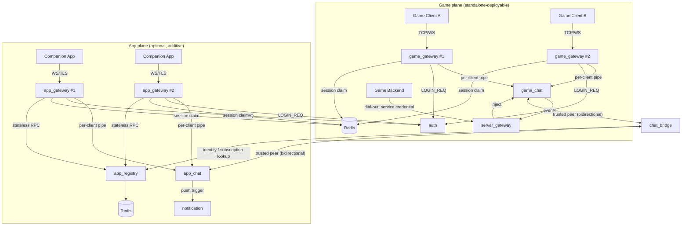
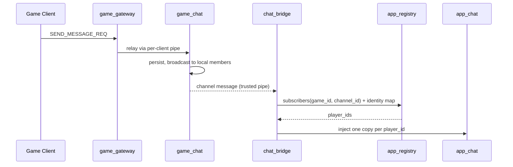
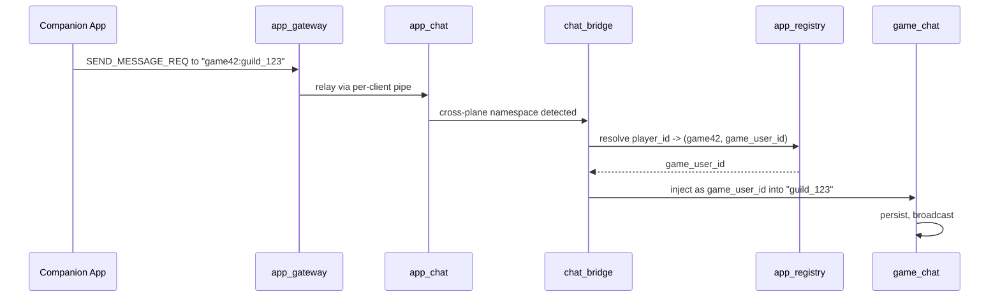
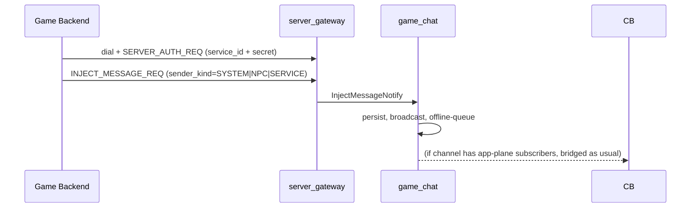

# Chirp Overall Architecture

Last reviewed: 2026-09-21

Chirp is a game-oriented realtime communication backend built around a hard split: **the game plane and the app plane are two independent systems**, each with its own edge, its own chat service, and its own operational lifecycle. A dedicated `chat_bridge` process connects the two planes when — and only when — cross-plane messages are needed.

## Executive Summary

- Two planes, two chats. `game_chat` serves game clients; `app_chat` serves companion apps. Neither knows the other exists.
- A single-purpose `chat_bridge` process sits between the two chats as a trusted peer of both, translating identity and namespace in both directions.
- `app_registry` is a stateless RPC service owning player identity bindings, channel subscriptions, and the unread badge ledger. Its state lives in Redis; the service itself scales horizontally.
- `server_gateway` is a thin game-backend injection hub. It does **not** carry player aggregation state.
- Edges (`game_gateway`, `app_gateway`) are stateless connection managers. Any number of instances run behind a load balancer.
- Deploying "just game chat" is a first-class shape: `game_gateway + game_chat + auth (+ optional server_gateway)` is a closed system with no app-plane dependency.

## Design Principles

1. **Two planes, not one shared core.** The game plane is game-scoped, high-frequency, latency-sensitive. The app plane is player-scoped, low-frequency, aggregation-heavy. Forcing them into one chat process couples their failure and scaling domains for no benefit.
2. **Edges are thin.** Connection management, protocol adaptation, auth forwarding, heartbeat. No business state in an edge.
3. **Chats are self-contained.** Each chat owns its sessions, storage, history, offline queues. Neither chat reaches into the other.
4. **Cross-plane traffic goes through exactly one component.** `chat_bridge` is the only process that understands both planes. It translates; it does not store.
5. **State lives in one place per concern.** Sessions in Redis (per edge), subscriptions and identity in Redis (via `app_registry`), messages in the owning chat.
6. **Trusted planes use service credentials, untrusted edges use user tokens.** Never mix them.

## Topology


```mermaid
flowchart TB
    subgraph game_plane["Game plane (standalone-deployable)"]
      GC1["Game Client A"] -->|TCP/WS| GG1["game_gateway #1"]
      GC2["Game Client B"] -->|TCP/WS| GG2["game_gateway #2"]
      GG1 -->|per-client pipe| GCHAT["game_chat"]
      GG2 -->|per-client pipe| GCHAT
      GB["Game Backend"] -->|dial-out, service credential| SG["server_gateway"]
      SG -->|inject| GCHAT
      GCHAT -->|events| SG
      GG1 & GG2 -->|LOGIN_REQ| AUTH["auth"]
      GG1 & GG2 -->|session claim| R1[("Redis")]
    end

    subgraph app_plane["App plane (optional, additive)"]
      APP1["Companion App"] -->|WS/TLS| AG1["app_gateway #1"]
      APP2["Companion App"] -->|WS/TLS| AG2["app_gateway #2"]
      AG1 -->|per-client pipe| ACHAT["app_chat"]
      AG2 -->|per-client pipe| ACHAT
      AG1 & AG2 -->|LOGIN_REQ| AUTH
      AG1 & AG2 -->|session claim| R1
      AG1 & AG2 -->|stateless RPC| AREG["app_registry"]
      ACHAT -->|push trigger| NT["notification"]
      AREG --> R2[("Redis")]
    end

    GCHAT <-->|"trusted peer (bidirectional)"| CB["chat_bridge"]
    CB <-->|"trusted peer (bidirectional)"| ACHAT
    CB -->|identity / subscription lookup| AREG
```

Reading the diagram:

- **Game plane is a closed system.** `game_gateway + game_chat + auth` is a fully functional game-chat deployment. `server_gateway` is added only when the game backend needs to inject system/NPC/service messages or receive events.
- **App plane is additive.** It deploys alongside the game plane and connects to it exclusively via `chat_bridge`. Removing the app plane does not affect the game plane's runtime.
- **`chat_bridge` is the only cross-plane component.** It is a trusted peer of both chats and translates identity and channel namespace on the fly.

## The Two Planes

### Game plane

| Concern | Owner | Notes |
| --- | --- | --- |
| Edge | `game_gateway` | TCP + WS listeners, login/logout/heartbeat, kick on reclaim. Stateless. |
| Chat | `game_chat` | The `chirp_chat` binary deployed for the game plane. Owns game-scoped channels, history, offline queues. |
| Auth | `auth` | Issues/verifies HS256 JWT user tokens. Shared across planes. |
| Session claim | Redis | `chirp:sess:<user>\x1F<device>` per edge instance. |
| Backend injection | `server_gateway` | Trusted hub; game backends dial out with `service_id` + secret. Only responsibility: message injection + event downlink. |

Deployment shape: one `game_chat` (single-writer, simplest correct semantics) behind any number of `game_gateway` instances. When chat itself needs to scale, swap in the distributed chat build — the gateway edge does not change.

### App plane

| Concern | Owner | Notes |
| --- | --- | --- |
| Edge | `app_gateway` | WS-first, optional TLS, mobile-tuned heartbeat. Stateless. |
| Chat | `app_chat` | The `chirp_chat` binary deployed for the app plane. Owns player-scoped channels and aggregated history. |
| Player registry | `app_registry` | Stateless RPC frontend over Redis. Owns identity bindings, channel subscriptions, unread badge ledger. |
| Push | `notification` | APNs/FCM bridge. |

Deployment shape: any number of `app_gateway` instances, any number of `app_registry` instances, one `app_chat`.

`app_registry` replaces the previous design where `app_gateway` held a long-lived `ServerGatewayPeer` connection to `server_gateway`. That design had a hard single-connection-per-`service_id` constraint which made multi-instance `app_gateway` impossible. A stateless RPC service behind Redis has no such constraint.

### Cross-plane bridge

`chat_bridge` is a new process with three outbound connections:

- Trusted peer of `game_chat` (authenticates via `SERVER_AUTH_REQ` with the game-plane service secret).
- Trusted peer of `app_chat` (authenticates via `SERVER_AUTH_REQ` with the app-plane service secret).
- RPC client of `app_registry`.

It does not terminate user connections, does not own sessions, and does not store messages. Its job is translation and routing.

**game → app flow**:

1. A channel message lands in `game_chat`.
2. `game_chat` forwards it to `chat_bridge` over the trusted-peer pipe.
3. `chat_bridge` asks `app_registry` for the channel's subscribers (player_ids) and the `game_user_id → player_id` mappings it needs.
4. `chat_bridge` injects one private copy per subscriber into `app_chat`, namespaced as `{game_id}:{channel_id}`.

**app → game flow**:

1. A player sends a message in `app_chat` to a channel namespaced `{game_id}:{channel_id}`.
2. `app_chat` recognizes the namespace as cross-plane and forwards the message to `chat_bridge`.
3. `chat_bridge` resolves the sender's `player_id → game_user_id` via `app_registry`.
4. `chat_bridge` injects the message into `game_chat` as that `game_user_id`, into the bare `channel_id`.

**Failure semantics**: if `chat_bridge` is down, app-plane users see "game service unavailable"; game-plane users are unaffected. If a chat is down, the bridge returns an error to the sender on the other plane. Neither chat ever blocks on the bridge — sends to the bridge are fire-and-forget with a bounded local queue.

**Scaling**: multiple `chat_bridge` instances shard by `game_id` via consistent hashing. Because bridge instances authenticate as distinct `service_id`s (`chat_bridge#<instance>`), there is no single-connection displacement problem.

## Identity and Namespace

Two identity spaces, one mapping point:

- **Game plane** uses `game_user_id`. Game backends issue short-lived user tokens scoped to their game. `game_chat` and `game_gateway` never see any other identity form.
- **App plane** uses `player_id`. The platform issues user tokens to players. `app_chat` and `app_gateway` never see `game_user_id`.
- **`app_registry` owns the binding.** The game backend asserts `player_id ↔ (game_id, game_user_id)` after authenticating the player on its own login server. The bridge consults the registry for every cross-plane message.

Channel namespace:

- Inside `game_chat`, channels are bare: `guild_123`, `world`, `team_42`.
- Inside `app_chat`, cross-plane channels are prefixed: `<game_id>:guild_123`. App-local channels (player-to-player DMs, app-side groups) are unprefixed.
- `chat_bridge` adds/removes the prefix. Neither chat knows the rule.

This is what makes it safe for the app plane to aggregate many games without the game plane carrying any game_id awareness.

## Credential Model

Two kinds of credentials, never interchangeable:

| Kind | Identifies | Lifetime | Where used |
| --- | --- | --- | --- |
| Service credential (`service_id` + secret) | A backend component | Long-lived | `server_gateway` peers, `chat_bridge` ↔ chats, gateway → chat trusted pipes |
| User token (HS256 JWT) | One user session | Short-lived | Game client → `game_gateway`, app → `app_gateway` |

Rules:

- Service credentials never ship in a client binary.
- User tokens never appear on trusted planes.
- Each plane has its own service secrets. `game_chat` only trusts the game-plane gateway secret and the game-plane bridge secret; `app_chat` likewise. Revoking one plane's secret does not touch the other.
- `auth` issues user tokens for both planes; each chat verifies locally with the shared HS256 secret.

## Data Flow

### Game client sends a channel message


```mermaid
sequenceDiagram
    participant C as Game Client
    participant G as game_gateway
    participant CH as game_chat
    participant CB as chat_bridge
    participant AR as app_registry
    participant AC as app_chat

    C->>G: SEND_MESSAGE_REQ
    G->>CH: relay via per-client pipe
    CH->>CH: persist, broadcast to local members
    CH-->>CB: channel message (trusted pipe)
    CB->>AR: subscribers(game_id, channel_id) + identity map
    AR-->>CB: player_ids
    CB->>AC: inject one copy per player_id
```

### App player replies into a game channel


```mermaid
sequenceDiagram
    participant A as Companion App
    participant AG as app_gateway
    participant AC as app_chat
    participant CB as chat_bridge
    participant AR as app_registry
    participant CH as game_chat

    A->>AG: SEND_MESSAGE_REQ to "game42:guild_123"
    AG->>AC: relay via per-client pipe
    AC->>CB: cross-plane namespace detected
    CB->>AR: resolve player_id -> (game42, game_user_id)
    AR-->>CB: game_user_id
    CB->>CH: inject as game_user_id into "guild_123"
    CH->>CH: persist, broadcast
```

### Game backend injects a system message


```mermaid
sequenceDiagram
    participant GB as Game Backend
    participant SG as server_gateway
    participant CH as game_chat

    GB->>SG: dial + SERVER_AUTH_REQ (service_id + secret)
    GB->>SG: INJECT_MESSAGE_REQ (sender_kind=SYSTEM|NPC|SERVICE)
    SG->>CH: InjectMessageNotify
    CH->>CH: persist, broadcast, offline-queue
    CH-->>CB: (if channel has app-plane subscribers, bridged as usual)
```

## Failure and Degradation

| Component failure | Blast radius |
| --- | --- |
| One `game_gateway` instance | Its current connections drop; clients reconnect to a peer instance. |
| `game_chat` | Game-plane messaging halts. App-plane continues (game-bridged messages queue or fail). |
| One `app_gateway` instance | Same as above, for app clients. |
| `app_chat` | App-plane messaging halts. Game plane unaffected. |
| `chat_bridge` | Cross-plane messages stop. Both planes keep working locally. Senders on either side see explicit errors for cross-plane sends. |
| `app_registry` | App-plane subscription/unread/identity lookups fail; app_chat keeps serving cached namespace decisions until its local cache TTLs out. Game plane unaffected. |
| `auth` | New logins blocked on both planes. Existing sessions unaffected (JWT verified locally at edges and chats). |
| Redis | Session claim degrades to per-instance (no cross-instance kick); `app_registry` becomes unavailable (it is Redis-backed by contract). Chat storage unaffected unless optional Redis history was enabled. |

No failure in the app plane can take down the game plane. That is the point of the split.

## Horizontal Scaling

- **Edges** (`game_gateway`, `app_gateway`): stateless; scale behind a load balancer. Cross-instance kick via Redis claim.
- **`app_registry`**: stateless; scale behind a load balancer.
- **`chat_bridge`**: shard by `game_id`. Each instance uses a distinct `service_id`, so the trusted-peer registry on each chat accepts all of them concurrently.
- **`server_gateway`**: one per game backend integration. Multiple game backends each dial their own `service_id`.
- **Chats**: single-writer by design. To scale chat itself, swap in the distributed build behind the same edge protocol — no edge or bridge change required.

## Repository Layers

| Layer | Paths | Role |
| --- | --- | --- |
| Protocol | `proto/*.proto` | Shared envelope and msg-id blocks |
| Common library | `libs/common` | Logger, JWT, base64, metrics |
| Network library | `libs/network` | ASIO TCP/WS sessions, framing, Redis client, trusted-peer helper |
| Game plane | `services/gateway`, `services/chat` (deployed as `game_chat`), `services/auth`, `services/server_gateway` | Standalone game-chat deployment |
| App plane | `services/app_gateway`, `services/chat` (deployed as `app_chat`), `services/app_registry`, `services/notification` | Player aggregation plane |
| Cross-plane | `services/chat_bridge` | Bidirectional translator |
| SDKs | `sdks/*` | Client integrations |
| Apps/tools | `apps/*`, `tools/*` | Demos, smoke clients, benchmarks |
| Delivery | `docker-compose.yml`, `deploy/`, `scripts/` | Orchestration and validation |

## Protocol Baseline

All edges and trusted peers use the same framing:

```
TCP stream:   [uint32_be payload_size][chirp.gateway.Packet protobuf bytes]
WebSocket:    binary frame payload = [uint32_be payload_size][chirp.gateway.Packet protobuf bytes]
```

`chirp.gateway.Packet` carries `msg_id`, `sequence`, `body`. Message-ID blocks:

| Block | Plane | Purpose |
| --- | --- | --- |
| 1xxx | both | auth / session / heartbeat |
| 2xxx | both | chat (client ↔ chat business messages) |
| 3xxx | game | social |
| 4xxx | game | voice |
| 5xxx | trusted | service-plane (server_gateway, chat_bridge trusted-peer) |
| 6xxx | app | device / notification |

`chat_bridge` reuses 5xxx for its trusted-peer handshakes and 2xxx for the chat payloads it relays — it is a chat client on both sides, not a new protocol.

## What This Architecture Commits To

- The game plane and the app plane are separate deployables. Either can exist without the other (app plane requires the game plane only if cross-plane messaging is wanted).
- `chat_bridge` is the only component that knows both planes. Adding a new cross-plane capability means extending `chat_bridge`, not leaking concepts into either chat.
- Player identity and game identity are never conflated. The binding lives in `app_registry`; every cross-plane message passes through it.
- Edges carry no business state. Chats carry no cross-plane state. Registries carry no session state.
