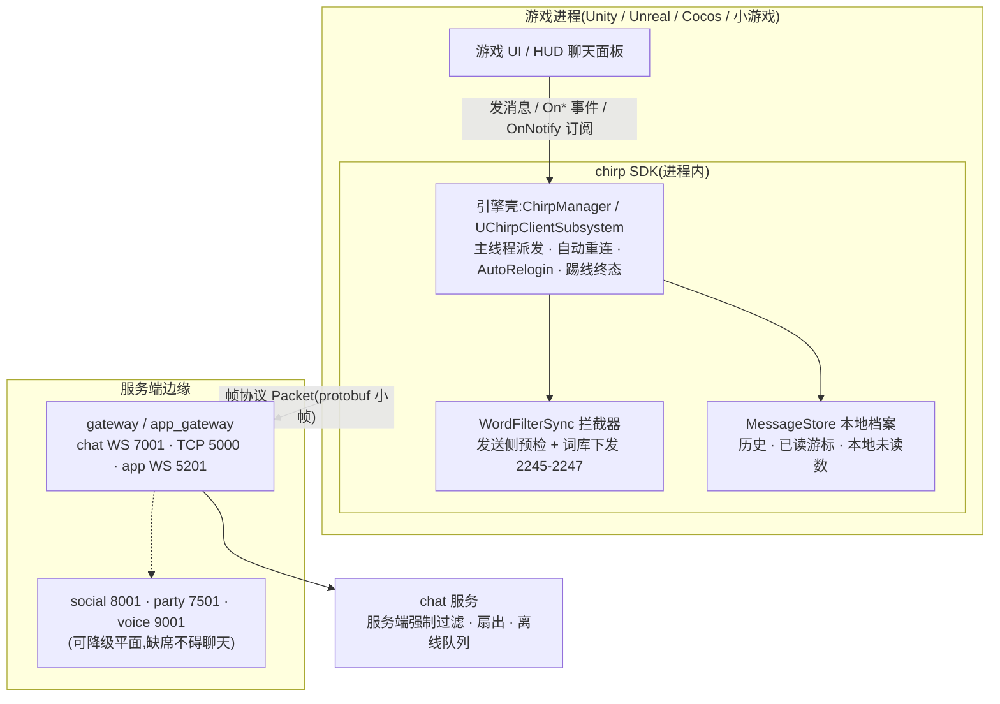
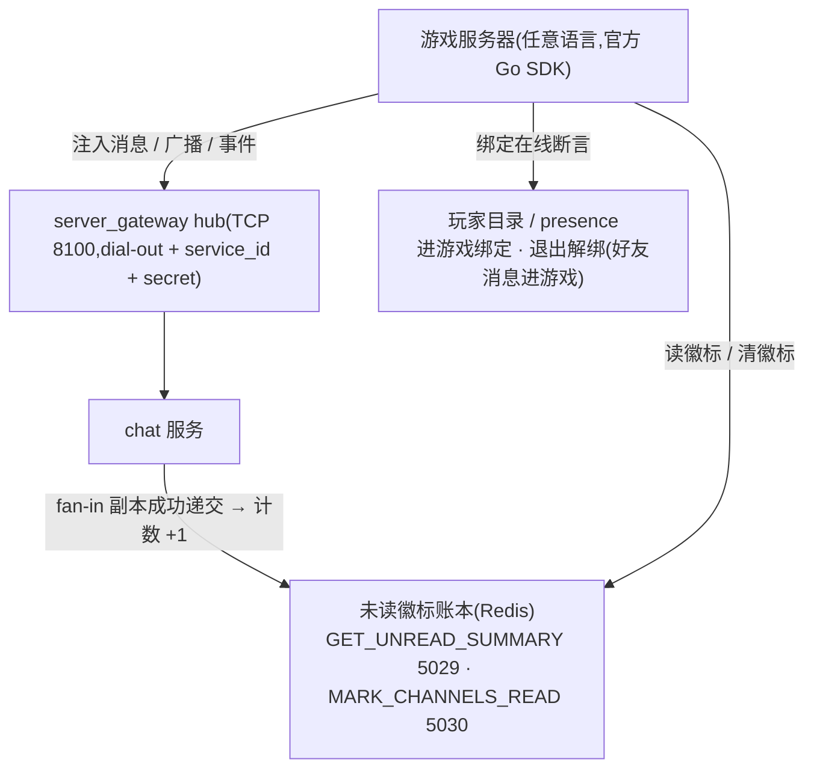
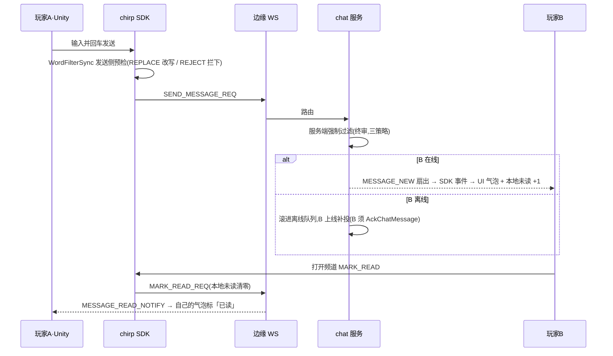

# 应用聊天原型与游戏内集成

本文两张图:**应用聊天原型线框**(对应当前已交付的聊天 UI)与**游戏中的集成图**(客户端内嵌 SDK / 游戏后端两条接入路径)。原型不是目标态——每个区块都标注了当前实现的组件来源,改 UI 先对图。

原型基准与范围:

| 客户端 | 现状 | 原型基准 |
| --- | --- | --- |
| web 伴侣(`apps/web_companion`,「Chirp 伴侣」) | 已交付,功能最全 | **参考实现**,线框图以它为基准 |
| 桌面端(`apps/desktop`,Tauri v2 + React/MUI) | 已交付,与 web 同功能面 | 同图;差异只在导航形态(Rail 竖排页签替代 260px 左列,`src/ui/Rail.tsx`) |
| Android / iOS(`apps/android`、`apps/ios`) | 仅协议库(`protocol/`、`Sources/ChirpProtocol/`),**无 UI** | **目标态原型**,见第三节;实现前不得引用为已交付 |

## 一、应用聊天原型

### 登录页

```text
┌────────────────────────────────────┐
│                                    │
│            登录到 Chirp             │
│     开发模式:输入用户 ID 即可登录      │
│                                    │
│      用户 ID  [ al____________ ]    │
│                                    │
│            [ 登录 ]                │
│                                    │
└────────────────────────────────────┘
```

来源 `LoginPage.tsx`:dev 模式无密码,用户 ID 即凭据;token 登录是 SDK 面(移动壳)的事。

### 主界面(双栏壳)

```text
┌───────────────────────┬────────────────────────────────────────────┐
│ Chirp 伴侣  alice      │  [ConnectionBanner:断线重连/被踢,仅异常时出现] │
├───────────────────────┼────────────────────────────────────────────┤
│ [新的私聊] [新建群组]    │  频道标题                            [⚙]   │
│───────────────────────│  alice, bob 正在输入…                       │
│ 私聊                   │────────────────────────────────────────────│
│  bob    (2) 好的,收到   │        [ 加载更早的消息 ]                    │
│  carol       在吗?      │                                            │
│ 群聊                   │     ┌──────────────────────────┐           │
│  战队A  (5) 集合了      │     │ bob: 今晚八点集合          │           │
│───────────────────────│     │ [👍 2] [👏] +             │           │
│ [好友] [组队] [语音]     │     └──────────────────────────┘           │
│ [设备]                 │     ┌──────────────────────────┐           │
│                       │     │ 我: 收到,准时上线    20:14  │           │
│ 通知权限(点此开启)       │     └────────────[已读]────────┘           │
│ 退出登录               │  ┌──────────────────────────────────────┐  │
│                       │  │ 输入消息,Enter 发送              [发送] │  │
└───────────────────────┴──┴──────────────────────────────────────┴──┘
     260px · ConversationList               ChatWindow
     (未选会话时右栏显示空态提示)
```

区块来源:

| 区块 | 内容 | 组件 |
| --- | --- | --- |
| 左列头部 | 应用名 + 当前用户 ID | `ChatPage.tsx` |
| 会话列表 | 私聊/群聊分组、未读角标、最近消息预览;顶部「新的私聊」「新建群组」按钮 | `ConversationList.tsx` |
| 平面入口 | 好友(加好友/请求/在线绿点)、组队(创建/邀请/转让/解散)、语音房(创建/加入/静音)、多端在线(其他在线端清单) | `FriendsDialog` / `PartyDialog` / `VoiceDialog` / `DevicesDialog` / `OnlineDevicesDialog` |
| 左列底部 | 桌面通知权限入口(从不自动请求)、退出登录 | `ChatPage.tsx` |
| 右栏头部 | 频道标题;正在输入指示(「alice, bob 正在输入…」);群聊独享 ⚙ 打开群设置 | `ChatWindow.tsx` |
| 消息列表 | 「加载更早的消息」按页上翻;气泡见下 | `ChatWindow.tsx` + `MessageBubble.tsx` |
| 输入区 | Enter 发送 | `MessageInput.tsx` |

### 消息气泡解剖

```text
   对方消息                                自己的消息
┌────────────────────────┐        ┌────────────────────────────┐
│ bob                    │        │                         我 │
│ 今晚八点集合            │        │         收到,准时上线        │
│ [👍 2] [👏] +          │        │         20:14 · 已读        │
└────────────────────────┘        └────────────────────────────┘
 气泡下方:表情回应 chips             状态行(逐级出现,同一行):
 (快捷反应一键回应)                   · 发送中… → 已读(对端 MARK_READ 后)
 (自己的消息另有 编辑/撤回)            · 发送失败
                                    · 对方离线,已排队(上线自动补投)
```

状态与特殊形态(全部来自 `MessageBubble.tsx` 现行为):

- **已读**:自己的消息在「对端已读游标 ≥ 本条」后追加 `· 已读`;
- **(已编辑)**:对方编辑过的消息显示标记;自己的编辑直接原位更新;
- **撤回**:整条折叠为「消息已撤回」(双方一致);
- **敏感词**:命中词库的内容已是改写后的文本(REPLACE 策略显示 `**`),规约见 [敏感词过滤](word_filter.md);
- 群聊额外有群主标识与成员数(群设置内)。

### 群设置(群聊 ⚙)

```text
┌─ 群组设置:战队A ──────────────┐
│  成员 4/10                    │
│  ──────────────────────────  │
│  ★ alice(群主)        [移出]  │
│    bob                [移出]  │
│  ──────────────────────────  │
│  [添加成员: 输入用户 ID]       │
│  [退出群组]                   │
└──────────────────────────────┘
```

来源 `GroupDialogs.tsx`:创建群、邀请/踢人、群主标识、退群确认。桌面端同功能面在 `desktop/src/ui/Dialogs.tsx`。

### 全局状态与降级行为

| 状态 | 表现 | 依据 |
| --- | --- | --- |
| 断线 | 顶部条幅「连接已断开,正在自动重连…」,恢复后自愈 | `ConnectionBanner.tsx` |
| 被踢(顶号) | 条幅「账号已在其他设备登录…」+ 返回登录按钮——踢线是终态,不自动重连 | 同上 |
| 平面缺席 | social/party/voice/设备四平面登录均 best-effort:任一宕机聊天主线照常,对应功能入口隐藏 | `ChatPage.tsx` 四个 useEffect 契约 |
| 桌面通知 | 仅在页面隐藏且消息不在当前频道时弹系统通知;权限从不自动请求 | `ChatPage.tsx` + `desktop_notify.ts` |
| 未读数 | 客户端本地记账(收消息 +1、MARK_READ 清零),登录后 `GET_UNREAD_COUNT`(2205) 向服务端对账一次;当前**没有**未读变更推送 | `ConversationList.tsx` / `message_handlers.cc` |

## 二、游戏中的集成

游戏接入有两条正交路径:**游戏客户端内嵌 SDK**(玩家聊天主线)与**游戏后端服务器平面**(系统消息/数据互通)。二者可同时存在。

### 图 A:客户端内嵌 SDK(in-process)



要点(接入语义详见 [SDK 总览](../sdk/index.md) 与 [SDK 钩子](sdk_hooks.md)):

- **游戏侧只面对事件与 Task**:`OnChatMessage` 等回调已被引擎壳派发回主线程;请求-响应走 spec 表(`RequestAsync`,序列号关联,超时抛错);
- **发送侧预检在 SDK 内完成**:注册 `WordFilterSync` 为拦截器后,`SendMessageAsync` 全管线先过词库;词库由服务端下发,客户端裁决预测服务端裁决;
- **离线不是失败**:发送返回 `TargetOffline` 表示已滚进对方离线队列;收到消息必须 `AckChatMessage`,否则服务端重复投递;
- **被踢是终态**:顶号后 SDK 停止重连,游戏弹重新登录(对应原型里的条幅)。

### 图 B:游戏后端(服务器平面 dial-out)



要点:

- **dial-out 直连**:游戏后端主动外连 hub,不开监听端口;鉴权用 service_id + secret;
- **徽标账本与聊天未读互不喂**:账本只数「订阅通知被成功递交给 chat」的 fan-in 副本,`MarkChannelsRead` 是唯一递减路径(协议注释明文);
- **presence 绑定即在线**:游戏后端在玩家进/退游戏时绑定/解绑,好友「在游戏中」状态由此而来,不需要额外心跳信号。

### 图 C:一句话在游戏里的一生



三道关卡与两处记账都在这张图里:预检(SDK,可被绕过所以服务端必审)→ 强制过滤(chat 服务)→ 扇出/离线;未读(收方本地)、已读游标(驱动 2207 通知)。

## 三、手机端原型(目标态,尚未实现)

> ⚠ 本节是**设计原型**——手机端 UI 尚未实现,仓库内现有的只有协议层
> (Android `apps/android/src/main/kotlin/chirp/mobile/protocol/`,iOS
> `apps/ios/Sources/ChirpProtocol/`)。本节功能面与 web/桌面完全同源,不新增
> 任何协议能力;实现落地前,不要在能力矩阵或 README 引用本节为已交付。

### 布局映射:Rail → 底部页签

手机单列形态没有 260px 左列的余地,导航映射沿用桌面 Rail 的五项(`desktop/src/ui/Rail.tsx`),压成底部页签;对话框(好友/组队/语音/设备/群设置)一律全屏 sheet。

### 会话列表(首页)

```text
┌────────────────────────────┐
│ Chirp 伴侣  alice     [🔔] │
├────────────────────────────┤
│ [新的私聊]      [新建群组]   │
│────────────────────────────│
│ 私聊                        │
│  bob     (2)  好的,收到     │
│  carol         在吗?        │
│ 群聊                        │
│  战队A   (5)  集合了        │
│────────────────────────────│
│  💬聊天   👥好友   🧩组队    │
│  🎙语音   📱设备            │
└────────────────────────────┘
 顶栏:应用名 + 当前用户 ID + 通知开关
 列表:同 web 会话列表(未读角标 + 最近消息预览)
 底部:五页签 = 桌面 Rail 同款功能入口
```

### 聊天窗口(全屏推入)

```text
┌────────────────────────────┐
│ ←   战队A              ⚙   │
│     bob 正在输入…           │
├────────────────────────────┤
│      [ 加载更早的消息 ]      │
│  ┌──────────────────────┐  │
│  │ bob: 今晚八点集合      │  │
│  │ [👍 2] [👏] +         │  │
│  └──────────────────────┘  │
│        ┌──────────────────┐│
│        │ 我: 收到   20:14  ││
│        └──────[已读]───────┘│
├────────────────────────────┤
│ [ 输入消息…           ][发送]│
└────────────────────────────┘
 头部:返回 + 标题 + typing 副标题 + ⚙(群聊)
 气泡:与「消息气泡解剖」同款,状态行/回应/撤回一致
```

### 群设置(全屏 sheet)

```text
┌────────────────────────────┐
│ ✕  群组设置:战队A           │
│────────────────────────────│
│  成员 4/10                  │
│  ★ alice(群主)      [移出]  │
│    bob              [移出]  │
│────────────────────────────│
│  [ 添加成员:输入用户 ID  ]   │
│  [ 退出群组 ]               │
└────────────────────────────┘
 内容与 web 群设置对话框同源(GroupDialogs)
```

### 手机端与 web/桌面的差异面

| 维度 | web / 桌面(已交付) | 手机端(目标态) | 依据 |
| --- | --- | --- | --- |
| 导航 | 260px 左列 / Rail 竖排页签 | 底部五页签 + 全屏 sheet | 桌面 `Rail.tsx` 同源映射 |
| 通知 | 桌面通知(页面隐藏且非当前频道) | 系统推送,经设备平面注册(`RegisterDevice`,app_gateway WS 5201);iOS APNs 凭据、鸿蒙 ArkTS 工具链为已登记的外部前置,落地前推送臂不可用 | `DeviceRegistrar.kt` / `apps/ios` 协议库 |
| 发送 | 在线直发,失败可重试 | 协议库自带离线发送队列,弱网先入队、恢复后重放 | `OfflineSendQueue.kt` |
| 顶号 | 条幅 + 返回登录 | 同为踢线终态:SDK 停止重连,弹重新登录 | 协议库踢线终态契约 |
| 词库 | `WordFilterSync` 拦截器随 SDK | 同一组件三端同契约(Kotlin/Swift 协议库已备),原生壳照接 | `WordFilterSync.kt` / `WordFilterSync.swift` |

登录页与 web 同款(开发模式用户 ID 即凭据),不另画。
