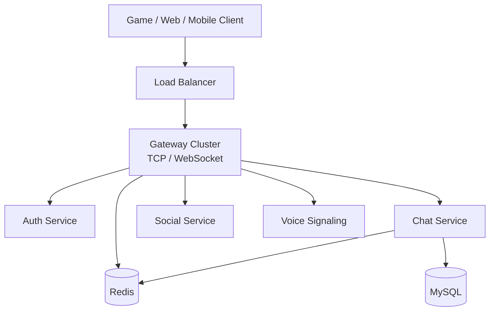

# 游戏聊天架构笔记

本页作为游戏聊天场景的设计笔记(design-notes)保留。

当前的仓库架构、服务边界、协议基线与架构合理性评审,请先读 [Overall Architecture](../architecture.md)。

## 当前位置

当前受支持的后端路径是 `gateway + auth + chat`。

- `gateway` 是登录/会话边缘,目前处理登录、登出、心跳和可选的 Redis 支撑跨实例踢线。
- `chat` 目前是独立的 TCP/WebSocket 服务,是当前聊天冒烟测试的实际入口。
- Social、voice、notification、search、SDK 包装层、移动应用和管理后台,除非 [Capability Matrix](../CAPABILITY_MATRIX.md) 另有说明,均为实验性或演示面。

## 设计意图

长期方向仍是面向游戏和伴侣应用的统一实时通信平台:

- 游戏客户端可以用 TCP 做可预期的二进制协议集成。
- Web 和移动伴侣客户端可以用 WebSocket。
- 将来的 gateway 可以成为唯一公网边缘,把业务包路由给内部服务。
- Redis 可以继续作为会话归属、Pub/Sub、近期/离线缓冲、分布式路由的快速共享协调层。
- MySQL 可以继续作为增强构建启用时的持久化历史与账号/会话存储。

## 合理的目标形态



这个目标是合理的,但它不是今天实现的运行时。缺的架构环节是网关到业务服务的路由,以及统一的会话/认证契约。

## 协议选择

当前代码在 TCP 和 WebSocket 上用同一套二进制协议:

```
[uint32_be payload_size][chirp.gateway.Packet protobuf bytes]
```

`Packet.msg_id` 标识业务消息,`Packet.body` 装序列化的 protobuf 请求或响应。

对游戏客户端来说这是个好选择:紧凑、跨语言稳定、TCP 和 WebSocket 通吃。KCP/QUIC 和完整 WebRTC 媒体路径应该留作独立的未来决策,而不应由当前核心隐含承诺。

## 实操建议

- 本地验证用 [Overall Architecture](../architecture.md) 描述的当前直连 `chat` 路径。
- 产品架构上,等网关路由实现后优先收敛到单一公网边缘。
- social、voice、search、推送或高级聊天功能,在有配套测试和明确的运行时拓扑之前,不要写成"受支持"。
