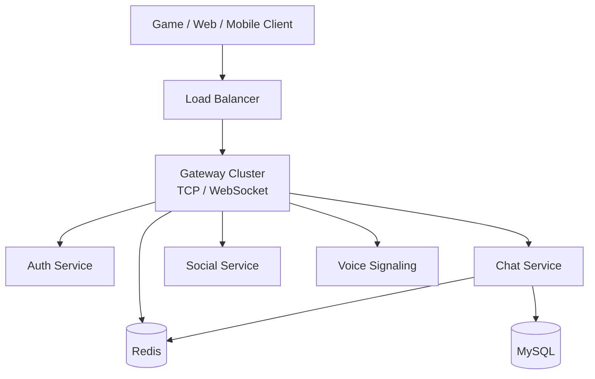

# Game Chat Architecture Notes

This page is kept as a design-notes entry for game chat scenarios.

For the current repository architecture, service boundaries, protocol baseline, and architecture reasonableness review, read [Overall Architecture](./architecture.md) first.

## Current Position

The current supported backend path is `gateway + auth + chat`.

- `gateway` is the login/session edge and currently handles login, logout, heartbeat, and optional Redis-backed cross-instance kick.
- `chat` is a separate TCP/WebSocket service today and is the practical entrypoint for current chat smoke tests.
- Social, voice, notification, search, SDK wrappers, mobile app, and admin dashboard are experimental or demo surfaces unless the [Capability Matrix](./CAPABILITY_MATRIX.md) says otherwise.

## Design Intent

The long-term direction is still a unified realtime communication platform for games and companion apps:

- Game clients can use TCP for predictable binary protocol integration.
- Web and mobile companion clients can use WebSocket.
- A future gateway can become the single public edge and route business packets to internal services.
- Redis can remain the fast shared coordination layer for session ownership, Pub/Sub, recent/offline buffers, and distributed routing.
- MySQL can remain the durable history and account/session store where enhanced builds are enabled.

## Reasonable Target Shape



This target is reasonable, but it is not the exact runtime implemented today. The missing architectural step is gateway-to-business-service routing plus a unified session/auth contract.

## Protocol Choice

The current code uses one binary protocol across TCP and WebSocket:

```
[uint32_be payload_size][chirp.gateway.Packet protobuf bytes]
```

`Packet.msg_id` identifies the business message, and `Packet.body` contains the serialized protobuf request or response.

This is a good choice for game clients because it is compact, stable across languages, and works with both TCP and WebSocket. KCP/QUIC and full WebRTC media paths should remain separate future decisions instead of being implied by the current core.

## Practical Guidance

- For local validation, use the current direct `chat` path described in [Overall Architecture](./architecture.md).
- For product architecture, prefer a single public edge once gateway routing is implemented.
- Do not document social, voice, search, push, or advanced chat features as supported until they have matching tests and a clear runtime topology.
