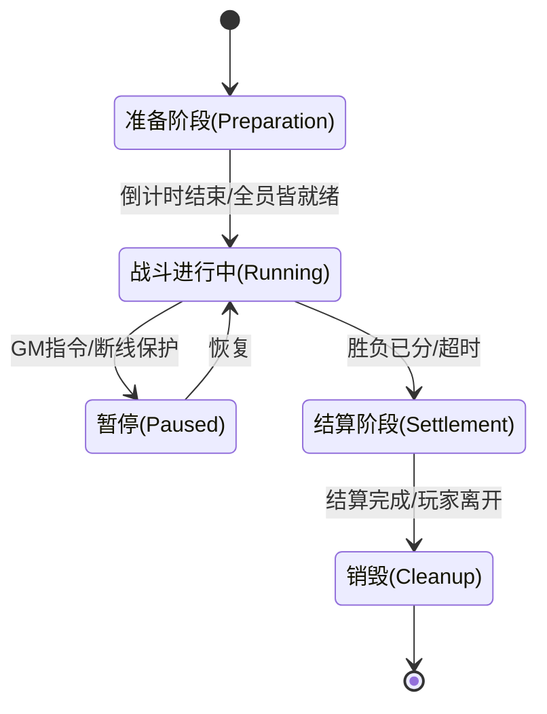

# 游戏战斗系统最佳实践 (Game Combat System Best Practices)

针对塔防 (Tower Defense) 和 MMORPG 两类游戏，战斗系统的设计重心虽然不同，但在架构模式上有很多通用的最佳实践。以下是分门别类的详细建议。

## 1. 核心架构模式：Entity-Component-System (ECS) vs 面向对象 (OOP)

对于现代游戏战斗系统，**首选推荐 ECS 或组合优于继承 (Composition over Inheritance) 的模式**。

- **传统 OOP 的问题**：
  - 层级过深（`Unit` -> `Movable` -> `CombatUnit` -> `Hero`），难以维护。
  - 缓存不友好（数据分散在内存各处）。
- **ECS 的优势**：
  - **组合性**：塔防里的塔和 MMORPG 里的玩家都可以只是 `Position` + `Health` + `Skill` 组件的组合。
  - **性能**：数据连续存储（Data Locality），对塔防这种同一屏幕可能有上千单位的游戏至关重要。

---

## 2. 塔防类 (Tower Defense) 最佳实践

塔防战斗的核心挑战在于**海量单位的路径与碰撞计算**以及**确定性**。

### A. 空间管理 (Spatial Partitioning)

- **痛点**：数百个塔，每秒都要寻找攻击范围内的几千个怪。$O(N^2)$ 复杂度无法接受。
- **方案**：使用 **四叉树 (QuadTree)** 或 **空间哈希 (Spatial Hashing)** (Grid)。
  - 每个 Grid 存储其中的怪物 ID。
  - 塔只需查询自身攻击半径覆盖的 Grid。

### B. 对象池 (Object Pooling)

- **痛点**：子弹、特效、怪物频繁创建销毁，导致 GC (如果是有 GC 语言) 或 内存碎片。
- **方案**：所有战斗实体（尤其是子弹）必须预分配并复用。

### C. 确定性 (Determinism)

- **场景**：防作弊校验、甚至由于联机模式（如《魔兽争霸 3》模式）。
- **方案**：
  - 逻辑与渲染分离。
  - 使用定点数 (Fixed-point math) 代替浮点数，保证跨平台计算结果一致。
  - 所有随机数使用统一的 Seed 序列。

---

## 3. MMORPG 类最佳实践

MMORPG 的核心挑战在于**网络延迟掩盖**、**状态同步**以及**技能系统的复杂度**。

### A. 技能系统 (GAS - Gameplay Ability System)

这是目前业界（如 Unreal Engine）的标准做法，即便不使用 Unreal，也建议参考其架构：

- **Ability (技能)**：不仅仅是“造成伤害”，而是一个逻辑流程（前摇 -> 判定 -> 结算 -> 后摇）。
- **Effect (效果/Buff)**：所有状态改变（扣血、中毒、加速）都抽象为 GameplayEffect。
- **Tag (标签)**：用标签控制逻辑。例如“眩晕”状态下拥有 `State.Stunned` 标签，而施法技能需要 `!State.Stunned`。
- **Attribute (属性)**：基础属性（力量）派生计算属性（攻击力），自动化重算。

### B. 网络同步模型

- **状态同步 (State Synchronization)**：
  - 客户端发送操作指令（"Cast Skill A at Target B"）。
  - 服务器验证 CD、距离、消耗，然后广播结果（"User A cast Skill A, User B took 100 dmg"）。
  - **不要信任客户端的计算结果**（不要直接发 "I dealt 100 dmg"）。
- **客户端预测 (Client Prediction)**：
  - **移动**：客户端先行移动，服务器回滚纠正（Rubber banding）。
  - **表现**：技能特效先行播放，伤害数字等服务器回包。

### C. AOI (Area of Interest)

- MMO 必须做 AOI，只同步玩家视野周边的实体状态，节省带宽。
- 常见做法：九宫格 (9-Grid) 或 十字链表 (Cross Linked List)。

---

## 4. 战斗核心系统设计 (Combat Core Design)

针对你关于**定时器、生命周期和更新循环**的具体疑问，以下是标准设计范式：

### A. 驱动模型：固定时间步长 (Fixed Time Step)

永远不要直接依赖系统时间的 `delta` 来更新战斗逻辑，因为网络波动和机器性能会导致不可预测的结果。

**最佳实践：Accumulator Pattern**

```cpp
// 伪代码：主循环
const double MS_PER_UPDATE = 16.666; // 60Hz 逻辑帧 (或者 MMO 常用 100ms/10Hz)
double accumulated_time = 0.0;

void GameLoop() {
    double current_time = GetHighResTime();
    double delta = current_time - last_time;
    last_time = current_time;

    accumulated_time += delta;

    // 追帧逻辑：如果积压了太多时间，连续执行多次 Update
    while (accumulated_time >= MS_PER_UPDATE) {
        BattleInstance->Update(MS_PER_UPDATE); // 传入固定 dt
        accumulated_time -= MS_PER_UPDATE;
    }

    // Render 使用插值 (Interpolation) 平滑表现 (Client Side)
}
```

- **优势**：保证所有玩家、所有机器上的逻辑迭代次数一致，物理计算和 CD 计算稳定。

### B. 定时器管理 (Timer Management)

战斗中充满大量的定时需求：Buff 持续时间、技能 CD、延迟伤害结算。

- **不要做的事**：

  - 不要使用 `std::thread` 或 `sleep`。
  - 不要在每个从对象（如每个 Buff）里单独存一个 `float timer` 然后每帧 `-= dt`（当拥有上万个对象时，遍历开销巨大）。

- **推荐方案 1：优先队列 (Priority Queue / Min-Heap)**

  - 适用：同时存在的定时器数量 < 1000。
  - 原理：将所有定时任务按 **触发的绝对时间戳** 放入最小堆。
  - Tick：每帧只检查 `Queue.top()`，如果 `now >= top.executeTime` 则弹出并执行，重复直到堆顶时间未到。
  - 复杂度：插入 $O(\log N)$，查询 $O(1)$。

- **推荐方案 2：时间轮 (Timing Wheel)** (Linux Kernel / Netty 采用)
  - 适用：海量定时器（如 MMO 服务器，数万个 Buff）。
  - 原理：类似钟表刻度，有一个指针每帧转动一格。任务挂在对应的刻度链表上。
  - 复杂度：插入 $O(1)$，执行 $O(1)$。

```cpp
// 简单定时器管理器接口
class BattleTimer {
public:
    using TimerID = uint64_t;
    using Callback = std::function<void()>;

    // 注册一个定时器，delayMs 后执行
    TimerID AddTimer(uint32_t delayMs, Callback cb);

    // 取消定时器 (比如 Buff 被驱散)
    void CancelTimer(TimerID id);

    // 在主循环 Update 中调用
    void Tick(uint64_t currentServerTimeMs);
};
```

### C. 战斗生命周期 (Combat Lifecycle FSM)

单场战斗必须是一个明确的**有限状态机 (Finite State Machine)**。



**代码结构示例**：

```cpp
class BattleInstance {
    enum class State { PREPARE, RUNNING, SETTLEMENT, FINISHED };
    State currentState;

    // 核心组件
    BattleMap map;
    EntityManager entityMgr;
    BattleTimer timerMgr;

public:
    void Update(double dt) {
        // 1. 驱动定时器
        timerMgr.Tick(GetLogicTime());

        // 2. 根据状态分发逻辑
        switch (currentState) {
            case State::Running:
                entityMgr.Update(dt); // 移动、攻击、AI
                CheckWinCondition();  // 胜负判定
                break;
            // ...
        }
    }

    void StartBattle() {
        currentState = State::Running;
        OnBattleStart(); // 触发各种 "战斗开始时" 的被动技能
    }
};
```

---

## 5. 服务器端战斗架构详解 (Server-Side Combat Architecture)

服务器端的战斗设计与客户端最大的不同在于：**稳定性、并发处理**与**防作弊**。

### A. 并发模型 (Concurrency Models)

如何利用多核 CPU 处理成千上万个战斗副本？

#### 1. Actor Model (推荐)

- **概念**：每个战斗房间 (Room/Zone) 是一个独立的 Actor。
- **线程模型**：
  - **Logic Thread**：所有战斗逻辑处理都在单个 Actor 内部串行执行（无锁）。
  - **Worker Pool**：一个固定大小的线程池（如 CPU 核数）调度执行成千上万个 Actor。
- **优势**：
  - **无锁编程**：不需要 `mutex`，代码极其干净，不用担心死锁。
  - **高吞吐**：CPU 利用率极高。
- **实现**：C++ 可用 `CAF (C++ Actor Framework)`，Go 语言天然支持 (Goroutine + Channel)，Java 可用 `Akka`。

#### 2. Thread-per-Zone (传统模型)

- **概念**：开一个线程专门跑一个地图或战斗。
- **缺点**：线程切换开销大，且如果战斗数量 > CPU 核数，性能急剧下降。只适合少量、极高负载的战斗（如单服万人同屏的国战）。

#### 3. ECS System 并行化

- **概念**：在 ECS 架构下，`MovementSystem` 处理所有实体的移动，`DamageSystem` 处理所有伤害。这些 System 可以并行。
- **注意**：实现难度极高，需要精细的数据依赖分析。通常只在单机 3A 大作或极少数高性能引擎中使用。

### B. 状态管理与持久化 (State & Persistence)

**黄金法则：战斗中绝不阻塞读写数据库。**

#### 1. 内存为王 (In-Memory Logic)

- 战斗开始时：从 DB/Redis 加载所有玩家数据到内存（Player Object）。
- 战斗进行中：**所有**读写只在内存中操作。
- 战斗结束/定期：异步回写 (Write-Back) 到数据库。

#### 2. 异步持久化设计

千万不要在 `OnDamage()` 里写 `db.Update()`。

```cpp
// 错误示范 (卡顿之源)
void OnDamage(Player* p, int dmg) {
    p->hp -= dmg;
    db.Execute("UPDATE players SET hp = ? WHERE id = ?", p->hp, p->id); // 阻塞 IO！
}

// 正确示范 (异步队列)
void OnDamage(Player* p, int dmg) {
    p->hp -= dmg;
    p->SetDirty(true); // 标记脏数据
}

// 独立的 Persistence Thread 每隔几秒或战斗结束时运行
void PersistenceLoop() {
    while (true) {
        auto dirtyPlayers = CollectDirtyPlayers();
        BulkUpdateDB(dirtyPlayers); // 批量写入，极大提高吞吐
        Sleep(5000);
    }
}
```

### C. 网络与 Tick 同步 (Server Authoritative)

#### 1. 权威服务器 (Server Authoritative)

- 永远以服务器数据为准。客户端发来的 `Move(x, y)` 只是**请求**，服务器计算后返回 `NewPos(x', y')`。
- **防瞬移/加速**：服务器每一帧都要校验 `dist(last_pos, new_pos) <= max_speed * dt`。

#### 2. 缓冲与插值 (Buffer & Interpolation)

- 服务器通常以固定频率发送快照 (Snapshot)，比如每 50ms (20Hz)。
- 客户端收到快照时，并不立即渲染，而是放入缓冲队列。
- 客户端渲染时间通常比服务器**滞后** 1-2 个包（Render Delay），在两个快照之间做线性插值，保证看到的其他玩家移动是平滑的。

#### 3. 甚至不需要 TCP

- 实时性要求极高（FPS/MOBA）：**UDP (KCP/QUIC)** 是必须的。丢包重发会导致“卡顿”，不如直接丢弃过期的包，只处理最新的状态包。
- MMORPG/卡牌/回合制：TCP/WebSocket 足矣。

---

## 6. 总结

| 特性         | 塔防 (Tower Defense)                   | MMORPG                         |
| :----------- | :------------------------------------- | :----------------------------- |
| **瓶颈**     | CPU / 内存宽带 (海量单位)              | 网络带宽 / 延迟 / 数据库一致性 |
| **同步方式** | 这里的关键往往是确定性 Lockstep (联机) | 状态同步 (State Sync)          |
| **核心算法** | A\*寻路, 空间哈希, 碰撞检测            | 技能逻辑(GAS), AOI, 持久化     |
| **推荐架构** | ECS (纯数据驱动)                       | ECS 或 Actor Model (便于 RPC)  |

建议如果是在现有 `chirp` 项目（看起来是 C++ 网络服务）中扩展，可以先从 **AOI 服务** 和 **基础属性组件** 开始构建。
