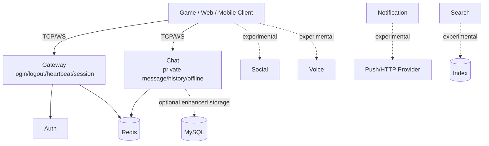

# Introduction to Chirp

Chirp is a game-oriented realtime communication backend skeleton. The current mature path is `gateway + auth + chat`; the repository also contains social, voice, notification, search, SDK, mobile, and admin code, but those areas are not all equally complete.

Read [Capability Matrix](../CAPABILITY_MATRIX.md) before treating a feature as stable.

## What Works Best Today

- Local backend validation for login, heartbeat, and private chat.
- TCP or WebSocket binary protocol integration.
- C++ client/SDK experiments against the Chat service.
- Redis-backed gateway session ownership and cross-instance kick experiments.
- Redis-backed chat history/offline queue experiments.
- Optional MySQL-backed enhanced auth/chat paths when native dependencies are available.

## Current Architecture



The most important current limitation is that Gateway is not yet a universal business router. Chat packets should currently be sent to the Chat service directly unless a future gateway routing layer is implemented.

## Technology Stack

- Language: C++17
- Networking: standalone ASIO
- Serialization: Protocol Buffers
- Optional coordination/cache: Redis
- Optional persistence: MySQL
- Build system: CMake
- Docs: VitePress

## Protocol

TCP and WebSocket use the same application payload:

```
[uint32_be payload_size][chirp.gateway.Packet protobuf bytes]
```

`Packet.msg_id` identifies the business message. `Packet.body` contains the serialized protobuf request or response.

## Status Categories

- `Supported`: default documented backend path and should remain buildable
- `Experimental`: code exists but is conditional, alternate, or not part of the minimal verified runtime
- `Demo`: useful for exploration, not a stable backend contract
- `Stub`: incomplete or mock-driven

## Next Steps

- Read [Overall Architecture](../architecture.md)
- Follow [Getting Started](./getting-started.md)
- Check [API Overview](../api/overview.md)
- Review [Capability Matrix](../CAPABILITY_MATRIX.md)
