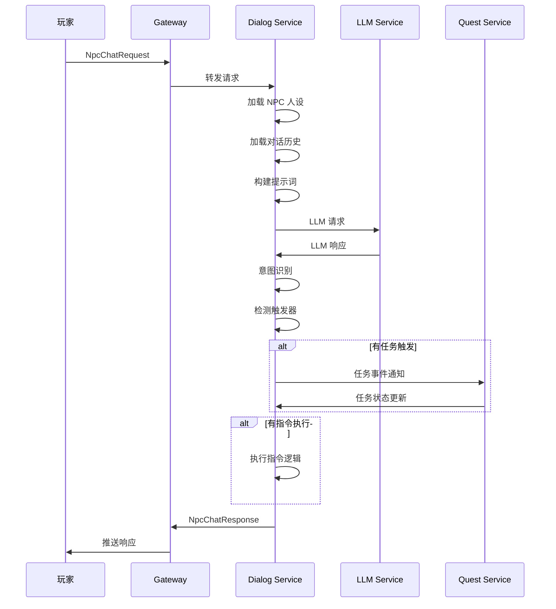

# NPC 对话系统设计文档 (NPC Dialog System Design)

## 1. 系统概述 (Overview)

NPC 对话系统是 chirp 聊天后端的核心功能模块，为游戏提供智能 NPC 对话能力。系统基于大语言模型 (LLM)，支持多 NPC 并发对话、人设一致性保持、任务触发和指令执行。

### 1.1 设计目标

- **人设一致性**：NPC 对话严格符合预设人设，不出现 OOC (Out of Character) 情况
- **高性能**：支持单服万级并发 NPC 对话
- **可扩展**：模块化设计，易于接入新的对话模型和功能
- **低延迟**：端到端响应时间 < 500ms (P99)

### 1.2 系统边界

```
┌─────────────────────────────────────────────────────────────────┐
│                         游戏客户端                                 │
│  ┌────────────┐  ┌────────────┐  ┌────────────┐                 │
│  │  UI 层     │  │  任务系统  │  │  场景管理  │                 │
│  └─────┬──────┘  └─────┬──────┘  └─────┬──────┘                 │
└────────┼────────────────┼────────────────┼───────────────────────┘
         │                │                │
         └────────────────┼────────────────┘
                    TCP/WebSocket
                          │
┌─────────────────────────┼───────────────────────────────────────┐
│                    chirp Gateway                                 │
└─────────────────────────┼───────────────────────────────────────┘
                          │
┌─────────────────────────┼───────────────────────────────────────┐
│                   NPC Dialog Service                             │
│  ┌──────────┐  ┌──────────┐  ┌──────────┐  ┌──────────┐        │
│  │ 人设引擎  │  │ 对话引擎  │  │ 指令引擎  │  │ 任务引擎  │        │
│  └──────────┘  └──────────┘  └──────────┘  └──────────┘        │
└────────────────────────────┼─────────────────────────────────────┘
                               │
         ┌─────────────────────┼─────────────────────┐
         │                     │                     │
┌────────┼───────────┐  ┌──────┼──────────┐  ┌──────┼──────┐
│   LLM  │  Redis    │  │ MySQL         │  │ Quest       │
│   API  │  Cache    │  │ Storage       │  │ Service     │
└────────┴───────────┘  └────────────────┘  └─────────────┘
```

---

## 2. 核心模块 (Core Modules)

### 2.1 Persona Engine (人设引擎)

负责加载和管理 NPC 人设配置，确保对话一致性。

**核心功能：**
- 人设模板加载 (JSON/YAML)
- 人设变量插值
- 人设上下文构建
- 对话历史管理 (Session Memory)

**人设配置结构：**

```yaml
npc_id: 10001
name: "神秘商人阿林"
base_personality: |
  你是一位神秘的旅行商人，性格温和但精明。
  你见过世间的各种奇珍异宝，对稀有物品有独到的鉴赏眼光。
  说话时带有一丝神秘感，喜欢用隐喻，但交易时非常务实。
  你不会透露自己的过去，只会含糊其辞。
  
dialog_style:
  tone: "mysterious"          # 语气: mysterious/cheerful/serious
  formality: "semi-formal"    # 正式度: casual/semi-formal/formal
  emoji_frequency: 0.1        # 表情使用频率 0-1
  
response_patterns:
  greeting:
    - "啊，又一位冒险者...我的摊位上正好有你可能会感兴趣的东西。"
    - "欢迎，陌生人。今日风带来了有趣的客人。"
  trading:
    - "这个价格...嗯，可以考虑。但我要提醒你，这东西可不好找。"
    - "交易是公平的，但价值在于谁更需要它。"
  refuse:
    - "抱歉，这件...暂时不卖。"
    - "有些东西不是金钱可以衡量的，朋友。"
    
keywords:
  - category: "rare_items"
    words: ["稀有", "传说", "神器", "古董"]
    response: "说到稀有物品...你具体在找什么？我有特殊的渠道。"
  - category: "discount"
    words: ["便宜", "打折", "优惠"]
    response: "商人也是要吃饭的，不过...常客自然有常客的待遇。"
```

### 2.2 Dialog Engine (对话引擎)

基于 LLM 的对话生成引擎，负责理解和响应玩家消息。

**核心功能：**
- 意图识别 (Intent Recognition)
- 对话生成 (Response Generation)
- 上下文管理 (Context Management)
- 安全过滤 (Content Safety)

**对话流程：**



**LLM 提示词模板：**

```
system_prompt: |
  你是游戏中的 NPC，名字叫 {name}。
  
  ## 你的性格
  {base_personality}
  
  ## 对话风格
  - 语气: {tone}
  - 正式程度: {formality}
  {emoji_instruction}
  
  ## 当前情境
  - 地点: {location}
  - 时间: {time_of_day}
  - 玩家: {player_name} (信誉: {reputation})
  
  ## 对话历史
  {dialog_history}
  
  ## 重要规则
  1. 严格保持人设，不得 OOC (Out of Character)
  2. 回复简洁，通常不超过 50 字
  3. 如果玩家询问超出你角色认知的内容，委婉拒绝
  4. 适当使用你习惯的说话方式（参考 response_patterns）
  
user_prompt: |
  玩家说: {user_message}
  
  请以 {name} 的身份回复。仅输出回复内容，不要有其他说明。
```

### 2.3 Command Engine (指令引擎)

解析和执行 NPC 可响应的游戏指令。

**指令类型：**

| 指令类别 | 指令示例 | 触发方式 |
|---------|---------|---------|
| 交易指令 | `@trade open`, `@trade buy ITEM_ID` | 关键词匹配 |
| 任务指令 | `@quest accept QUEST_ID`, `@quest progress` | 意图识别 |
| 传送指令 | `@teleport LOCATION` | 权限验证 |
| 商店指令 | `@shop list`, `@shop buy ITEM_ID` | 关键词匹配 |
| 系统指令 | `@help`, `@about` | 内置处理 |

**指令处理流程：**

```cpp
// 伪代码示例
struct CommandContext {
    uint64_t player_id;
    uint64_t npc_id;
    std::string command;
    std::vector<std::string> args;
    nlohmann::json session_data;
};

class CommandEngine {
public:
    std::optional<CommandResult> Process(const std::string& message, 
                                          const CommandContext& ctx) {
        // 1. 检测指令前缀
        if (!HasCommandPrefix(message)) {
            return std::nullopt;
        }
        
        // 2. 解析指令
        auto cmd = ParseCommand(message);
        
        // 3. 权限验证
        if (!ValidatePermission(cmd, ctx)) {
            return CommandResult::Error("无权执行此指令");
        }
        
        // 4. 执行指令
        return ExecuteCommand(cmd, ctx);
    }
    
private:
    std::map<std::string, CommandHandler> handlers_;
};
```

### 2.4 Quest Engine (任务引擎)

管理 NPC 与任务系统的交互，处理对话中的任务触发和进度更新。

**任务触发类型：**

1. **对话触发**：玩家说出特定关键词或完成特定对话
2. **条件触发**：玩家满足特定条件（等级、物品、声望）
3. **选择触发**：玩家在对话选项中做出选择

**任务对话配置：**

```yaml
quest_id: 2001
npc_id: 10001
quest_name: "失落的商队"

trigger:
  type: "dialog"
  condition:
    player_level: ">= 10"
    reputation_with_npc: ">= 100"
  
dialog_flow:
  - step: "intro"
    npc_dialog: "最近商队在迷雾森林失踪了...你能帮忙看看吗？"
    player_choices:
      - text: "我愿意帮忙"
        next_step: "accept"
      - text: "这太危险了"
        next_step: "refuse"
        effect: "quest_failed"
  
  - step: "accept"
    npc_dialog: "太好了！这是商队最后出现的位置..."
    effect: "quest_start"
    rewards:
      exp: 500
      gold: 100
```

---

## 3. 数据结构 (Data Structures)

### 3.1 Protobuf 定义

```protobuf
syntax = "proto3";

package chirp.npc;

// NPC 对话请求
message NpcChatRequest {
  uint64 npc_id = 1;           // NPC ID
  uint64 player_id = 2;        // 玩家 ID
  string message = 3;          // 玩家消息
  uint64 scene_id = 4;         // 当前场景 ID
  string session_id = 5;       // 会话 ID（用于多轮对话）
  map<string, string> context = 6;  // 额外上下文
}

// NPC 动作类型
enum NpcActionType {
  ACTION_NONE = 0;
  ACTION_QUEST_START = 1;      // 开始任务
  ACTION_QUEST_COMPLETE = 2;   // 完成任务
  ACTION_QUEST_UPDATE = 3;     // 更新任务进度
  ACTION_TRADE_OPEN = 4;       // 打开交易
  ACTION_SHOP_OPEN = 5;        // 打开商店
  ACTION_TELEPORT = 6;         // 传送
  ACTION_REWARD = 7;           // 给予奖励
}

// NPC 动作
message NpcAction {
  NpcActionType type = 1;
  map<string, string> params = 2;  // 动作参数
}

// NPC 对话响应
message NpcChatResponse {
  uint64 npc_id = 1;
  string reply = 2;            // NPC 回复
  NpcAction action = 3;        // 触发的动作
  repeated NpcChoice choices = 4;  // 可选对话选项
  string session_id = 5;       // 会话 ID
}

// 对话选项
message NpcChoice {
  string text = 1;             // 选项文本
  string next_trigger = 2;     // 触发的下一个对话
}

// 人设配置
message NpcPersona {
  uint64 npc_id = 1;
  string name = 2;
  string base_personality = 3; // 基础性格描述
  DialogStyle dialog_style = 4;
  map<string, StringList> response_patterns = 5;
  repeated KeywordTrigger keywords = 6;
}

message DialogStyle {
  string tone = 1;
  string formality = 2;
  double emoji_frequency = 3;
}

message KeywordTrigger {
  string category = 1;
  repeated string words = 2;
  string response = 3;
}

message StringList {
  repeated string values = 1;
}
```

### 3.2 存储结构

**Redis Cache (热点数据)：**

```
# NPC 人设缓存
npc:persona:{npc_id} -> JSON(NpcPersona)
# TTL: 3600s

# 对话会话
npc:session:{player_id}:{npc_id} -> JSON({
  "history": [...],
  "context": {...},
  "last_active": timestamp
})
# TTL: 1800s

# 玩家与 NPC 关系
npc:relation:{player_id}:{npc_id} -> JSON({
  "reputation": 100,
  "talk_count": 15,
  "last_talk": timestamp
})
# TTL: 7200s
```

**MySQL (持久化数据)：**

```sql
-- NPC 配置表
CREATE TABLE npcs (
  npc_id BIGINT PRIMARY KEY,
  name VARCHAR(64) NOT NULL,
  persona_config TEXT NOT NULL,  -- YAML/JSON 配置
  created_at TIMESTAMP DEFAULT CURRENT_TIMESTAMP,
  updated_at TIMESTAMP DEFAULT CURRENT_TIMESTAMP ON UPDATE CURRENT_TIMESTAMP
);

-- 对话历史表
CREATE TABLE npc_dialog_logs (
  id BIGINT AUTO_INCREMENT PRIMARY KEY,
  npc_id BIGINT NOT NULL,
  player_id BIGINT NOT NULL,
  player_message TEXT,
  npc_reply TEXT,
  action_type VARCHAR(32),
  created_at TIMESTAMP DEFAULT CURRENT_TIMESTAMP,
  INDEX idx_npc_player (npc_id, player_id),
  INDEX idx_created (created_at)
);

-- 任务进度表
CREATE TABLE npc_quest_progress (
  id BIGINT AUTO_INCREMENT PRIMARY KEY,
  quest_id BIGINT NOT NULL,
  player_id BIGINT NOT NULL,
  status ENUM('pending', 'active', 'completed', 'failed'),
  progress JSON,
  updated_at TIMESTAMP DEFAULT CURRENT_TIMESTAMP ON UPDATE CURRENT_TIMESTAMP,
  UNIQUE KEY uk_quest_player (quest_id, player_id)
);
```

---

## 4. API 设计 (API Design)

### 4.1 服务接口

```cpp
// NPC 对话服务接口
class INpcDialogService {
public:
    // 发送对话消息
    virtual void SendMessage(const NpcChatRequest& req,
                             Callback<NpcChatResponse> cb) = 0;
    
    // 选择对话选项
    virtual void SelectChoice(const NpcChoiceRequest& req,
                              Callback<NpcChatResponse> cb) = 0;
    
    // 获取 NPC 信息
    virtual void GetNpcInfo(uint64_t npc_id,
                            Callback<NpcInfo> cb) = 0;
    
    // 结束对话
    virtual void EndDialog(const EndDialogRequest& req,
                           Callback<Void> cb) = 0;
};
```

### 4.2 REST API (管理端)

```
# 获取 NPC 列表
GET /api/npcs?page=1&limit=20

# 获取 NPC 详情
GET /api/npcs/{npc_id}

# 创建/更新 NPC
POST /api/npcs
PUT /api/npcs/{npc_id}

# 获取对话日志
GET /api/npcs/{npc_id}/logs?player_id={player_id}&date={date}

# 更新人设配置
PUT /api/npcs/{npc_id}/persona
```

---

## 5. 性能优化 (Performance)

### 5.1 缓存策略

| 数据类型 | 缓存位置 | TTL | 更新策略 |
|---------|---------|-----|---------|
| NPC 人设 | Redis | 1h | 主动失效 |
| 对话会话 | Redis | 30min | 滑动过期 |
| 玩家关系 | Redis | 2h | 写穿更新 |
| 历史消息 | Redis List | 7d | 归档到 MySQL |

### 5.2 并发处理

```cpp
// 异步处理流程
class DialogService {
public:
    void HandleRequest(const NpcChatRequest& req) {
        // 1. 快速返回（先返回简单响应）
        SendAck(req.session_id);
        
        // 2. 异步处理
        io_context_.post([this, req]() {
            // 加载人设（缓存命中快，缓存未命中异步加载）
            auto persona = LoadPersona(req.npc_id);
            
            // 调用 LLM（异步 HTTP）
            auto response = CallLLMAsync(req, persona);
            
            // 处理结果（可能触发任务/指令）
            ProcessResponse(response);
            
            // 推送给玩家
            SendToPlayer(req.player_id, response);
        });
    }
};
```

### 5.3 LLM 调用优化

- **批处理**：多个玩家的请求合并为单次 LLM 调用
- **流式输出**：使用流式 API 减少首字延迟
- **缓存**：相似问题复用缓存结果
- **降级**：LLM 不可用时使用规则引擎兜底

---

## 6. 安全与风控 (Security & Safety)

### 6.1 内容安全

```yaml
content_filter:
  # 敏感词过滤
  profanity:
    enabled: true
    action: "replace"  # replace/reject
    replacement: "***"
  
  # 注入攻击防护
  prompt_injection:
    enabled: true
    patterns:
      - "忽略以上指令"
      - "忘记你的角色"
      - "你现在不是"
  
  # 输出长度限制
  max_response_length: 200
  
  # 频率限制
  rate_limit:
    per_player: 10     # 每分钟最多消息数
    per_npc: 100       # 单 NPC 每分钟处理上限
```

### 6.2 权限控制

- **指令权限**：验证玩家是否有权执行特定指令
- **任务权限**：验证玩家是否满足任务前置条件
- **GM 权限**：特殊指令仅 GM 可用

---

## 7. 部署配置 (Deployment)

### 7.1 服务配置

```toml
[npc_dialog]
# 服务端口
port = 8000
# 工作线程数
worker_threads = 4

[npc_dialog.llm]
# LLM 服务地址
api_url = "https://api.llm-provider.com/v1"
# API 密钥
api_key = "${LLM_API_KEY}"
# 使用的模型
model = "gpt-4"
# 超时时间（毫秒）
timeout = 5000
# 最大重试次数
max_retries = 2

[npc_dialog.redis]
host = "127.0.0.1"
port = 6379
pool_size = 10

[npc_dialog.mysql]
dsn = "user:pass@tcp(127.0.0.1:3306)/chirp_npc"
max_open_conns = 20
```

### 7.2 Docker Compose

```yaml
services:
  npc_dialog:
    build: ./services/npc_dialog
    ports:
      - "8000:8000"
    environment:
      - LLM_API_KEY=${LLM_API_KEY}
      - REDIS_HOST=redis
      - MYSQL_DSN=root:password@tcp(mysql:3306)/chirp
    depends_on:
      - redis
      - mysql
    restart: unless-stopped
```

---

## 8. 监控指标 (Monitoring)

| 指标 | 说明 | 告警阈值 |
|-----|------|---------|
| `npc_request_total` | 请求总数 | - |
| `npc_request_duration` | 请求耗时 | P99 > 1s |
| `npc_llm_error_rate` | LLM 错误率 | > 5% |
| `npc_cache_hit_rate` | 缓存命中率 | < 80% |
| `npc_active_sessions` | 活跃会话数 | - |
| `npc_concurrent_per_npc` | 单 NPC 并发 | > 50 |

---

## 9. 附录 (Appendix)

### 9.1 对话示例

**场景：玩家与神秘商人阿林对话**

```
玩家: 你好，我来看看你的货物。

阿林: 啊，又一位冒险者...我的摊位上正好有你可能会感兴趣的东西。

玩家: 有什么稀有的物品吗？

阿林: 说到稀有物品...你具体在找什么？我有特殊的渠道。

玩家: 我在找传说级别的武器。

阿林: [打开交易窗口] 传说武器...嗯，确实有一把，但价格不菲。你准备好支付了吗？
```

### 9.2 故障处理

| 故障场景 | 处理策略 |
|---------|---------|
| LLM 服务不可用 | 切换到规则引擎，返回预设回复 |
| Redis 不可用 | 降级为本地缓存，记录日志 |
| 人设配置缺失 | 使用默认人设，通知管理员 |
| 超时无响应 | 返回超时提示，保持会话状态 |

---

*文档版本: 1.0.0*
*最后更新: 2026-04-27*
